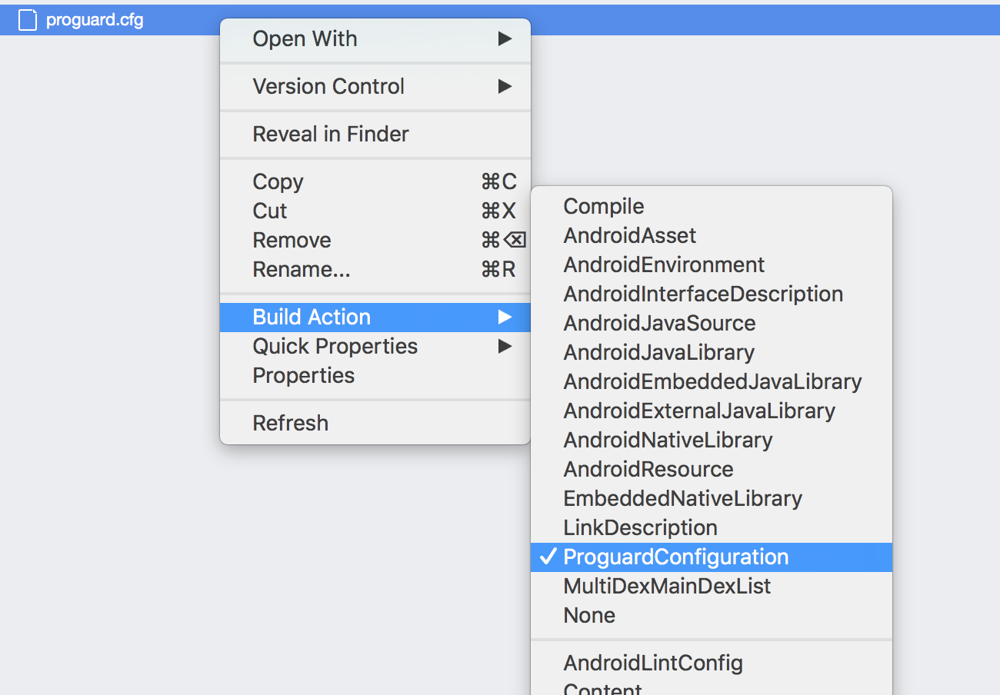

---
# required metadata

title: App Center Push for Xamarin.Android Apps
description: Integrating App Center Push into Xamarin.Android applications
keywords: sdk, push
author: elamalani
ms.author: emalani
ms.date: 07/05/2018
ms.topic: article
ms.assetid: 3f3e83cd-0f05-455e-8e67-6b6d5042949d
ms.service: vs-appcenter
ms.custom: sdk
ms.tgt_pltfrm: xamarin.android
---

# App Center Push

> [!div  class="op_single_selector"]
> * [Android](android.md)
> * [iOS](ios.md)
> * [UWP](uwp.md)
> * [Xamarin.Android](xamarin-android.md)
> * [Xamarin.iOS](xamarin-ios.md)
> * [Xamarin.Forms](xamarin-forms.md)
> * [React Native Android](react-native-android.md)
> * [React Native iOS](react-native-ios.md)
> * [macOS](macos.md)
> * [Cordova Android](cordova-android.md)
> * [Cordova iOS](cordova-ios.md)
> 
> [!NOTE]
> For all the Android developers using App Center, there is a change coming where Firebase SDK is required to use Push Notifications. For Android P, its scheduled at the release date for the latest OS version. For all other versions of Android, it will be required after April 2019. Please follow the [How to add Firebase SDK guide](migration/xamarin-android.md).

[!include[](introduction-android.md)]

## Add App Center Push to your app

Please follow the [Get started](~/sdk/getting-started/xamarin.md) section if you haven't set up and started the SDK in your application yet.

### 1. Add the App Center Push module

[!include[](add-nuget.md)]

### 2. Start App Center Push

[!include[](start-push.md)]

### 3. Add google-services.json

* Copy **google-services.json** file into the root of your Android specific project using Visual Studio so that the file is visible in the solution.
* Close and reopen your solution. 
* The next step depends if you are on Mac or Windows:
    * On Visual Studio for Mac, open the context menu on the **google-services.json** file then select **GoogleServicesJson** in **Build Action**.
    * On Visual Studio for Windows, select the **google-services.json** file in the Solution explorer. In **Properties > Advanced > Build Action**, select **GoogleServicesJson**.

### 4. Modify the project's AndroidManifest.xml file

Edit the project's **AndroidManifest.xml** file, then insert the following lines **inside** the <application> section:

```xml
<application ...>
    
    <!-- Add these lines -->
    <receiver
        android:name="com.google.firebase.iid.FirebaseInstanceIdInternalReceiver"
        android:exported="false" />
    <receiver
        android:name="com.google.firebase.iid.FirebaseInstanceIdReceiver"
        android:exported="true"
        android:permission="com.google.android.c2dm.permission.SEND">
        <intent-filter>
            <action android:name="com.google.android.c2dm.intent.RECEIVE" />
            <action android:name="com.google.android.c2dm.intent.REGISTRATION" />
            <category android:name="${applicationId}" />
        </intent-filter>
    </receiver>
    <!-- end of section to add -->

</application>
```

### 5. Customize ProGuard configuration

If you're using ProGuard, you must customize the project's configuration for Push.

#### 5.1. Create a ProGuard configuration file

> [!NOTE]
> If you don't use ProGuard or if you already have a ProGuard configuration file in your project, you may skip this section.

Add an empty file to your Xamarin.Android project named *proguard.cfg*. Set the build action to "ProguardConfiguration."



#### 5.2. Add customization to ProGuard configuration file

In your Xamarin.Android project, add the following line to your `proguard.cfg` file:

```
-dontwarn com.microsoft.appcenter.**
-dontwarn com.google.android.gms.**
-keep class com.google.firebase.provider.FirebaseInitProvider
-keep class com.google.firebase.iid.FirebaseInstanceIdReceiver
-keep class com.google.firebase.messaging.FirebaseMessagingService
```

## Intercept push notifications

### Additional setup

If (**and only if**) your launcher activity uses a `launchMode` of `singleTop`, `singleInstance` or `singleTask`, you need to add this in the activity `onNewIntent` method:

```csharp
        protected override void OnNewIntent(Android.Content.Intent intent)
        {
            base.OnNewIntent(intent);
            Push.CheckLaunchedFromNotification(this, intent);
        }
```

### Subscribe to the push event

[!include[](dotnet-push-event-intro.md)]

> [!NOTE]
> A notification is not generated when your application receives a push in the foreground.
> 
> [!NOTE]
> If the push is received in background, the event is **NOT** triggered at receive time.
> The event is triggered when you click on the notification.
> 
> [!NOTE]
> The background notification click callback does **NOT** expose **title** and **message**.
> **Title** and **message** are only available in **foreground** pushes.

[!include[](dotnet-push-event-example.md)]

## Custom data in your notifications

[!include[](custom-data-android.md)]

## Configure notification's default values

[!include[](android-configure-notifications.md)]

## Existing Firebase Analytics users

App Center Push SDK automatically disables Firebase Analytics. If you are a Firebase customer and want to keep reporting analytics data to Firebase, you need to call `Push.EnableFirebaseAnalytics()` before `AppCenter.Start()` like so:

```csharp
Push.EnableFirebaseAnalytics();
AppCenter.Start("{Your App Secret}", typeof(Analytics), typeof(Crashes), typeof(Push));
```

## Enable or disable Push at runtime

[!include[](enable-or-disable.md)]
