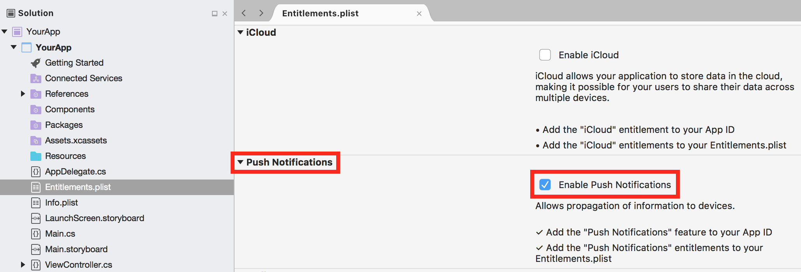
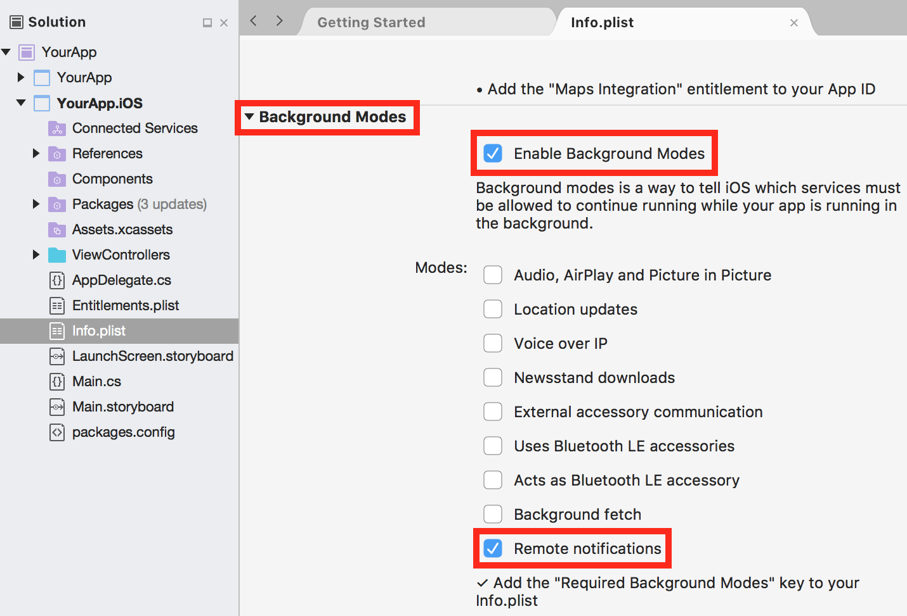

---
# required metadata

title: App Center Push for Xamarin.iOS Apps
description: Integrating App Center Push into Xamarin.iOS applications
keywords: sdk, push
author: elamalani
ms.author: emalani
ms.date: 02/14/2019
ms.topic: article
ms.assetid: 1fe3506e-ba5c-406d-8ba2-b38a2d1ca588
ms.service: vs-appcenter
ms.custom: sdk
ms.tgt_pltfrm: xamarin.ios
---

# App Center Push

> [!div  class="op_single_selector"]
> * [Android](android.md)
> * [iOS](ios.md)
> * [UWP](uwp.md)
> * [Xamarin.Android](xamarin-android.md)
> * [Xamarin.iOS](xamarin-ios.md)
> * [Xamarin.Forms](xamarin-forms.md)
> * [React Native Android](react-native-android.md)
> * [React Native iOS](react-native-ios.md)
> * [macOS](macos.md)
> * [Cordova Android](cordova-android.md)
> * [Cordova iOS](cordova-ios.md)
> * [Unity Android](unity-android.md)
> * [Unity iOS](unity-ios.md)
> * [Unity Windows](unity-windows.md)

> [!NOTE]
> Starting with version 1.11.0, calling `Push.DidReceiveRemoteNotification(...)` within a `UNUserNotificationCenterDelegate` is no longer necessary. If you implemented a `UNUserNotificationCenterDelegate` and are calling the `Push.DidReceiveRemoteNotification(...)` callback, please refer to [the App Center SDK migration guide](migration/xamarin-ios.md) to migrate your code.

App Center Push enables you to send push notifications to users of your app from the App Center portal.

## Prerequisite - Enable Apple Push Notifications service (APNs) for your app

Please configure Apple Push Notifications service (APNs) for your app from your Apple developer account and the App Center portal before adding App Center Push to your app. App Center Push won't get any notifications if you don't setup push notifications.

### Enable push notifications on your application

Double-click the **Entitlements.plist** file in your Xamarin Solution Explorer. This will open the Entitlements.plist editor. Check the **Enable Push Notifications** checkbox from the **Push Notifications** section.


[!include[](ios-apns-setup.md)]

For more information, refer to the [Xamarin documentation](https://docs.microsoft.com/xamarin/ios/platform/user-notifications/enhanced-user-notifications#configuring-the-remote-notifications-environment).

#### [Optional] Enable silent notifications

Silent notifications give you a way to wake up your app  so that it can refresh its data in the background (see [Xamarin documentation](https://docs.microsoft.com/en-us/xamarin/ios/app-fundamentals/backgrounding/ios-backgrounding-techniques/updating-an-application-in-the-background#silent-remote-notifications)). To enable silent notifications double-click the **Info.plist** file in your Xamarin Solution Explorer. This will open the Info.plist editor. Check **Background modes** then **Remote notifications** checkboxes from the **Background modes** section.



> [!NOTE]
> If there are no user-visible updates that go along with the background update, you can leave the title and message fields empty to prevent showing any visible notifications.

## Add App Center Push to your app

### 1. Add the App Center Push package

The App Center SDK is designed with a modular approach – a developer only needs to integrate the modules of the services that they're interested in. It can be integrated using Visual Studio or Package Manager Console.

[!include[](add-nuget.md)]

### 2. Start App Center Push

[!include[](start-push.md)]

> [!NOTE]
> If your Xamarin.iOS project is part of a [Xamarin.Forms](xamarin-forms.md) application, it is not necessary to add the call to `AppCenter.Start()` in the Xamarin.iOS portion of the project. The method call can instead be made from the PCL or shared project portion of your Xamarin.Forms application.

## Intercept push notifications

### Subscribe to the push event

[!include[](dotnet-push-event-intro.md)]

> [!NOTE]
> If silent notifications are enabled **and** you push a notification with `content-available: 1`, then the event may be triggered twice for the same notification: when the notification is received in background and when it is tapped.

[!include[](dotnet-push-event-example.md)]

## Custom data in your notifications

[!include[](custom-data-ios.md)]

## Enable or disable Push at runtime

[!include[](enable-or-disable.md)]

## Disable automatic method forwarding to App Center services

App Center uses swizzling to automatically forward various delegate methods to App Center services to improve SDK integration. There is a possibility of conflicts with other third party libraries or the delegates defined in your application. In this case, you should disable the App Center delegate forwarding for all App Center services by following the steps below:

1. Open your **Info.plist file**.
2. Add `AppCenterAppDelegateForwarderEnabled` key and set the value to `0`. This will disable application delegate forwarding for all App Center services.
3. Implement two methods to register push notifications

    Implement the methods `RegisteredForRemoteNotifications` and `FailedToRegisterForRemoteNotifications` in your `AppDelegate` class as follows:

    ```csharp
    public override void RegisteredForRemoteNotifications(UIApplication application, NSData deviceToken)
    {
        Push.RegisteredForRemoteNotifications(deviceToken);
    }
    ```

    ```csharp
    public override void FailedToRegisterForRemoteNotifications(UIApplication application, NSError error)
    {
        Push.FailedToRegisterForRemoteNotifications(error);
    }
    ```

   > [!NOTE]
   > You may have already implemented these methods while following Xamarin's documentation on enabling APNS. It is okay to replace the implementation from their example with the code provided above. You may also add the App Center lines of code above alongside existing code in your implementation of these methods.

4. Implement the callback to enable push event

    Implement `DidReceiveRemoteNotification` in your `AppDelegate` class as follows:

    ```csharp
    public override void DidReceiveRemoteNotification(UIApplication application, NSDictionary userInfo, System.Action<UIBackgroundFetchResult> completionHandler)
    {
        var result = Push.DidReceiveRemoteNotification(userInfo);
        if (result)
        {
            completionHandler(UIBackgroundFetchResult.NewData);
        }
        else
        {
            completionHandler(UIBackgroundFetchResult.NoData);
        }
    }
    ```

Now, the `Push.PushNotificationReceived` event will be invoked when your application receives a push notification. This event is also accessible from the PCL part of a Xamarin.Forms project.

### User Notification Center Delegate

1. Open your project's `Info.plist` file.
2. Add the `AppCenterUserNotificationCenterDelegateForwarderEnabled` key, and set the value to `0`. This disables `UNUserNotificationCenter` delegate forwarding for App Center Push.
3. Implement `UNUserNotificationCenterDelegate` callbacks and pass notification payload to App Center Push.

    ```csharp
    public override void WillPresentNotification (UNUserNotificationCenter center, UNNotification notification, Action<UNNotificationPresentationOptions> completionHandler) {

      //...

      // Pass the notification payload to MSPush.
      Push.DidReceiveRemoteNotification(notification.Request.Content.UserInfo);

      // Complete handling the notification.
      completionHandler(UNNotificationPresentationOptions.None);
    }

   public override void DidReceiveNotificationResponse (UNUserNotificationCenter center, UNNotificationResponse response, Action completionHandler) {

      //...

      // Pass the notification payload to MSPush.
     Push.DidReceiveRemoteNotification(response.Notification.Request.Content.UserInfo);

      // Complete handling the notification.
      completionHandler();
    }
    ```

## Common tasks for push notifications

### Handle a push notification while the app is in foreground

App Center Push allows apps to intercept push notifications and react to them, e.g. to display an alert, as described in [the App Center Push documentation](~/sdk/push/ios.md). In some cases, it is helpful to distinguish between push notifications received while the app is in the foreground or background, and handle them differently. The App Center SDK-provided callback is not enough in this case since the application's state will always be reported as `active`.

To distinguish between notifications received in the foreground and notifications received while the app was in the background, you must implement one of the callbacks defined in `UNUserNotificationDelegate`. Please see [Xamarin.iOS documentation](https://docs.microsoft.com/en-us/xamarin/ios/platform/user-notifications/enhanced-user-notifications) for more details.

> [!NOTE]
> The solution below requires iOS 10 or later.

1. Implement your own UNUserNotificationCenterDelegate class and implement the `WillPresentNotification(...)` callback.

    ```csharp
    using UserNotifications;

    public class YourOwnUNUserNotificationCenterDelegate : UNUserNotificationCenterDelegate
    {
        // This is a property that it is exposed so it can be used elsewhere.
        public bool didReceiveNotificationInForeground { get; set; }

        public override void WillPresentNotification(UNUserNotificationCenter center, UNNotification notification, Action<UNNotificationPresentationOptions> completionHandler)
        {
            // Do something, e.g. set a Boolean property to track the foreground state.
            this.didReceiveNotificationInForeground = true;

            // This callback overrides the system default behavior, so MSPush callback should be proxied manually.
            Push.DidReceiveRemoteNotification(notification.Request.Content.UserInfo);

            // Complete handling the notification.
            completionHandler(UNNotificationPresentationOptions.None);
        }
    }
    ```

    > [!NOTE]
    > If you pass `UNNotificationPresentationOptions.Alert` to the `completionHandler`, the default callback will also be called when the user clicked the notification. In this case, you don't need to call `Push.DidReceiveRemoteNotification` explicitly here to avoid duplication.

2. In your `AppDelegate`, add the following to the `FinishedLaunching(...)` to register your newly created custom `UNUserNotificationCenterDelegate`:

    ```csharp
    private YourOwnUNUserNotificationCenterDelegate myOwnNotificationDelegate = null;

    public override bool FinishedLaunching(UIApplication application, NSDictionary launchOptions)
    {

        // Your code, e.g. App Center setup code is here.

        if (UIDevice.CurrentDevice.CheckSystemVersion(10, 0))
        {
            this.myOwnNotificationDelegate = YourOwnUNUserNotificationCenterDelegate();
            UNUserNotificationCenter.Current.Delegate = this.myOwnNotificationDelegate;
        }

        return true;
    }
    ```

3. (Optional) If you have implemented the App Center Push SDK `PushNotificationReceived` callback, you may want adjust its behavior to a handle the foreground detection:

    ```csharp
    Push.PushNotificationReceived += (sender, e) =>
    {
        if (this.myOwnNotificationDelegate.didReceiveNotificationInForeground)
        {
            // Handle the push notification that was received while in foreground.
        }
        else
        {
            // Handle the push notification that was received while in background.
        }

        // Reset the property for next notifications.
        this.myOwnNotificationDelegate.didReceiveNotificationInForeground = false;
    };
    ```

### Detecting when a user has tapped on a push notification

Sometimes it is helpful to determine if user has tapped push notification. To perform this task you must implement one of the callbacks defined in `UNUserNotificationDelegate`. Please see [Apple's documentation](https://developer.apple.com/documentation/usernotifications/unusernotificationcenterdelegate) for more details.

> [!NOTE]
> The solution below requires iOS 10 or later.

1. Implement your own UNUserNotificationCenterDelegate class and implement the `DidReceiveNotificationResponse(...)` callback.

    ```csharp
    public class YourOwnUNUserNotificationCenterDelegate : UNUserNotificationCenterDelegate
    {

        public override void DidReceiveNotificationResponse(UNUserNotificationCenter center, UNNotificationResponse response, Action completionHandler)
        {
            if (response.IsDefaultAction)
            {
                // User tapped on notification
            }

            // This callback overrides the system default behavior, so MSPush callback should be proxied manually.
            Push.DidReceiveRemoteNotification(response.Notification.Request.Content.UserInfo);

            // Complete handling the notification.
            completionHandler();
        }
    }
    ```

2. In your `AppDelegate`, add the following to the `FinishedLaunching(...)` to register your newly created custom `UNUserNotificationCenterDelegate`:

    ```csharp
    private YourOwnUNUserNotificationCenterDelegate myOwnNotificationDelegate = null;

    public override bool FinishedLaunching(UIApplication application, NSDictionary launchOptions)
    {

        // Your code, e.g. App Center setup code is here.

        if (UIDevice.CurrentDevice.CheckSystemVersion(10, 0))
        {
            this.myOwnNotificationDelegate = YourOwnUNUserNotificationCenterDelegate();
            UNUserNotificationCenter.Current.Delegate = this.myOwnNotificationDelegate;
        }

        return true;
    }
    ```
