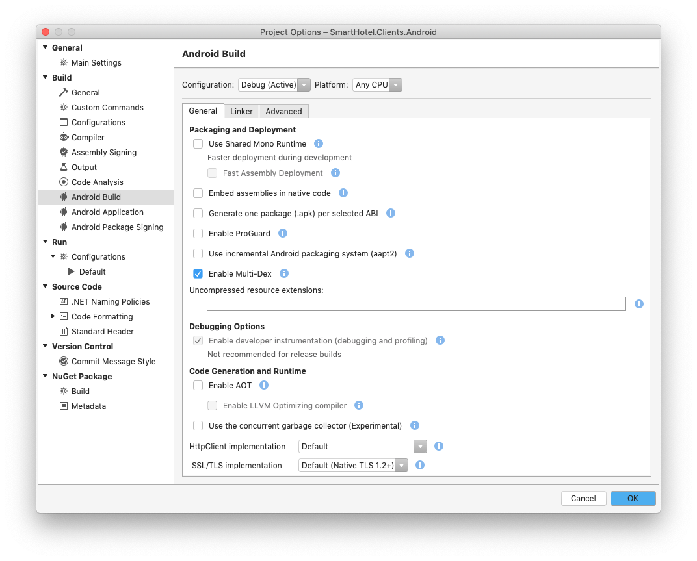
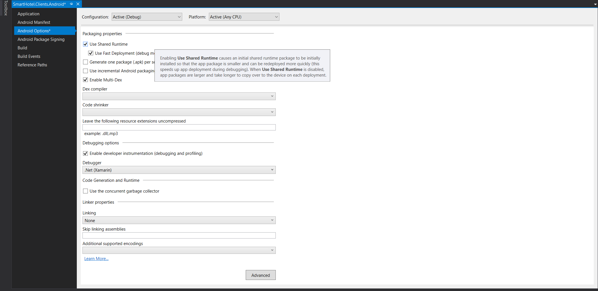

# Preparing Xamarin.Android Apps
This guide provides instructions for preparing Xamarin.UITests for upload to App Center Test. Select your platform to begin.

> [!IMPORTANT]
> Running Xamarin.UITest on Windows requires [setting the ANDROID_HOME environment variable with the path to the Android SDK](https://www.360logica.com/blog/how-to-set-path-environmental-variable-for-sdk-in-windows/)

To prepare a Xamarin.Android app and Xamarin.UITests for submission to App Center for Test:
1. Ensure that the app requests the `INTERNET` permission by inserting this snippet `<uses-permission android:name="android.permission.INTERNET" />` into the AndroidManifest.xml, outside the `<application>` tag.
2. Disable **Use Shared Mono Runtime**. The Shared Mono Runtime will prevent Xamarin.UITests from running in App Center for Test, and the CLI will throw the error "Mono Shared Runtime is not supported."


## Visual studio for Mac 
Disable **Use Shared Mono Runtime**. The Shared Mono Runtime will prevent Xamarin.UITests from running in App Center for Test.

In Visual Studio for Mac, open **Build > Android Build** then select **Project Options**. On the **General** tab, look for **Packaging and Deployment** and uncheck the **Use Shared Mono Runtime** checkbox.




## Visual Studio (Windows)
Disable **Use Shared Mono Runtime**. The Shared Mono Runtime will prevent Xamarin.UITests from running in App Center for Test, and may throw a `Mono dependency error` during upload.

In Visual Studio 2019, open the project properties, and select the **Android Options** tab. In the first section, look for **Packaging Properties**, then uncheck the **Use Shared Runtime** checkbox.



### Generating an upload command
Once a test suite is prepared, you can [setup a test run](~/test-cloud/starting-a-test-run.md) to upload and run your tests. That process will generate a prototype command line like this:

```bash 
appcenter test run uitest --app "MyOrg/MyApp" --devices "MyOrg/MyDeviceSet" --app-path pathToFile.apk --test-series "main" --locale "en_US" --build-dir pathToUITestBuildDir
```

The command line requires some modifications:
1. You _must_ provide paths for the arguments `--app-path` & `--build-dir`.
2. You _may_ need to specify the UITest package you're using, if the CLI can't automatically find it: `--uitest-tools-dir /Users/{your username}/.nuget/packages/xamarin.uitest/{UITest version}/tools`

