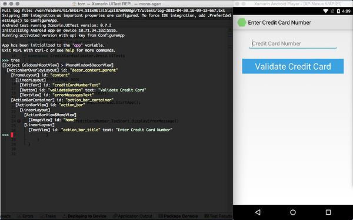

# Working with the REPL
An important tool in creating Xamarin.UITests is the *REPL* (*read-eval-print-loop*). The REPL is a console-like environment where you can dynamically experiment with UITest expressions. The REPL evaluates them, runs them live in the app, and logs detailed output. Expressions can be copied from the REPL tool and used directly in your UITest project.

## Starting the REPL
The REPL can only be started by running a test that calls the `IApp.Repl()` method:

```csharp
[TestFixture]
public class Tests
{
    AndroidApp app;

    [SetUp]
    public void BeforeEachTest()
    {
        app = ConfigureApp.Android.StartApp();
    }

    [Test]
    public void CreditCardNumber_TooShort_DisplayErrorMessage()
    {
        app.Repl();
    }
}
```

When the test is run and `.Repl()` is invoked, Xamarin.UITest will halt the test and start the REPL in a terminal window:


#### [Visual Studio](#tab/vswin/)
[ ](./images/repl-01-vs.png#lightbox)


#### [Visual Studio for Mac](#tab/vsmac/)
[ ](./images/repl-02-xs.png#lightbox)

* * *

> [!TIP]
> If the REPL window doesn't appear on macOS, go to **System Preferences > Security & Privacy > Privacy > Automation**, search for **Visual Studio**, and make sure **Terminal** is checked. Then try launching it again.

There are three ways to exit the REPL:

* Pressing **Ctrl-C**
* Typing **exit**
* Typing **quit**

Xamarin.UITest will resume executing the rest of the test when the REPL is closed.

## Using the REPL
The REPL provides an instance of `IApp` that will allow interaction with the application. The REPL also provides two commands that are useful for creating Xamarin.UITests, the `tree` command and the `copy` command.

A common workflow is to use the `tree` command or `IApp.Flash` to identify views on the screen and to obtain meta-data about those views. That information is used to create `AppQueries` and spike out the steps that will make up a test. Then the `copy` command can be used to copy that work to the clipboard so that it may be pasted into the test.

## Discovering Views With the tree Command
The `tree` command will display a hierarchical list of the views that are visible on the screen: 

#### [Visual Studio](#tab/vswin/)
[ ](./images/repl-02-vs.png#lightbox)


#### [Visual Studio for Mac](#tab/vsmac/)
[ ](./images/repl-02-xs.png#lightbox)

* * *

## Discovering Views with IApp.Flash
Many Xamarin.UITest API methods accept an `AppQuery` object to locate views on the screen. The `IApp.Flash()` method can be helpful in testing these queries in the REPL. `IApp.Flash()` will highlight the results of the query by making them flash, and return some details about the views in the results.

As an example, the following snippet shows how we can locate all of the `EditText` views that are visible on an Android activity:

```bash
>>> app.Flash(c=>c.Class("EditText"))                               
Flashing query for Class("EditText") gave 1 results.
[
  {
    "Id": "creditCardNumberText",
    "Description": "android.widget.EditText{528165e4 VFED..CL .F...... 139,70-941,178 #7f050001 app:id/creditCardNumberText}",
    "Rect": {
      "Width": 802.0,
      "Height": 108.0,
      "X": 139.0,
      "Y": 274.0,
      "CenterX": 540.0,
      "CenterY": 328.0
    },
    "Label": null,
    "Text": "",
    "Class": "android.widget.EditText",
    "Enabled": true
  }
]
```

We can use the `Flash` method to help create `AppQuery`s to use in conjunction with the other APIs to work out a test.

## Creating Steps in a Test
Let's see how we can use the REPL to quickly create and try individual steps in a test.

As an example, we can use the results of the `tree` command above. If our test is required to enter text in the `EditText` with the ID of <span class="uiitem">creditCardNumberText</span>, it could use the `IApp.EnterText` method:

```bash
>>> app.EnterText(c=>c.Marked("creditCardNumberText"), "1234567890123456")
Using element matching Marked("creditCardNumberText").
Tapping coordinates [ 540, 328 ].
```

Likewise, if the test needs to simulate the user tapping on a button, it could use the `IApp.Tap` method:

```bash
>>> app.Tap(c=>c.Marked("validateButton"))
Using element matching Marked("validateButton").
Tapping coordinates [ 540, 533 ]. 
```

## Using the `copy` Command
The REPL keeps a history of the commands entered during the session. The `copy` command adds the history to the clipboard so you can paste them into your app:

```text
>>> copy
Copying history to clipboard.
```