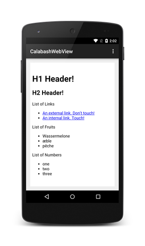
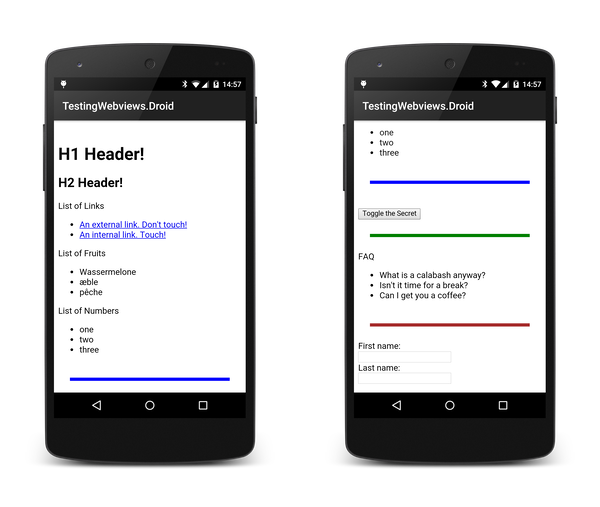
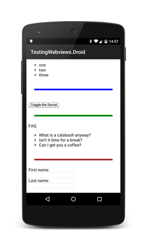

# Working with WebViews
Xamarin.UITest provides APIs for locating and interaction with views in native mobile applications. However, some mobile apps are hybrid apps that use webviews to display HTML to the user. Android provides the `android.webkit.WebView`, while iOS applications may use either [UIWebView](https://docs.microsoft.com/dotnet/api/UIKit.UIWebView/) or [WKWebView](https://docs.microsoft.com/dotnet/api/WebKit.WKWebView/). UIWebView is older and compatible with all versions of iOS, while WKWebView is for iOS 8 and higher.
  
Interacting with webviews is a bit more involved as UITest must first obtain a reference to the webview, and then to the DOM elements it contains.

## WebView APIs in UITest
There are two APIs to obtain a reference to a webview control in UITest:
 
* **[AppQuery.WebView](https://docs.microsoft.com/dotnet/api/Xamarin.UITest.Queries.AppQuery.WebView/)**  is used for `UIWebView` controls.
* **[AppQuery.Class](https://docs.microsoft.com/dotnet/api/Xamarin.UITest.Queries.AppQuery.Class/)** is used for `WKWebView` controls.

Each of these will be discussed in more detail below. 

## Locating the `UIWebView` control with AppQuery.WebView
UITest provides the [AppQuery.WebView](https://docs.microsoft.com/dotnet/api/Xamarin.UITest.Queries.AppQuery.WebView/) method to obtain a reference to a `UIWebView` control.  The following snippet is an example:

```text
>>> app.Query(c=>c.WebView())       
```

If there's only one webview on the screen, then `WebView` will default to that one webview. If there are multiple webviews on the screen, the [`WebView(Int32)`](https://docs.microsoft.com/dotnet/api/Xamarin.UITest.Queries.AppQuery.WebView#Xamarin_UITest_Queries_AppQuery_WebView_System_Int32_) can be used to isolate one by passing a zero-based index.


## Locating the `WKWebView` control
UITest provides the [AppQuery.Class](https://docs.microsoft.com/dotnet/api/Xamarin.UITest.Queries.AppQuery.Class/) method to obtain a reference to a `WKWebView` control.  The following snippet is an example:

```text
>>> app.Query(c=>c.Class("WKWebView"))
```                

## Interacting with DOM Elements in a webview control
Once the webview has been isolated, there are two main APIs for interacting with DOM elements:

* **CSS** &ndash; This API uses CSS selectors to locate DOM elements displayed by the webview.
* **XPath** &ndash; UITest can use XPath expressions to locate DOM elements in the webview.

The XPath API, while more powerful is also more complicated to use. In general, preference should be given to the CSS API, and the XPath API used when necessary.

### CSS
It's possible to match HTML elements using the [AppQuery.Css](https://docs.microsoft.com/dotnet/api/Xamarin.UITest.Queries.AppQuery.Css#Xamarin_UITest_Queries_AppQuery_Css_System_String_) method. This method takes a CSS selector and will return an array of all HTML elements that match. Functionally, this API is the same on Android and iOS.

For example, the following Android activity contains an [`android.webkit.WebView`](https://docs.microsoft.com/dotnet/api/Android.Webkit.WebView/):

[ ](./images/webviews-android-01.png#lightbox)

This snippet shows how to locate all H1 DOM elements in the webview:

```text
>>> app.Query(c=>c.Css("H1"))                                                                                
Query for Css("H1") gave 1 results.
[
    [0] {
        Id => "",
        NodeType => "ELEMENT_NODE",
        NodeName => "H1",
        Class => "",
        Html => "<h1>H1 Header!</h1>",
        Value => null,
        WebView => "webView1",
        TextContent => "H1 Header!",
        Rect => {
            Width => 1032,
            Height => 117,
            CenterX => 540,
            CenterY => 408,
            Top => 44,
            Bottom => 83,
            Left => 8,
            Right => 352,
            X => 24,
            Y => 351
        }
    }
]
```

If there's more than one webview on a given screen, then UITest will automatically default to the first webview. If there are multiple webviews, then it's necessary to explicitly identify the webview using [`IApp.WebView(Int32)`](https://docs.microsoft.com/dotnet/api/Xamarin.UITest.Queries.AppQuery.WebView#Xamarin_UITest_Queries_AppQuery_WebView_System_Int32_). For example, if a screen had two webviews and we want to find all the H1 elements in the second webview:

```text
>>> app.Query(c=>c.WebView(1).Css("H1"))                                                                                
Query for WebView().Css("H1") gave 1 results.
[
    [0] {
        Id => "",
        NodeType => "ELEMENT_NODE",
        NodeName => "H1",
        Class => "",
        Html => "<h1>H1 Header!</h1>",
        Value => null,
        WebView => "webView1",
        TextContent => "H1 Header!",
        Rect => {
            Width => 1032,
            Height => 117,
            CenterX => 540,
            CenterY => 408,
            Top => 44,
            Bottom => 83,
            Left => 8,
            Right => 352,
            X => 24,
            Y => 351
        }
    }
]
```

If more than one HTML element matches the CSS query, the `Index` method can be used to access an individual element in the result set. For example, the following snippet shows how to access the third element of HTML elements with the `.user` style:

```text
>>> app.Tap(c => c.Css(".user").Index(2));
```

### XPath
XPath is a powerful API for searching the DOM, but can be a bit more difficult to use compared to the CSS API. UITest can locate DOM elements by an XPath selector passed to the [AppQuery.XPath](https://docs.microsoft.com/dotnet/api/Xamarin.UITest.Queries.AppQuery.XPath#Xamarin_UITest_Queries_AppQuery_XPath_System_String_) method. This API is the same on Android and iOS.

The following snippet is an example of how to match the H1 DOM element from the previous section using XPath:

```text
>>> app.Query(c=>c.XPath("//h1"))
Query for XPath("//h1") gave 1 results.
[
    [0] {
        Id => "",
        NodeType => "ELEMENT_NODE",
        NodeName => "H1",
        Class => "",                                                                                                   
        Html => "<h1>H1 Header!</h1>",
        Value => null,
        WebView => "webView1",
        TextContent => "H1 Header!",
        Rect => {
            Width => 1032,
            Height => 117,
            CenterX => 540,
            CenterY => 408,
            Top => 44,
            Bottom => 83,
            Left => 8,
            Right => 352,
            X => 24,
            Y => 351
        }
    }
]
```

## Invoking JavaScript
It's also possible to locate webviews using the [`AppQuery.InvokeJS`](https://docs.microsoft.com/dotnet/api/Xamarin.UITest.Queries.AppQuery.InvokeJS#Xamarin_UITest_Queries_AppQuery_InvokeJS_System_String_) method. This method takes a query in the form of, and invokes JavaScript on the view elements matched by the query. If view elements other than WebViews are found, the execution will halt and an Exception will be thrown.

### InvokeJS on Android
Generally speaking Android requires that the JavaScript `returns` the value; otherwise the query will return `null`:

```text
>>> app.Query (w => w.WebView ().InvokeJS ("document.getElementById('lastname').value"))
[
[0] "null"
]
>>> app.Query (w => w.WebView ().InvokeJS ("return document.getElementById('lastname').value"))
[
[0] "Smith"
]
```

### InvokeJS on iOS
Generally speaking, on iOS the `return` isn't used:

```text
>>> app.Query (w => w.WebView ().InvokeJS ("return document.getElementById('lastname').value"))
[
[0] ""
]

>>> app.Query (w => w.WebView ().InvokeJS("document.getElementById('lastname').value"))
[
[0] "Smith"
]
```

## Examples
This section will cover some common use cases that may be found when writing Calabash tests involving webviews.

### Scrolling
It's possible to scroll a webview to bring DOM elements onto the screen. This is accomplished using the `IApp.ScrollDownTo` or `IApp.ScrollUpTo` methods. The signature of these methods is similar:

```csharp
IApp.ScrollDownTo(Func<AppQuery, AppWebQuery> toQuery,
                  string withinMarked,
                  ScrollStrategy strategy,
                  Nullable<TimeSpan> timeout)
```

Here is a quick description of the parameters:

* `toQuery` - this is a UITest web query that will locate a DOM element in the webview.
* `withinMarked` - this is a string that will located the webview on the screen. This parameter is optional if there's only one webview on the screen. This string will used by `IApp.Marked` to locate the webview on the screen.
* `strategy` - this optional parameter tells UITest how to scroll within the webview. `ScrollStrategy.Gesture` will try to emulate how a user would scroll, by dragging the screen. `ScrollStrategy.Programatic` frees up UITest to scroll in the quickest way possible. `ScrollStrategy.Auto` tells UITest to use any combination of `Gesture` and `Programatic` to scroll (with a preference to `Programatic`).
* `timeout` - an optional parameter that specifies how long UITest should wait before timing out the query.

As an example of using these APIs, consider the screenshots of a webview embedded in an Android application:


[ ](./images/webviews-android-02.png#lightbox)

If we examine the view hierarchy of this Activity in the REPL, we can see the following:

```text
>>> tree                                                                                                                
[[object CalabashRootView] > PhoneWindow$DecorView]                                                                     
  [ActionBarOverlayLayout] id: "decor_content_parent"
    [FrameLayout > LinearLayout] id: "content"
      [WebView] id: "webView1",  label: "WebView"
        [dom] id: "show_secret"
        [dom] id: "firstname"
        [dom] id: "lastname"
    [ActionBarContainer] id: "action_bar_container"
      [Toolbar] id: "action_bar"
        [TextView] text: "TestingWebviews.Droid"
  [View] id: "statusBarBackground"
  [View] id: "navigationBarBackground"
```

The output from the `tree` command tells us that the webview has an the ID `webView1`, and contains three DOM elements:

* an HTML button called `show_secret` with the markup `<button id="show_secret">Toggle the Secret</button>`
* an HTML input field `firstname`, with the markup `<input type="text" name="firstname" id='firstname'>`
* an HTML input field `lastname`, with the markup `<input type="text" name="lastname" id='lastname'>`

The `show_secret` button is visible on the screen, but `firstname` and `lastname` aren't. Before a UITest may interact with those DOM elements, it's necessary to use the scrolling APIs to bring those fields into view. The following snippet from the REPL shows how to scroll the HTML input elements into view using the `ScrollDownTo` API:

```text
>>> app.ScrollDownTo(c=>c.Css("#firstname"))                              
Scrolling down to Css("#firstname")
```

### Entering Text
Entering text into an HTML input element is accomplished by providing text and an `AppWebQuery` using [`AppQuery.EnterText`](https://docs.microsoft.com/dotnet/api/Xamarin.UITest.IApp.EnterText#Xamarin_UITest_IApp_EnterText_System_Func_Xamarin_UITest_Queries_AppQuery_Xamarin_UITest_Queries_AppQuery__System_String_) API . Given the following screenshot of a webview in an Android application:


[ ](./images/webviews-android-03.png#lightbox)

The following code snippet will show to enter text into the `firstname` HTML input element:

```csharp
[Test]
public void ScrollDownAndEnterName()
{
  app.ScrollDownTo(c => c.Css("input#firstname"), );
  app.EnterText(c => c.Css("input#firstname"), "Monkey");		

  // A more verbose way to enter text, explicitly identifying the webview and ScrollStrategy
  app.ScrollDownTo(c => c.Css("input#lastname"), "webView1", ScrollStrategy.Gesture);
  app.EnterText(c => c.Css("input#lastname"), "Chimpanzee");

}
```
