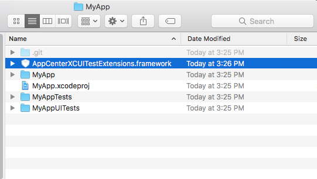

# Preparing XCUITest Tests for Upload

[**AppCenter XCUITest
Extensions**](https://github.com/Microsoft/AppCenter-Test-XCUITest-Extensions)
is an iOS Framework for taking screenshots and labeling test steps when
running XCUITest test in App Center or Xamarin Test Cloud. At the
conclusion of each test method, a label and screenshot are automatically
generated for the test report. You can create additional labels and
screenshots to track your app's progress during a test method.

**This framework is _required_ for running XCUITests in App Center and
Xamarin Test Cloud.**

If you encounter a problem, please file a GitHub
[issue](https://github.com/Microsoft/AppCenter-Test-XCUITest-Extensions/issues).

## Requirements

* XCode >= 9.0
* Sierra or High Sierra
* iOS >= 9.0

You must launch your application using the `ACTLaunch` API.

### Objective-C

```obj-c
//Insert before @interface
#import <AppCenterXCUITestExtensions/AppCenterXCUITestExtensions.h>


XCUIApplication *app = act_launch
XCUIApplication *app = act_launch_app([[XCUIApplication alloc] init]);

XCUIApplication *app = [ACTLaunch launch];
XCUIApplication *app = [ACTLaunch launchApplication:[[XCUIApplication alloc] init]];
```
### Swift

```swift
//insert before class
import AppCenterXCUITestExtensions

let app = ACTLaunch.launch()
let app = ACTLaunch.launch(XCUIApplication())
```

## Usage

Be sure that you launch your app with the `ACTLaunch` API. See the
examples in the [Requirements](#requirements) section.

* **[ACTLabelTest.m](https://github.com/Microsoft/AppCenter-Test-XCUITest-Extensions/blob/master/TestApp/Tests/UI/ACTLabelTest.m)** &ndash; Examples in Objective-C
* **[ACTLabelTest.swift](https://github.com/Microsoft/AppCenter-Test-XCUITest-Extensions/blob/master/TestApp/Tests/UI/ACTLabelTest.swift)** &ndash; Examples in Swift

## Adding the AppCenterXCUITestExtensions to an Xcode Project

The **AppCenterXCUITestExtensions.framework** needs to be linked with
the project's XCUITest target.  The framework should _not_ be linked
with the project's iOS application.

1. [Carthage](#carthage) &ndash; Preferred. This is a dependency manager for iOS and macOS.
2. [Building from Source](#building_from_source) &ndash; Build the extension from source and manually add it to the Xcode project.
3. [CocoaPods](#cocoapods) &ndash; For those who are already using CocoaPods.

### <a name="carthage" /> Carthage

Install carthage with [homebrew](http://brew.sh/):

```shell
$ brew install carthage
```

Create a `Cartfile` with the following contents:

```
github "Microsoft/AppCenter-Test-XCUITest-Extensions"
```

Follow the [Carthage
Instructions](https://github.com/Carthage/Carthage#adding-frameworks-to-unit-tests-or-a-framework)
for installing frameworks from a Cartfile.

Remember that the **AppCenterXUITestExtensions.framework** needs to be
linked with the XCUITest target and _not_ the iOS application.

You can check this test code as an example for setting up App Center XCUITest [Example code](https://github.com/Microsoft/AppCenter-Test-XCUITest-Extensions/tree/master/Dido)

### <a name="building_from_source" /> Building from Source

##### 1. Make the AppCenterXCUITestExtensions.framework

```shell
$ git clone git@github.com:Microsoft/AppCenter-Test-XCUITest-Extensions.git
$ cd AppCenter-Test-XCUITest-Extensions
$ make
...
INFO: Installed Products/framework/AppCenterXCUITestExtensions.framework
INFO: Done!
```

##### 2. Copy `AppCenterXCUITestExtensions.framework` into your application's project folder.

Use the Finder to drag-and-drop or use `ditto` to perserve symbolic
links and file attributes.

```shell
$ ditto Products/framework/AppCenterXCUITestExtensions.framework \
  path/to/MyApp/AppCenterXCUITestExtensions.framework
```



##### 3. Link AppCenterXCUITestExtensions.framework with the XCUITest target

In Xcode, in the 'Build Phases' tab of the _XCUITest target_ (not the
main application target), add the
`AppCenterXCUITestExtensions.framework` in the 'Link Binary With
Libraries' phase.

In the same tab, add a 'Copy Files' phase with Destination: Frameworks
and add the `AppCenterXCUITestExtensions.framework`.

Note that your project may already have a 'Copy Files' phase.


When you are finished, your Build Phases pane should resemble the
following:


Here is a Swift example [Code example](https://github.com/Microsoft/AppCenter-Test-XCUITest-Extensions/tree/master/StickShift)

### <a name="cocoapods" /> Cocoapods

If you are not already using CocoaPods, we recommend you use Carthage or
manually linking the framework.

Update your `Podfile` in your Xcode project folder with the following:

```ruby
use_frameworks! # required for projects with Swift sources

target 'MyAppUITests' do pod 'AppCenterXCUITestExtensions' end
```

'MyAppUITests' should be the name of the target for your XCUITests.

```shell
$ pod install
```

Code example for CocoaPods [Code example](https://github.com/Microsoft/AppCenter-Test-XCUITest-Extensions/tree/master/BeetIt)

## Build For Testing

In order to run a test in App Center or Xamarin Test Cloud, you will
need to build your application and an XCUITest bundle. To do this, run
the following command from the root of your application project
directory:

```shell
$ rm -rf DerivedData
$ xcrun xcodebuild build-for-testing \
  -configuration Debug \
  -workspace YOUR_WORKSPACE \
  -sdk iphoneos \
  -scheme YOUR_APP_SCHEME \
  -derivedDataPath DerivedData
```

This will build your app and an XCUITest bundle into the
`DerivedData/Build` directory. Your app and XCUITest bundle will be
located in the `DerivedData/Build/Products/Debug-iphoneos/` directory.

`YOUR_WORKSPACE` should point to a `.xcworkspace` file, likely titled
`PROJECT_NAME.xcworkspace`. `YOUR_APP_SCHEME` should be the scheme you
use to build your application. By default it is usually the name of your
application. To see the list of schemes defined in your Xcode project,
run:

```shell
$ xcrun xcodebuild -list
```

For a concrete example of generating an app and an XCUITest bundle, see
**[bin/make/build-for-testing.sh](https://github.com/Microsoft/AppCenter-Test-XCUITest-Extensions/blob/master/bin/make/build-for-testing.sh)**.

## Uploading Tests to App Center

Tests are uploaded to App Center using the `appcenter` command line tool.

To install, follow the instructions in the README of the [AppCenter-CLI
GitHub](https://github.com/Microsoft/AppCenter-CLI) repository.

Use the App Center Test page to generate a device selection and 
an example command-line invocation. For more information, see [Starting a Test run](~/test-cloud/starting-a-test-run.md).

```
# Follow the instructions to generate a resuable API token.
# Save this token, you will use it later, but keep it private.
$ app-center login

# Generate an XCUITest bundle and your iOS application as describe above.
$ rm -rf DerivedData
$ xcrun xcodebuild build-for-testing [args] -derivedDataPath DerivedData

# Upload your test to App Center
$ appcenter test run xcuitest \
  --app "<app center username/<app name>" \
  --devices DEVICE_SET \
  --test-series "master" \
  --locale "en_US" \
  --build-dir DerivedData \
  --token APP_CENTER_API_TOKEN
```

For a concrete example of submitting tests to App Center, see
**[bin/make/appcenter.sh](https://github.com/Microsoft/AppCenter-Test-XCUITest-Extensions/blob/master/bin/make/appcenter.sh)**.
