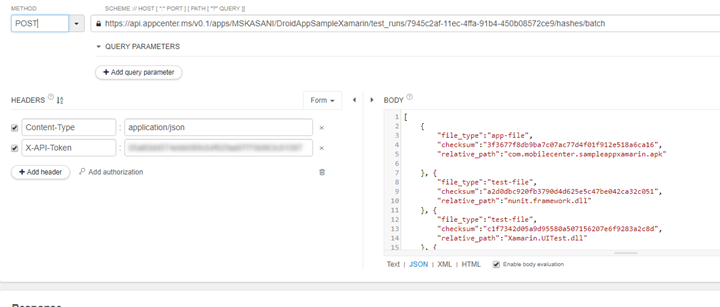

# Run UI Tests using AppCenter REST API
We've received a lot of requests where users wanted an example on how to Upload their App Package, Test Binaries and queue UI Tests using our API. 

We've decided to create a highly detailed one. We hope you find this useful and informative! 

### Steps
1. [Create a new test run](https://openapi.appcenter.ms/#/test/test_createTestRun) using the POST Method. Once the request is sent, you'll recieve a **test run ID** in the Response Header. You should save that ID for reference.

**Sample Request** https://api.appcenter.ms/v0.1/apps/MSKASANI/DroidAppSampleXamarin/test_runs 


2. **Create file hashes** for each file you want to upload to AppCenter Test.

You can get the file hashes by running the command `shasum`. This utility is available in Mac/Linux machines by default. For Windows, consider installing Git Bash and use it instead.

**Example**
```bash
ankasani@AK--PC MINGW64 ~/source/repos/AppXamarin/sampleapp-xamarin-master/UITest/bin/Debug/testdlls (master)

$ shasum nunit.framework.dll

 a2d0dbc920fb3790d4d625e5c47be042ca32c051 *nunit.framework.dll

$ shasum Xamarin.UITest.dll

c1f7342d05a9d95580a507156207e6f9283a2c8d *Xamarin.UITest.dll

$ shasum UITest.dll

542153902bc889d0d85a83b005854b5ebd9864f1 *UITest.dll

$ shasum com.mobilecenter.sampleappxamarin.apk

3f3677f8db9ba7c07ac77d4f01f912e518a6ca16 *com.mobilecenter.sampleappxamarin.apk
```

3. [Create a store for files](https://openapi.appcenter.ms/#/test/test_uploadHashesBatch) uisng POST and hashes value calculated from the previous step. 

**Sample Request**
https://api.appcenter.ms/v0.1/apps/MSKASANI/DroidAppSampleXamarin/test_runs/fb0cc373-aa4a-455f-b083-4fc1afa87f2e/hashes/batch

   - **file_type** - app-file for apk\ipa and test-file for test assemblies/test related files.

   - **checksum** - hash values from step 2 

   - **relative_path** - you can just define File Name with Extension, no need to specify the complete path.
   
The JSON Body looks like:

```json
[
    {
     "file_type":"app-file", 
     "checksum":"3f3677f8db9ba7c07ac77d4f01f912e518a6ca16",
     "relative_path":"com.mobilecenter.sampleappxamarin.apk"
    }, 
    
    {
     "file_type":"test-file",
     "checksum":"a2d0dbc920fb3790d4d625e5c47be042ca32c051",
     "relative_path":"nunit.framework.dll"
    }, 
    
    {
     "file_type":"test-file",
     "checksum":"c1f7342d05a9d95580a507156207e6f9283a2c8d",
     "relative_path":"Xamarin.UITest.dll"
    }, 
    
    {
     "file_type":"test-file",
     "checksum":"542153902bc889d0d85a83b005854b5ebd9864f1",
     "relative_path":"UITest.dll"
    }
]
```


The response looks like:
```json
[
    {
     "fileType": "app-file",
     "checksum": "3f3677f8db9ba7c07ac77d4f01f912e518a6ca16",
     "relativePath": "com.mobilecenter.sampleappxamarin.apk",
     
     "uploadStatus":
        {
         "statusCode": 412,
         "location": "https://testcloud.xamarin.com/v0.1/direct_uploads?token=ZXlKMGVYQWlPaUpLVjFRaUxDSmhiR2NpT2lKU1V6STFOaUo5LmV5SjBaWE4w%0AWDNKMWJsOXBaQ0k2SWpjNU5EVmpNbUZtTFRFeFpXTXROR1ptWVMwNU1XSTBM%0AVFExTUdJd09EVTNNbU5sT1NJc0ltVjRjQ0k2TVRVek16Z3dOVFEzTUgwLlJO%0AaTQ3VTNPYTB5YWswMVRVdTV6Q0dfWFhwV25QUWJDdkJaNmVCRWRmOENuQ19U%0AbmdpRGI4MU0yYk1lTlZNY1VCVmRWLXlkRjh4dElLaU1yNFdtQUFhOFdoay02%0AOVVjb29rYkNTYUU2eUlzamowZlZPZVJhR2lFdGpvLWJHTFJLcXNGY0ZTeUdR%0ARTQzQUZ1TFlyTWlCRnowMElpd3ZudjYzZk9wQnRGaXhNa2lNNjhUTWxxVnNa%0AOFl3TFlTeU5KSWFvYVJCM0ZZTUkwajNYOWdVb3VJclVjNnpqcGNkYkxCcWJ0%0AVUpyN0ZFaTdJeWY4UG9rMXZxTzRlUExiaEszTmItTmd0Q2JuckZzS2x6Z3Za%0AaktUWHZZb2oya0FGWXZHaVZ4LVhfNVhUcGdiVnE1Z2dxVEtIdjRaUGFuaGR4%0AdnFvZ2YxRVYwWUJYaG40YUJLM3BnUVBodw%3D%3D%0A"
        }
    },

    {
     "fileType": "test-file",
     "checksum": "a2d0dbc920fb3790d4d625e5c47be042ca32c051",
     "relativePath": "nunit.framework.dll",
     
     "uploadStatus":
        {
         "statusCode": 412,
         "location": "https://testcloud.xamarin.com/v0.1/direct_uploads?token=ZXlKMGVYQWlPaUpLVjFRaUxDSmhiR2NpT2lKU1V6STFOaUo5LmV5SjBaWE4w%0AWDNKMWJsOXBaQ0k2SWpjNU5EVmpNbUZtTFRFeFpXTXROR1ptWVMwNU1XSTBM%0AVFExTUdJd09EVTNNbU5sT1NJc0ltVjRjQ0k2TVRVek16Z3dOVFEzTUgwLlJO%0AaTQ3VTNPYTB5YWswMVRVdTV6Q0dfWFhwV25QUWJDdkJaNmVCRWRmOENuQ19U%0AbmdpRGI4MU0yYk1lTlZNY1VCVmRWLXlkRjh4dElLaU1yNFdtQUFhOFdoay02%0AOVVjb29rYkNTYUU2eUlzamowZlZPZVJhR2lFdGpvLWJHTFJLcXNGY0ZTeUdR%0ARTQzQUZ1TFlyTWlCRnowMElpd3ZudjYzZk9wQnRGaXhNa2lNNjhUTWxxVnNa%0AOFl3TFlTeU5KSWFvYVJCM0ZZTUkwajNYOWdVb3VJclVjNnpqcGNkYkxCcWJ0%0AVUpyN0ZFaTdJeWY4UG9rMXZxTzRlUExiaEszTmItTmd0Q2JuckZzS2x6Z3Za%0AaktUWHZZb2oya0FGWXZHaVZ4LVhfNVhUcGdiVnE1Z2dxVEtIdjRaUGFuaGR4%0AdnFvZ2YxRVYwWUJYaG40YUJLM3BnUVBodw%3D%3D%0A"
        }
    },
 
    {
     "fileType": "test-file",
     "checksum": "c1f7342d05a9d95580a507156207e6f9283a2c8d",
     "relativePath": "Xamarin.UITest.dll",
     
     "uploadStatus":
        {
         "statusCode": 412,
         "location": "https://testcloud.xamarin.com/v0.1/direct_uploads?token=ZXlKMGVYQWlPaUpLVjFRaUxDSmhiR2NpT2lKU1V6STFOaUo5LmV5SjBaWE4w%0AWDNKMWJsOXBaQ0k2SWpjNU5EVmpNbUZtTFRFeFpXTXROR1ptWVMwNU1XSTBM%0AVFExTUdJd09EVTNNbU5sT1NJc0ltVjRjQ0k2TVRVek16Z3dOVFEzTUgwLlJO%0AaTQ3VTNPYTB5YWswMVRVdTV6Q0dfWFhwV25QUWJDdkJaNmVCRWRmOENuQ19U%0AbmdpRGI4MU0yYk1lTlZNY1VCVmRWLXlkRjh4dElLaU1yNFdtQUFhOFdoay02%0AOVVjb29rYkNTYUU2eUlzamowZlZPZVJhR2lFdGpvLWJHTFJLcXNGY0ZTeUdR%0ARTQzQUZ1TFlyTWlCRnowMElpd3ZudjYzZk9wQnRGaXhNa2lNNjhUTWxxVnNa%0AOFl3TFlTeU5KSWFvYVJCM0ZZTUkwajNYOWdVb3VJclVjNnpqcGNkYkxCcWJ0%0AVUpyN0ZFaTdJeWY4UG9rMXZxTzRlUExiaEszTmItTmd0Q2JuckZzS2x6Z3Za%0AaktUWHZZb2oya0FGWXZHaVZ4LVhfNVhUcGdiVnE1Z2dxVEtIdjRaUGFuaGR4%0AdnFvZ2YxRVYwWUJYaG40YUJLM3BnUVBodw%3D%3D%0A"
        }
    },

    {
     "fileType": "test-file",
     "checksum": "542153902bc889d0d85a83b005854b5ebd9864f1",
     "relativePath": "UITest.dll",
     
     "uploadStatus":
        {
         "statusCode": 412,
         "location": "https://testcloud.xamarin.com/v0.1/direct_uploads?token=ZXlKMGVYQWlPaUpLVjFRaUxDSmhiR2NpT2lKU1V6STFOaUo5LmV5SjBaWE4w%0AWDNKMWJsOXBaQ0k2SWpjNU5EVmpNbUZtTFRFeFpXTXROR1ptWVMwNU1XSTBM%0AVFExTUdJd09EVTNNbU5sT1NJc0ltVjRjQ0k2TVRVek16Z3dOVFEzTUgwLlJO%0AaTQ3VTNPYTB5YWswMVRVdTV6Q0dfWFhwV25QUWJDdkJaNmVCRWRmOENuQ19U%0AbmdpRGI4MU0yYk1lTlZNY1VCVmRWLXlkRjh4dElLaU1yNFdtQUFhOFdoay02%0AOVVjb29rYkNTYUU2eUlzamowZlZPZVJhR2lFdGpvLWJHTFJLcXNGY0ZTeUdR%0ARTQzQUZ1TFlyTWlCRnowMElpd3ZudjYzZk9wQnRGaXhNa2lNNjhUTWxxVnNa%0AOFl3TFlTeU5KSWFvYVJCM0ZZTUkwajNYOWdVb3VJclVjNnpqcGNkYkxCcWJ0%0AVUpyN0ZFaTdJeWY4UG9rMXZxTzRlUExiaEszTmItTmd0Q2JuckZzS2x6Z3Za%0AaktUWHZZb2oya0FGWXZHaVZ4LVhfNVhUcGdiVnE1Z2dxVEtIdjRaUGFuaGR4%0AdnFvZ2YxRVYwWUJYaG40YUJLM3BnUVBodw%3D%3D%0A"
        }
    }
]