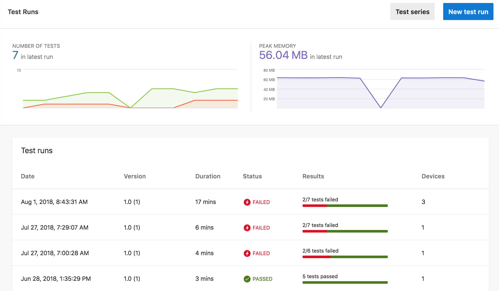
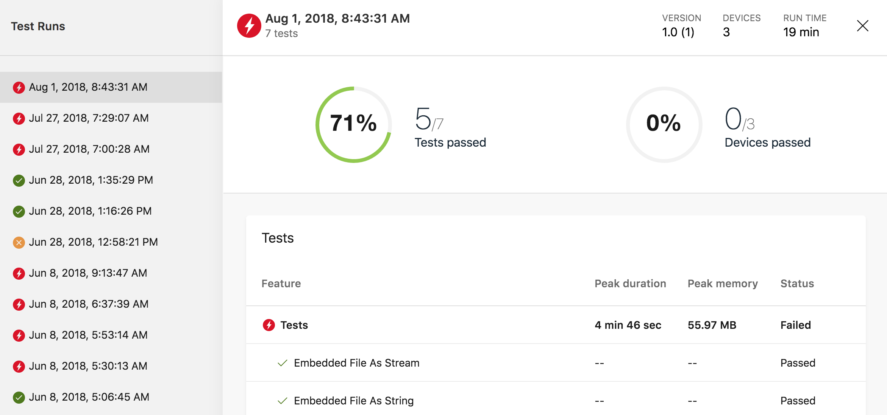
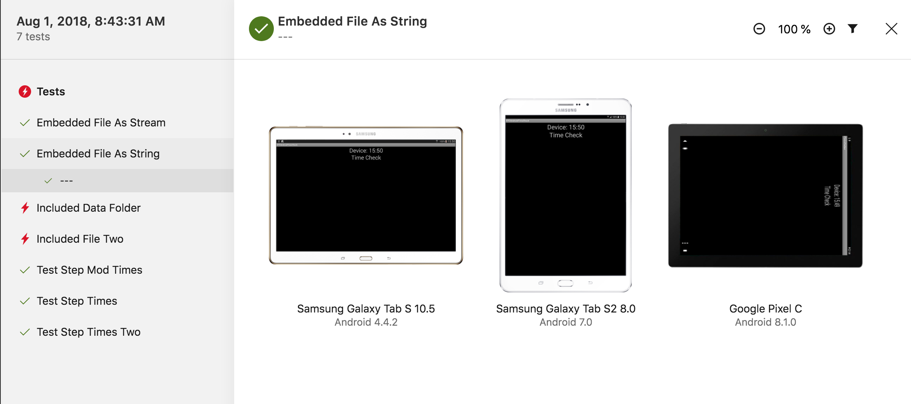
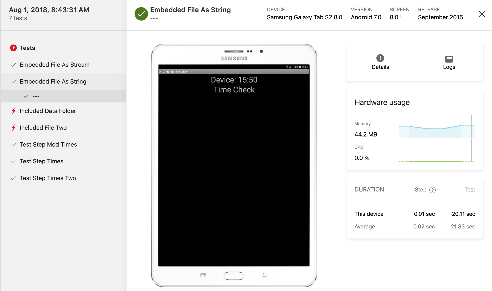
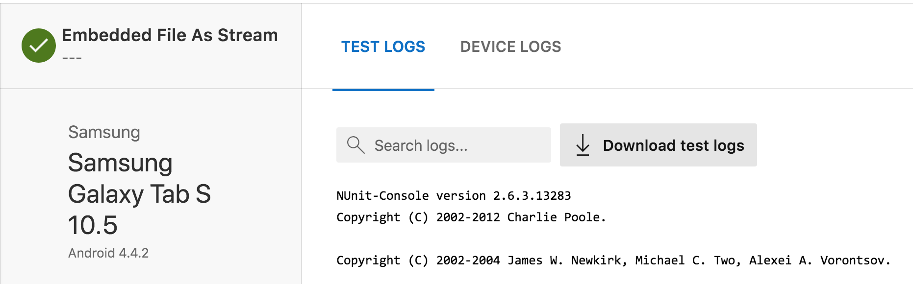

# Test reports

When your tests execute in App Center Test, we generate reports with summary and detail information for the test run, the tests and the devices. At the completion of the test run, you can view these reports in the **Tests** section of App Center.

For an explanation of some of the terms and concepts used below see [App Center Test Core concepts](~/test-cloud/core-concepts.md).

## Navigating to test runs

Starting from the App Center **My Apps** page, select an application, then select **Tests** in the navigation list. This brings you to the *Test runs dashboard* for all test runs in the default test series for that application.

## Test runs dashboard

The color green or a check mark on a green background indicates passing and the color red or a lightning bolt on a red background indicates failing, throughout the test reports.

* The **Test series** button filters or creates a test series.
* The **New test run** button starts the new test run wizard used to create a sample command line to submit a new test run.
* The **Number of Tests** graphic near the top left shows the test run history with the number of tests passed and tests failed. Click in this graph to navigate to a specific test run.
* The **Peak Memory** graphic at top right shows test run history for the peak memory consumed by the application. Click in this graph to navigate to a specific test run.
* The **Test runs** list shows summary test run results including **Date**, **Duration**, **Status**, **Results** and number of **Devices**. When filtering by test series, only test runs from the selected  test series are shown.

Click on the test run of interest to see the *Test run summary* page for that test run.

## Test run summary

Click in the Test Runs navigation list on the left to view the summary for that test run in the detail pane. The detail pane shows:

* The date and time the test run was submitted.
* The number of **Devices** in the test run.
* The **Run Time** for the test run. *Run time* is the total elapsed time from when the test run was submitted until the final reports are viewable in App Center Test.
* The number of tests in the test run.
* The **Tests passed** graphic shows the percentage and number of tests that passed. To *pass* a test must pass on every device in the test run.
* The **Devices passed** graphic shows the percentage and number of devices on which all tests passed.
* The **Tests** list displays the tests in the test run.

Click on a test of interest in the detail pane and either the *Test overview* page or the *Test detail* page opens, depending on the number of devices in the test run. If there is one device, App Center opens the *Test detail* page and if there are multiple devices, App Center opens the *Test overview* page where you can navigate to a *Test detail* page for a specific device.

## Test overview

This page only displays if there are multiple devices in the test run.

The **Tests** navigation list on the left shows the test step name or test label. Navigate by clicking in this list or scrolling up and down with the 'k' (up) or 'j' (down) keys.

The detail pane shows screenshots for each of the devices in the test run for the selected test step. The Device and OS version are listed beneath the screenshot. The **Filter** icon near the top right lets you filter by various device attributes like form factor, cpu, and OS version.

Click on a screenshot to navigate to the **Test detail** page for that device.

## Test detail

The **Tests** navigation list on the left shows the test step name or test label. Navigate by clicking in this list or scrolling up and down with the 'k' (up) or 'j' (down) keys.

* The **test name**, **device** and **os version** are listed across the top of the page.
* The screenshot is displayed for the selected device for the selected test step.
* The **Details** icon displays device information like memory, CPU speed and dimensions.
* Clicking the **Logs** icon will navigate to the *Test logs* page.
* The **Hardware usage** graph displays the **Memory** and **CPU** utilization during the test. 
* **Duration** shows the time to complete this test and test step. The test step time shown here is the test time starting with the displayed screenshot and the selected test step until the following screenshot. It is not the time ending with this screenshot.

## Test logs

The tabs across the top of the page include **Test Logs** and **Device Logs**. There may be others depending on the test framework used. A **Stack Trace** tab will appear if any stack traces were captured for this test run for this device.

### Test logs tab

Click the **Test Logs** tab near the top of the page.

Test logs and framework specific logs are the output from the test framework and provide clues as to why a test failed or issues involving the test framework.

### Stack trace tab

Click the **Stack Trace** tab near the top of the page.

Stack traces are errors captured during the test run. Any stack traces should be examined along with the test logs and device logs for more context to troubleshoot application issues.

On iOS the stack trace is usually relevant to any issues with the tests. On Android, if your application code is included in part of the stack trace it is generally relevant.

### Device log tab

Click the **Device Logs** tab near the top of the page.

The device log is the output from the device during the test run. Click **Download device log** to access all of the the device log file. When the log file starts loading in your web browser, you can use your web browser to save the file locally and use local tools to examine the log. Saving the file locally will usually be faster for multiple searches or when the device log file is large.

## Getting help

You can always contact us through [the blue chat icon in the lower-right hand corner](https://intercom.help/appcenter/getting-started/getting-help-with-app-center). We do not provide 24/7 support, but will reply as soon as we can.

If you want help with a test run, navigate to the test run in question and copy the URL from your browser and paste it into the support conversation. A test run URL looks like something like https://appcenter.ms/orgs/OrgName/apps/App-Name/test/runs/77a1c67e-2cfb-4bbd-a75a-eb2b4fd0a747.
