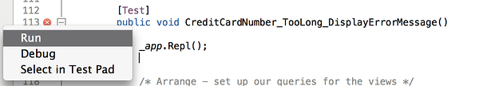
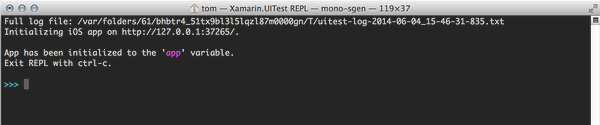
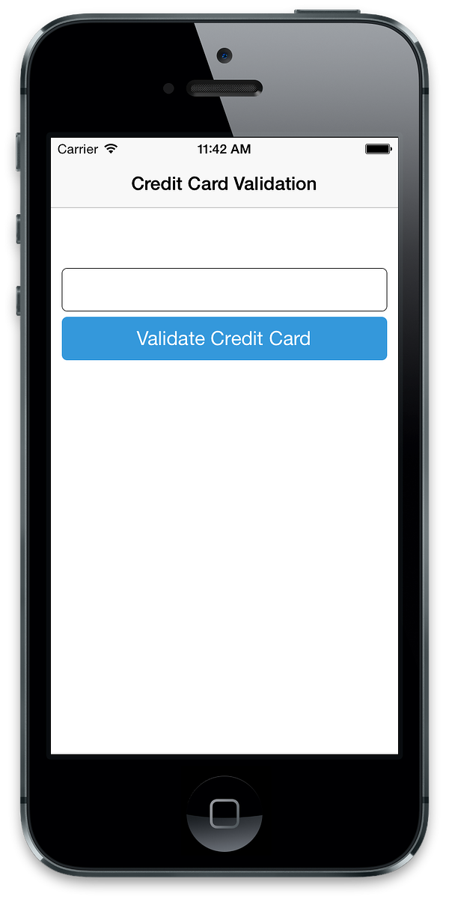

# Xamarin.UITest

_Xamarin.UITest_ is a testing framework that enables Automated UI Acceptance Tests written in [NUnit](http://www.nunit.org/) to be run against iOS and Android applications. It integrates tightly with Xamarin.iOS and Xamarin.Android projects but it can also be used with iOS and Android projects written natively in Objective-C/Swift and Java. Xamarin.UITest is the *Automation Library* that allows the NUnit tests to execute on Android and iOS devices. The tests interact with the user interface just as a user would, enter text, tapping buttons, and performing gestures &#x2013; such as swipes. For more information on the components enable Xamarin.UITest to automate a mobile application, please read about the [core concepts](~/test-cloud/core-concepts.md).
 
Typically, each UITest is written as a method that is referred to as a *test*. The class which contains the test is known as a *test fixture*. The test fixture contains either a single test or logical grouping of tests and is responsible for any setup to make the test run and any cleanup that needs to be peformed when the test finishes. Each test should follow the *Arrange-Act-Assert* pattern:
 
1.  **Arrange** &ndash; The test will setup conditions and initialize things so that the test can be actioned.
2.  **Act** &ndash; The test will interact with the application, enter text, pushing buttons, and so on.
3.  **Assert** &ndash; The test examines the results of the actions performed in the Act step to determine correctness. For example, the application may verify that a particular error message is displayed.
 
The best time get started with UITest is during the development of a mobile application. Automated tests are written as a feature is being developed according to the steps described in the following list:
 
1. Develop the feature in the Android and/or iOS application.
2. Write the tests and run them locally to verify functionality.
3. Create a new Test Run in Test Cloud, or use an existing Test Run.
4. Compile the iOS app bundle or the Android APK and then upload this along with the tests to Test Cloud.
5. Fix any issues or bugs that are exposed by Test Cloud.
6. Repeat the process by moving on to the next feature for the application.
 
For existing applications that are no longer under active development it may not be cost-effective to retroactively add automated tests. Instead, a better approach is to use UITest when fixing bugs. For example, consider an application that has no automated testing, and a user reports a bug. A developer assigned to fix that bug might take some (or all) following actions:
 
* Verify the bug or the regression manually.
* Write a test using Xamarin.UITest that demonstrates the bug.
* Submit the test to App Center test to gain some insight on the scope and impact of the bug on relevant devices.
* Fix the bug.
* Prove that the bug has been fixed with a passing Xamarin.UITest. This may be a completely new test, or a modification of the test created the previous step.
* Submit the fixes and test to App Center Test to verify that the bug has been fixed on the relevant devices.
* Check the passing tests into version control.  
 
Automate UI testing relies heavily on being able to locate and interact with views on the screen. Xamarin.UITest addresses this requirement with two important sets of APIs that work with each other:
  
1. *Actions* that can be performed on views &ndash; UITest provides APIs that allow a test to simulate common user actions such as tapping on the view, enter text, or swiping on the view.
2. *Queries* to locate views on the screen &ndash; Part of the UITest framework are APIs that will locate the views on a screen. Queries locate views at run time by inspecting attributes associated with the view and returning an object that the actions may work upon. Querying in such a manner is a very powerful technique that allows tests to be written for user interfaces regardless of the screen size, orientation, or layout

To help with writing tests, Xamarin.UITest provides a *read-eval-print-loop* ([*REPL*](http://en.wikipedia.org/wiki/Read%E2%80%93eval%E2%80%93print_loop)). The REPL allows developers and testers to interact with a screen while the application is running and simplifies creating the queries.

## Introducing the Xamarin.UITest API

All test interactions with the mobile application occur through an instance of `Xamarin.UITest.IApp`. This interface defines the methods that are crucial for the test to collaborate with the application and interact with the user interface. There are two concrete implementations of this interface:

* **`Xamarin.UITest.iOS.iOSApp`** &nbsp; This class will automate tests against iOS.
* **`Xamarin.UITest.Android.AndroidApp`** &nbsp; This class is for automating tests on Android.

`iOSApp` and `AndroidApp` objects are not instantiated directly. Instead, they are created using the helper `ConfigureApp` class. This class is a builder that ensures that the `iOSApp` or `AndroidApp` is properly instantiated.

It is recommended that a new `IApp` instance be used for each test &nbsp; this will prevent state from one test spilling over into another, affecting the results and reliability of the downstream tests. There are two places where an NUnit test could initialize an instance of `IApp`:

* **In `SetUp` method** &nbsp; Typically, a test fixture is a logical grouping of related tests, each of them running independent of the other. In this scenario the `IApp` should be initialized in the `SetUp` method, ensuring that a new `IApp` is available for each test.
* **In the `TestFixtureSetup` method** &nbsp; In some situations a single test may require its own test fixture. In this case it may make more sense to initialize the `IApp` object once in the `TestFixtureSetup` method.

Once `IApp` has been configured, a test may begin to interact with the application being tested. To do so, it is necessary to obtain references to the views that are visible on the screen. Many methods in Xamarin.UITest take a `Func<AppQuery, AppQuery>` parameter to locate the views. For example, the following snippet shows how to tap on a button:

```csharp
app.Tap(c=>c.Button("ValidateButton"));
```

There are two implementations of the `IApp` interface within the UITest framework, one for iOS and one for Android.

### Initialize IApp for iOS Applications

When Xamarin.UITest runs a test on iOS, it will start up an instance of the iOS simulator, deploy the application, start it, and begin running the tests. The iOS application must already be built &ndash; Xamarin.UITest will not compile the application and create the App Bundle for you.

The `AppBundle` method can be used to specify where on the file system the app bundle may be found. There are two ways to do so, with an absolute path, or a relative path. This snippet shows using an absolute path to the app bundle:

```csharp
IApp app = ConfigureApp
    .iOS
    .AppBundle("/path/to/iosapp.app")
    .StartApp();
```
To use a relative path, the path must be relative to the UITest assembly. This snippet is and example of how to use a relative path to locate the app bundle:

```csharp
IApp app = ConfigureApp
    .iOS
    .AppBundle("../../../iOSAppProject/bin/iPhoneSimulator/Debug/iosapp.app")
    .StartApp();
```

The relative path example tells `AppBundle` to go up three directories from the UITest assembly, and then navigate down the project tree of the iOS application project to find the app bundle.

`ConfigureApp` does have other methods to help configure `IApp`. See the [iOSAppConfigurator](http://developer.xamarin.com/api/type/Xamarin.UITest.Configuration.iOSAppConfigurator/) class for more details. Some of the more interesting methods are described in the following table:


| Method | Description |
| --- | ---|
| `AppBundle` | This method specifies the path to the app bundle to use when testing. |
| `Debug` | This method will enable debug logging messages in the test runner. This method is useful to troubleshoot problems with running the application on the simulator. |
| `DeviceIdentifier` | Configures the device to use with the device identifier. This method will be described in more detail below. |
| `EnableLocalScreenshots` | Enable screenshots when running tests locally. Screenshots are always enable when tests are running in the cloud. |
| `Repl` | This method will halt the test execution and invoke the REPL in a terminal prompt. |

For more information on how to run iOS tests on a specific iOS Simulator, please see [Selecting an iOS Simulator for Local Tests](http://developer.xamarin.com/guides/testcloud/uitest/selecting-simulator).

### Initialize IApp for Android Applications

Xamarin.UITest will deploy an existing APK to an attached device or an instance of the Android emulator that is already running. The app will be started, and then the test will be run. Xamarin.UITest cannot build the APK nor can it start an instance of the Android emulator.  

The `ApkFile` method of `IApp` is used to specify where on the file system the APK may be found. There are two ways to do so, with an absolute path, or a relative path. This snippet shows using an absolute path to the APK:

```csharp
IApp app = ConfigureApp
    .Android
    .ApkFile("/path/to/android.apk")
    .StartApp();
```
To use a relative path, the path must be relative to the UITest assembly. This snippet is and example of how to use a relative path to locate the app bundle:

```csharp
IApp app = ConfigureApp
    .Android
    .ApkFile("../../../AndroidProject/bin/Debug/android.apk")
    .StartApp();
```

The relative path example tells `AppBundle` to go up three directories from the UITest assembly, and then navigate down the project tree of the Android application project to find the app bundle.

If there is more than one device or emulator connected, UITest will hat test execution and display an error message as it is unable to resolve what the intended target is for the test. In this case, it will be necessary to initialize provide the *serial ID* of the device/emulator that should be used to run the test. For example, consider the following output from the `adb devices` command which will list all of the devices (or emulators) attached to the computer (along with their serial ID):

```bash
$ adb devices
List of devices attached
192.168.56.101:5555	device
03f80ddae07844d3	device
```

The device can be specified using the `DeviceSerial` method:

```csharp
IApp app = ConfigureApp.Android.ApkFile("/path/to/android.apk").DeviceSerial("03f80ddae07844d3").StartApp();
```

## Interacting with the User Interface

To interact with views, many `IApp` methods take a [`Func<AppQuery, AppQuery>`](http://msdn.microsoft.com/en-us/library/bb549151(v=vs.110).aspx) delegate for locating the view. This delegate in turn uses [`AppQuery`](http://developer.xamarin.com/api/type/Xamarin.UITest.Queries.AppQuery/), which is at the core of how Xamarin.UITest locates views.

`AppQuery` is a [fluent interface](http://en.wikipedia.org/wiki/Fluent_interface) for building the queries to locate views. Of the methods that `AppQuery` provides, the `Marked` method is one of the simplest and most flexible. This method uses a heuristic to try and locate views and will be discussed in more detail in the following section. For now, it is important to understand that `IApp` has many methods for interacting with an application. These methods use a `Func<AppQuery, AppQuery>` to obtain a reference to the view to interact with. Some of the more interesting methods provided by `AppQuery` are listed below:

| Method | Description |
| --- | ---|
| `Button` | Will locate one or more buttons on the screen. |
| `Class`  |Will try to locate views that are of a specified class. |
| `Id` | Will try to locate a view with the specified Id. |
| `Index`| Will return one view from a collection of matching views. Usually used in conjunction with other methods. Takes a zero-based index. | 
| `Marked` | Will return a view according to the heuristics that were previously mentioned. |
| `Text` | Will match views that contain the provided text. |
| `TextField` | Will match an Android <code>EditText</code> or iOS <code>UITextField</code>. |

For example, the following method shows how to simulate a tap on a button called "SaveUserdataButton":

```csharp
app.Tap(c=>c.Marked("SaveUserDataButton"));
```

Because `AppQuery` is a fluent interface, it is  possible to chain together multiple method invocations together. Consider this more complicated example of tapping on a view:

```csharp
app.Tap(c=>c.Marked("Pending")
            .Parent()
            .Class("AppointmentListCell").Index(0));
```
Here, the `AppQuery` will first find a view marked `Pending`, then select the first parent of that view that is a `AppointmentListCell` type.

It can be tricky trying to create these queries by just looking at a mobile app. Xamarin.UITest provides a REPL that can be used to explore the view hierarchy of a screen, experiment with creating queries, and use them to interact with an application. 

## Using the REPL

The only way to start the REPL is to invoke the `IApp.Repl` method within an existing test. This requires creating an NUnit `TestFixture`, configuring an instance of `IApp` that can be used in a `Test` method. The following code snippet shows an example of how to do so:

```csharp
[TestFixture]
public class ValidateCreditCard
{
    IApp app;

    [SetUp]
    public void Setup()
    {
        app = ConfigureApp.Android.AppBundle("/path/to/application.apk").StartApp();
    }
    [Test]
    public void CreditCardNumber_TooLong_DisplayErrorMessage()
    {
        app.Repl();
    }
}
```

To run the test by right clicking in the gutter of Visual Studio and selecting **Run**:

[ ](./images/index-01-xs.png)

The test will run, and when the `Repl` method is invoked, Xamarin.UITest will start the REPL in a terminal session, as shown in the following screenshot:

[ ](./images/index-02-xs.png)

Notice that the REPL has initialized an instance of `IApp` that is called `app`, which can be used to interact with the application. At this point, one of the first things to do is to explore the user interface. The REPL has a `tree` command that will do exactly that. It will print out the hierarchy of views in the displayed screen. As an example, consider the following screenshot of an application:

[ ](./images/index-03-xs.png)


We can use the `tree` command to display the following hierarchy of this screen:

```bash
App has been initialized to the 'app' variable.
Exit REPL with ctrl-c or see help for more commands.

>>> tree
[UIWindow > UILayoutContainerView]
  [UINavigationTransitionView > ... > UIView]
    [UITextView] id: "CreditCardTextField"
      [_UITextContainerView]
    [UIButton] id: "ValidateButton"
      [UIButtonLabel] text: "Validate Credit Card"
    [UILabel] id: "ErrorrMessagesTestField"
  [UINavigationBar] id: "Credit Card Validation"
    [_UINavigationBarBackground]
      [_UIBackdropView > _UIBackdropEffectView]
      [UIImageView]
    [UINavigationItemView]
      [UILabel] text: "Credit Card Validation"
>>>
```

We can see that there is a `UIButton` in this view with the `id` of **ValidateButton**. We can use the information displayed by the `tree` command to help craft the necessary queries to locate and interact with views. For example, the following code simulates a tap on the button:

```csharp
app.Tap(c=>c.Marked("ValidateButton"))
```

As commands are being entered, they are remembered by the REPL in a buffer. The REPL provides a `copy` command that will copy the contents of this buffer to the clipboard. This technique allows us to prototype a test interactively. We can copy the work that performed in the REPL to clipboard with `copy`, and then paste those commands inside a `[Test]`.

## Using Marked To Locate Views
 
The [AppQuery.Marked](http://developer.xamarin.com/api/member/Xamarin.UITest.Queries.AppQuery.Marked/) method is a very convienent and powerful way to query for views on screen. It works by inspecting the view hierarchy for a view on the screen, trying to match the properties on the view with to the provided string. `Marked` works differently depending on the operating system.

### Finding iOS Views with Marked

iOS views will be located using one of the following attributes:

* the `AccessibilityIdentifier` of the view
* the `AccessibilityLabel` of the view

As an example, consider the following C# snippet which creates a `UILabel` and sets the `AccessibilityLabel`:

```csharp
UILabel errorMessagesTextField = new UILabel(new RectangleF(10, 210, 300, 40));
errorMessagesTextField.AccessibilityLabel = "ErrorMessagesTextField";
errorMessagesTextField.Text = String.Empty;
```
This view can be located by the following query:

```csharp
AppResult[] results = app.Marked("ErrorMessagesTextField");
```
### Finding Android Views with Marked

Android views will be located based on one of the following properties:

* the `Id` of the view
* the `ContentDescription` of the view
* the `Text` of a view

For example, consider an Android layout that has the following button defined:

```code-xml
<Button
    android:text="Action 1"
    android:layout_width="wrap_content"
    android:layout_height="match_parent"
    android:id="@+id/action1_button"
    android:layout_weight="1"
    android:layout_marginLeft="5dp" />
```
We can see that the `android:id` of this button is _action1_button_ and that the `android:text` is _Action 1_. Either of the following two queries will locate the button on the screen:

-  `app.Query(c=>c.Marked("action1_button"));`
-  `app.Query(c=>c.Marked("Action 1"));`


## Controlling the Application with Xamarin.UITest.IApp

Once `IApp` has been configured and initialized, the test may begin interacting with the application. One example of a method using  `Func<AppQuery, AppQuery>` is the `IApp.Query()` method. This method will execute the query and return the results. The simplest example is shown in the following snippet, which will return a list of all views that are visible on the screen:

```csharp
AppResult[] results = app.Query(c=>c.All())
```

The following table demonstrates some other examples of using `AppQuery` to locate views on the screen:

| Syntax | Results |
| --- | --- | 
| `app.Query(c=&gt;c.Class("UILabel"))` | The `.Class()` method will query for views that are a subclass of an iOS `UILabel`. |
| `app.Query(c=&gt;c.Id("txtUserName"))` | The `.Class()` method will query for views with an `Id<` of **txtUserName**. |
| `app.Query(c=&gt;c.Class("UILabel").Text("Hello, World"))` | Locates all `UILabel` classes that have the text "Hello, World".|
| `results = app.Query(c=&gt;c.Marked("ValidateButton"))` | Returns all views that are _marked_ with the specified text. The `Marked` method is a very useful method that can simplify queries. It will be covered in the following section. |

The next table lists some (but not all) of the methods provided by `IApp` that can be used to interact with or manipulate views on the screen:


| Example | Description |
| --- | --- |
| `PressEnter` |Press the enter key in the app. |
| `Tap` | Simulates a tap on the Enter button. |
| `EnterText` | Enters text into the view. In an iOS application, Xamarin.UITest will enter the text using the soft keyboard. In contrast, Xamarin.UITest will not use the Android keyboard, it will directly enter the text into the view. |
| `WaitForElement` | Pauses the execution of the test until the views appear on the screen. |
| `Screenshot(String)` | Takes a screenshot of the application in it's current state and saves it to disk. It returns a `FileInfo` object with information about the screenshot taken. |
| `Flash` | This method will cause the the selected view to "flash" or "flicker" on the screen. |


For more information on the [`IApp`](http://developer.xamarin.com/api/type/Xamarin.UITest.IApp/) interface, please consult the [API documentation](http://developer.xamarin.com/api/root/Xamarin.UITest.Docs/) for [`IApp`](/api/type/Xamarin.UITest.IApp/), [`AndroidApp`](http://developer.xamarin.com/api/type/Xamarin.UITest.Android.AndroidApp/), and [`iOSApp`](http://developer.xamarin.com/api/type/Xamarin.UITest.iOS.iOSApp/).

As an example of how to use these methods, consider the following test for the screenshot that was displayed above. This test will enter a 17-digit number for a credit card into a text field and then tap a button on the screen. It will then inspect the screen for an error message informing the user that the number is too long to be a valid credit card number:

```csharp
[Test]
public void CreditCardNumber_TooLong_DisplayErrorMessage()
{
    /* Arrange - set up our queries for the views */
    // Nothing to do here, app has been instantiated in the [SetUp] method.

    /* Act */
    app.EnterText(c => c.Marked("CreditCardTextField"), new string('9', 17));
    // Screenshot can be used to break this test up into "steps". The
    // screenshot can be inspected after the test run to verify the
    // visual correctness of the screen.
    app.Screenshot("Entering a 17 digit credit card number.");

    app.Tap(c => c.Marked("ValidateButton"));
    app.Screenshot("The validation results.");

    /* Assert */
    AppResult[] result = app.Query(c => c.Class("UILabel").Text("Credit card number is too long."));
    Assert.IsTrue(result.Any(), "The error message is not being displayed.");
}
```

This test also uses the `Screenshot` method to take pictures at key points during the test execution. When this test is run, Xamarin Test Cloud will take the screenshots and display them in the test results. This provides a way to break a test up into steps and a provide a description of what the screenshot is about.