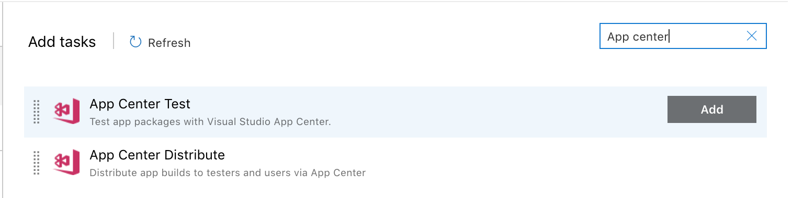
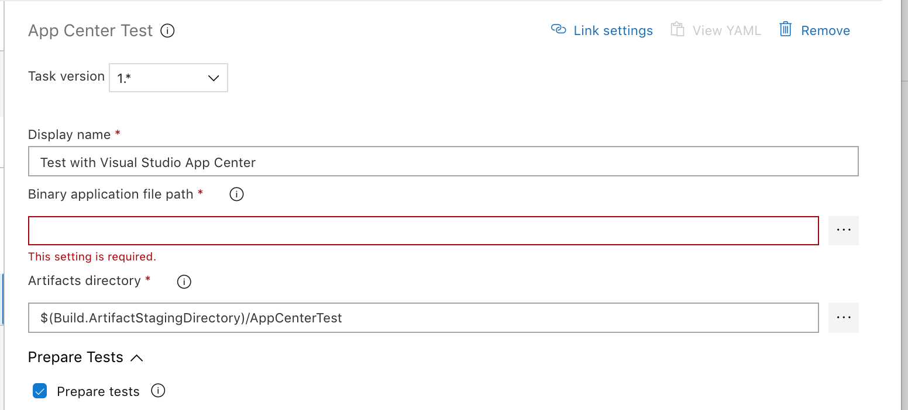
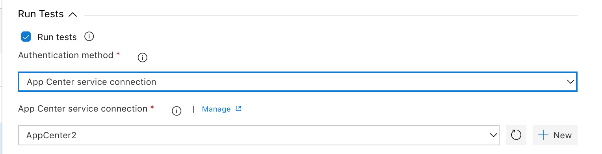
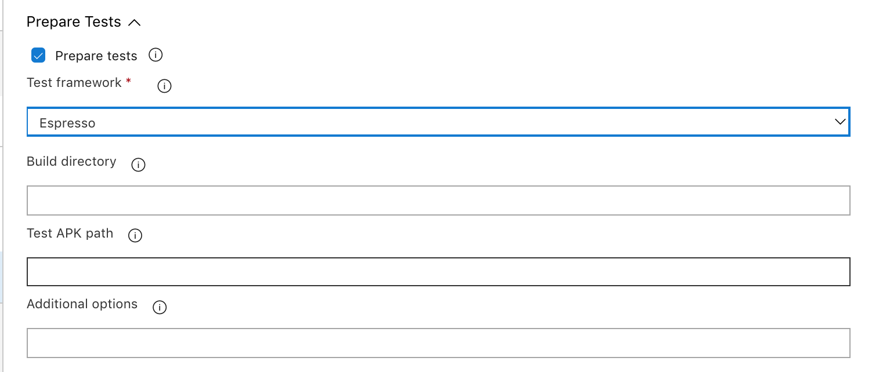
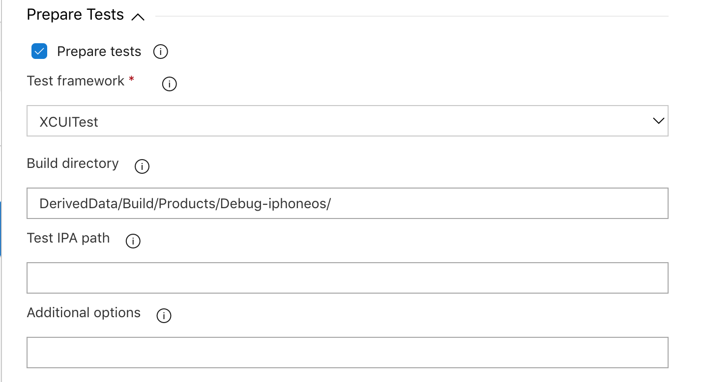

---
# required metadata
title: Using Azure DevOps for UI Testing
description: How to get started with UI Testing in Azure DevOps (VSTS)
keywords: test, VSTS, Azure DevOps, Azure Pipelines, espresso, appium, xamarin.uitest, xcuitest
author: Oddj0b
ms.author: vigimm
ms.date: 06/04/2019
ms.topic: article
ms.service: vs-appcenter
ms.assetid: 225497b6-6f5a-460a-b842-0d43756deaa9
---

# Using Azure DevOps for UI Testing

This guide describes how to modify your existing Azure Pipelines build that creates an application binary (`.apk` or `.ipa` file) to add an App Center Test task that runs your test suite in App Center Test.

Azure Pipelines is available as part of Azure DevOps Services. Azure Pipelines helps you implement a build, test, and deployment pipeline for any app. For more information about Azure DevOps Services or Azure Pipelines, see [Azure DevOps Documentation](https://docs.microsoft.com/azure/devops/?view=azure-devops) or [Azure Pipelines](https://docs.microsoft.com/azure/devops/pipelines/?view=azure-devops), respectively.

The App Center Test task for Azure Pipelines lets you run your test suites in App Center Test. You can use Appium, XCUItest, Espresso, and Xamarin.UITest frameworks. Read more about the frameworks on the [App Center Test Supported frameworks](supported-frameworks.md) page.

Each framework has its own section in this guide, where you can read about the basic requirements for setting up an App Center Test task definition in Azure Pipelines.

## General configuration steps

### Before you start

You need the following before you can start testing,

* An Azure Pipelines build that creates your application binary (`.apk` or `.ipa` file).
* An active App Center Test account. You can activate a trial for App Center Test at [App Center](https://appcenter.ms/). First select your app and then select Test in the left-hand menu.

### Azure Pipelines general configuration

Locate your Azure Pipelines project and open it for **Edit**. Click **+** to add a new task, then search for **App center**.



Click on **Add** next to the **App Center Test** task. On the left-hand side of the screen, click on the added **Test with Visual Studio App Center** task to select and modify it.

The **App Center Test** task is divided into sections.



In the top section, insert the path to your app binary (`.apk` or `.ipa`) in the **Binary application file path** field.

### Connecting to App Center Test

Sign in to App Center before using the service; there are two authentication methods available to you.

The first method uses an API token; to acquire your account's API token:

* Sign in to App Center and click the user settings icon in the upper-left corner of the App Center portal.
* In the menu that appears, select **Account Settings**.
* In the **Settings** panel, select **API Tokens**.
* Click the **New API token** button in the upper-right corner of the panel.
* Name the new API token - for instance, you can call it **Azure DevOps**. In the future, this name will help you identifying which service is using the service.

    

* Click **Add new API token** button. A pop-up displays the new API token; this pop-up is the **only time** App Center will display this token. Click the clipboard button to copy the API Token to the browser's clipboard. Save the API token somewhere ([Azure Key Vault](https://azure.microsoft.com/services/key-vault/), for example) where you can securely reference it again later if needed.

With the API Token on the clipboard:

* Switch to your Azure DevOps Services window. In the **App Center Connection** field, in the **Run** section of the App Center Test task, click the **Add** button.
* Populate the form's **Name** field with an appropriate name for the connection (for example: **App Center**).
* Paste the App Center API Token into the **API token** field.
* Finish the set up by clicking close.

Make sure your newly created connection appears in the App Center Connection field.



The second method uses your App Center account credentials:

* Select **Credentials** from the **Authentication Method** dropdown menu.
* Populate the **App Center Username** and **App Center Password** fields with the credentials from your App Center account.

> [!NOTE]
> Your App Center username is in your [App Center account profile](https://appcenter.ms/settings/profile). If signing in using your Microsoft credentials, you must set up your account with a password or the task can't login. You can [set up a password in App Center](https://appcenter.ms/settings/password).

## Appium

* Before creating a test run, complete the steps at the [Before you start](#before-you-start) section of this guide.
* [Prepare your repository for App Center Test, Appium testing](appium/preparing-for-upload.md).

### Azure Pipelines configuration for Appium

Start by adding the App Center Test task to the build definition as described earlier at [Azure Pipelines general configuration](#azure-pipelines-general-configuration).


In the Prepare Tests section, make sure the **Prepare Tests** checkbox is checked, then for **Test Framework**, select **Appium Test Framework**. Insert the path to the Appium test-classes, dependency-jars, and the `pom.xml` file into the **Build directory** field. These three artifacts are usually in the `upload` folder.

Now you can configure the test run. All the information you need is found by creating a new test under Test in App Center. Follow the instructions at [Starting a Test Run](~/test-cloud/starting-a-test-run.md). Leave the submit page (last page on test run setup) open, so you can use that information as you set up the App Center Test task.

```shell
appcenter test run appium --app "username/appname" --devices 209ed689
 --app-path pathToFile.apk --test-series "master" --locale "en_US"
  --build-dir target/upload
```


* On the submit page, the app slug is the `--app` parameter. Insert that into the **App Slug** field.
* The devices selection is the `--devices` parameter. Insert that into the **Devices** field.
* **Test series** is a free text field - it can be anything. It's the `--test-series` parameter.
* **System Language** is a drop-down menu. If **Other** is selected, an **Other Locale** field appears where you can enter language and country code like this format: `en_US`.

Save the configuration and you are all set to start the build and App Center Test run.

## Espresso

* Before creating a test run, complete the steps at the [Before you start](#before-you-start) section of this guide.
* [Read how to prepare your repository for App Center Test, Espresso testing](espresso/preparing-for-upload.md).

### Azure Pipelines configuration for Espresso

Start by adding the App Center Test task to the build definition as described earlier at [Azure Pipelines general configuration](#azure-pipelines-general-configuration).



In the Prepare Tests section, make sure the **Prepare Tests** checkbox is checked, then for **Test Framework**, select **Espresso Test Framework**.

Now you can configure the test run. All the information you need is found by creating a new test under Test in App Center. Follow the instructions at [Starting a Test Run](~/test-cloud/starting-a-test-run.md). Leave the submit page (last page on test run setup) open, so you can use that information as you set up the App Center Test task.

```shell
appcenter test run espresso --app "username/appname" --devices 209ed689
 --app-path pathToFile.apk --test-series "master" --locale "en_US"
  --build-dir pathToEspressoBuildFolder
```


* On the submit page, the app slug is the `--app` parameter. Insert that into the **App Slug** field.
* The devices selection is the `--devices` parameter. Insert that into the **Devices** field.
* **Test series** is a free text field - it can be anything. It's the `--test-series` parameter.
* **System Language** is a drop-down menu. If **Other** is selected, an **Other Locale** field appears where you can enter language and country code like this format: `en_US`.

Save the configuration and you're all set to start the build and App Center Test run.

## Xamarin.UITest

* Before creating a test run, complete the steps at the [Before you start](#before-you-start) section of this guide.
* [Read how to prepare your Xamarin.Android repository for App Center Test, Xamarin.UITest testing](uitest/xamarin-android-uitest.md).
* [Read how to prepare your Xamarin.iOS repository for App Center Test, Xamarin.UITest testing](uitest/xamarin-ios-uitest.md).

### Azure Pipelines configuration for Xamarin.UITest

Start by adding the App Center Test task to the build definition as described earlier at [Azure Pipelines general configuration](#azure-pipelines-general-configuration).


In the Prepare Tests section, make sure the **Prepare Tests** checkbox is checked and that **Xamarin UI Test** is selected under **Test Framework**. Insert the path to your build directory; in most cases the build folder is: `<ProjectName>/bin/<configuration>`.

Now you can configure the test run. All the information you need is found by creating a new test under Test in App Center. Follow the instructions at [Starting a Test Run](~/test-cloud/starting-a-test-run). Leave the submit page (last page on test run setup) open, so you can use that information as you set up the App Center Test task.

```shell
appcenter test run uitest --app "username/appname" --devices 209ed689
 --app-path pathToFile.apk --test-series "master" --locale "en_US"
  --build-dir pathTUITestBuildDir
```


* On the submit page, the app slug is the `--app` parameter. Insert that into the **App Slug** field.
* The devices selection is the `--devices` parameter. Insert that into the **Devices** field.
* **Test series** is a free text field - it can be anything. It's the `--test-series` parameter.
* **System Language** is a drop-down menu. If **Other** is selected, an **Other Locale** field appears where you can enter language and country code like this format: `en_US`.

Save the configuration and you're all set to start the build and App Center Test run.

## XCUITest

* Before creating a test run, complete the steps at the [Before you start](#before-you-start) section of this guide.
* [Read how to prepare your repository for App Center Test, XCUITest testing](xcuitest/preparing-for-upload.md).

> [!NOTE]
> In your pipeline, before the App Center Test task, you will need an **Xcode** task step with an action of `build-for-testing` to build the test runner app needed for testing. In that task, under **Arguments** in the **Advanced** section, specify a derived data path, typically using `-derivedDataPath DerivedData`. You will also need an `.ipa file` for your application. You can build the `.ipa file` in the same **Xcode** `build-for-testing` task by checking the `Create app package` option, or in a separate **Xcode** build step or in a **Bash** script step.

### Azure Pipelines configuration for XCUITest

Start by adding the App Center Test task to the build definition as described earlier at [Azure Pipelines general configuration](#azure-pipelines-general-configuration).



In the Prepare Tests section, make sure the **Prepare Tests** checkbox is checked and that **XCUITest** is selected under **Test Framework**. Insert the path to your build directory from the Xcode `build-for-testing` step. Typically, the build folder is: `DerivedData/Build/Products/Debug-iphoneos/`.

Now you can configure the test run. All the information you need is found by creating a new test under Test in App Center. Follow the instructions at [Starting a Test Run](~/test-cloud/starting-a-test-run.md). Leave the submit page (last page on test run setup) open, so you can use that information as you set up the App Center Test task.

```shell
appcenter test run xcuitest --app "username/appname" --devices 209ed689 --test-series "master" --locale "en_US" --build-dir pathToXCUItestBuildFolder
```


* On the submit page, the app slug is the `--app` parameter. Insert that into the **App Slug** field.
* The devices selection is the `--devices` parameter. Insert that into the **Devices** field.
* **Test series** is a free text field - it can be anything. It's the `--test-series` parameter.
* **System Language** is a drop-down menu. If **Other** is selected, an **Other Locale** field appears where you can enter language and country code like this format: `en_US`.

Save the configuration and you're all set to start the build and App Center Test run.
