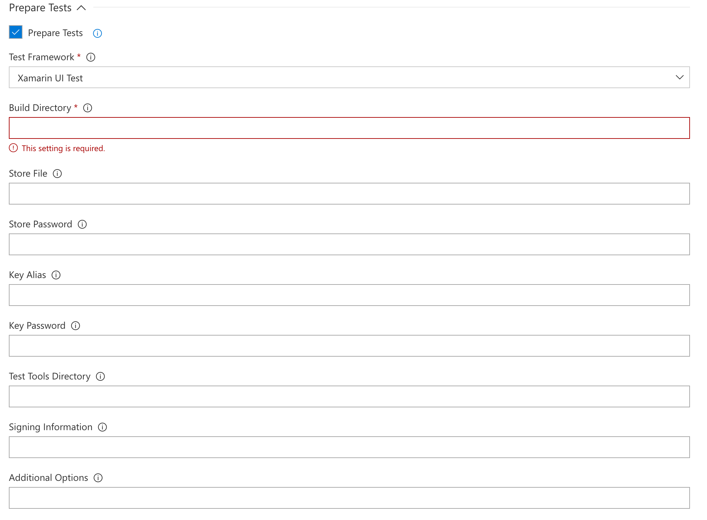

---
# required metadata

title: Using Team Services for UI Testing | App Center Test
description: How to get started with UI Testing in VSTS
keywords: test, VSTS, espresso, appium, xamarin.uitest
author: Oddj0b
ms.author: vigimm
ms.date: 05/02/2017
ms.topic: article
ms.service: vs-appcenter
ms.assetid: 225497b6-6f5a-460a-b842-0d43756deaa9 
---

# Add UI tests to your VSTS builds

With the App Center Test task for Visual Studio Team Services (VSTS), you can run your Appium, Calabash, Espresso and Xamarin.UITest test suite in App Center Test. It is the next generation of Xamarin Test Cloud task which also is available in VSTS. You can read more about the frameworks on the [Supported frameworks](supported-frameworks.md) page. 

Each framework will have its own section in this document, where you can read about the basic requirements for setting up a build step definition in VSTS.


## Appium

* There are some requirements before starting. See the [Before you start](#before-you-start) section of this document.
* Prepare your repository for Appium - read more [here](preparing-for-upload/appium.md).

### VSTS setup

Start by adding the App Center Test task to the build definition - read how that is done in the [VSTS general setup](#vsts-general-setup)


In the Prepare Tests section, first make sure the _Prepare Tests_ checkbox is checked and that Appium is chosen under `Test Framework`. Insert the path to the Appium test-classes, dependency-jars and the `pom.xml` file into the `Build directory` field. These three artifacts is usually located in the `upload` folder.

If everything is done correctly - preparations are done and it is time to configure the test run. All the information needed is found by creating a new test under Test in App Center. Navigate your browser to [App Center](https://appcenter.ms/) and select your app. Go to the Test service and click on `New test run` in the upper right hand side of the screen

Select the devices for the test run. The general rule of a device selection is that more devices equal longer testing time. Start small with 1-3 devices, and when everything is working, create a new test run with more devices. Finish your selection by clicking next.

On the next page select your test series or create a new one. Test series is a way of managing your test runs. Choose something which makes sense and will make it easy to find the results later. Examples is VSTS which tells where the test is send from. It can be changed later so it matches your existing test series. Select Appium as framework and click `Next` to proceed.
```
appcenter test run appium --app "username/appname" --devices 209ed689
 --app-path pathToFile.apk --test-series "master" --locale "en_US"
  --build-dir target/upload
```

Leave the submit page (last page on test run setup) open, as there is information needed for setting up the test run on VSTS. 


* First step is creating an App Center connection. See the [Connecting to App Center](#connecting-to-app-center-test) section of this document.
* The app slug is structured as `<username>/<appname>`. Insert that into the `App Slug` field. On the submit page it is the `--app` parameter
* Your device selection which is a mixture of letters and numbers, is specified in the `Devices` field. On the submit page it is the `--devices` parameter.
* Test series is a free text - it can be anything. It's the `--test-series` parameter
* System Language is a drop-down menu, and if `Other` is selected a `Other Locale` field appears where you can input laguage and country code like this: en_US

You can read more about starting a test run on the [Starting a test run](starting-a-test-run.md) page.

You're all set to initiate the build.

## Espresso

* There are some requirements before starting. See the [Before you start](#before-you-start) section of this document.
* Prepare your repository for Espresso - read more [here](preparing-for-upload/espresso.md).

### VSTS setup

Start by adding the App Center Test task to the build definition - read how that is done in the [VSTS general setup](#vsts-general-setup)

If everything is done correctly - preparations are done and it is time to configure the test run. All the information needed is found by creating a new test under Test in App Center. Navigate your browser to [App Center](https://appcenter.ms/) and select your app. Go to the Test service and click on `New test run` in the upper right hand side of the screen

Select the devices for the test run. The general rule of a device selection is that more devices equal longer testing time. Start small with 1-3 devices, and when everything is working, create a new test run with more devices. Finish your selection by clicking next.

On the next page select your test series or create a new one. Test series is a way of managing your test runs. Choose something which makes sense and will make it easy to find the results later. Examples is VSTS which tells where the test is send from. It can be changed later so it matches your existing test series. Select Espresso as framework and click `Next` to proceed.

```
appcenter test run espresso --app "username/appname" --devices 209ed689
 --app-path pathToFile.apk --test-series "master" --locale "en_US"
  --build-dir pathToEspressoBuildFolder
```

Leave the submit page (last page on test run setup) open, as there is information needed for setting up the test run on VSTS. 


* First step is creating an App Center connection. See the [Connecting to App Center](#connecting-to-app-center-test) section of this document.
* The app slug is structured as `<username>/<appname>`. Insert that into the `App Slug` field. On the submit page it is the `--app` parameter
* Your device selection which is a mixture of letters and numbers, is specified in the `Devices` field. On the submit page it is the `--devices` parameter.
* Test series is a free text - it can be anything. It's the `--test-series` parameter
* System Language is a drop-down menu, and if `Other` is selected a `Other Locale` field appears where you can input laguage and country code like this: en_US

You can read more about starting a test run on the [Starting a test run](starting-a-test-run.md) page.

You're all set to initiate the build.

## Xamarin.UITest

* There are some requirements before starting. See the [Before you start](#before-you-start) section of this document.
* Prepare your repository for Xamarin.UITest - read more [here](preparing-for-upload/uitest.md).

### VSTS setup

Start by adding the App Center Test task to the build definition - read how that is done in the [VSTS general setup](#vsts-general-setup)



In the Prepare Tests section, first make sure the _Prepare Tests_ checkbox is checked and that _UI Test_ is chosen under `Test Framework`. Insert the path to your build directory, under most circumstances its folder path is: `<ProjectName>/bin/<configuration>`.

If everything is done correctly - preparations are done and it is time to configure the test run. All the information needed is found by creating a new test under Test in App Center. Navigate your browser to [App Center](https://appcenter.ms/) and select your app. Go to the Test service and click on `New test run` in the upper right hand side of the screen

Select the devices for the test run. The general rule of a device selection is that more devices equal longer testing time. Start small with 1-3 devices, and when everything is working, create a new test run with more devices. Finish your selection by clicking next.

On the next page select your test series or create a new one. Test series is a way of managing your test runs. Choose something which makes sense and will make it easy to find the results later. Examples is VSTS which tells where the test is send from. It can be changed later so it matches your existing test series. Select Xamarin.UITest as framework and click `Next` to proceed.

```
appcenter test run uitest --app "username/appname" --devices 209ed689
 --app-path pathToFile.apk --test-series "master" --locale "en_US"
  --build-dir pathTUITestBuildDir
```

Leave the submit page (last page on test run setup) open, as there is information needed for setting up the test run on VSTS. 


* First step is creating an App Center connection. See the [Connecting to App Center](#connecting-to-app-center-test) section of this document.
* The app slug is structured as `<username>/<appname>`. Insert that into the `App Slug` field. On the submit page it is the `--app` parameter
* Your device selection which is a mixture of letters and numbers, is specified in the `Devices` field. On the submit page it is the `--devices` parameter.
* Test series is a free text - it can be anything. It's the `--test-series` parameter
* System Language is a drop-down menu, and if `Other` is selected a `Other Locale` field appears where you can input laguage and country code like this: en_US

You can read more about starting a test run on the [Starting a test run](starting-a-test-run.md) page.

You're all set to initiate the build.

## General setup steps

### Before you start

Before you can start testing, the following steps are required.
* You will need the application binary (`.apk` or `.ipa` file)
* Activate your trial for App Center Test - this is done on [App Center](https://appcenter.ms/). First select your app and then select Test in the left-hand menu.

### VSTS General Setup


You start by adding the App Center Test task to your build definition. The App Center task in the build definition is divided up into sections - where focus will be on _General_, _Prepare Tests_ and _Run Test_ sections. In the general section it is required to insert the path to your app binary (`.apk` or `.ipa`) in the `Binary Application File Path` field.

### Connecting to App Center Test

You must login into App Center before using the service; there are 2 methods of authentication. 

The first method is using an API token - you can acquire one by going to App Center and clicking the settings icon at the buttom of the left-hand menu.

Select the API Tokens in the middle menu, and click New API token in the top right hand side of the browser window.

Then name your API token - for instance, you can call it VSTS. In the future, this will help you indentifying which service is using the service. And finally click Add new API token.


A windows appears with the token. When you click close the token will dissappear and not be recoverable, so copy it and store it safely.

Back in VSTS, click `add` next to the App Center Connection field. Inside `name` you can insert app-center and the token into the `API token` field. Finish the setup by clicking close. Make sure your newly created connection appears in the App Center Connection field.

The second method is using your log-in credentials. When selecting _Credentials_ from the `Authentication Method`  dropdown menu two new fields appear. `App Center Username` and `App Center Password` insert the your username and password in the aptly named fields. 

You can find your [username here](https://appcenter.ms/settings/profile). There is a limitation while logging in using your Microsoft credentials, where you might need to create a specific password for App Center. You can set a [new password here](https://appcenter.ms/settings/password).
