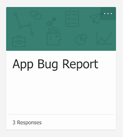

# HockeyApp Feedback

App Center does not support the [HockeyApp Feedback](https://hockeyapp.net/features/feedback/) functionality. Therefore it’s not possible to move feedback data to App Center. In the following we’re laying out ways how you can replicate similar functionality in your app with other tools than HockeyApp.

## Microsoft Flow & Azure Boards

With Flow + Azure Boards, users can fill out an online form to submit their feedback.  Flow then takes the form submission and auto creates a work item in Azure Boards.  Flow will also autopost the feedback into [Microsoft Teams](https://products.office.com/en-us/microsoft-teams/group-chat-software).

**To start:**

1. Create a feedback submission form with [Microsoft Forms](https://forms.office.com/Pages/DesignPage.aspx).  This should include a free text form for the user to input their feedback.

2. Log into [Microsoft Flow](https://preview.flow.microsoft.com/en-us/), and create the [Automatically file bugs and notify team](https://preview.flow.microsoft.com/en-us/galleries/public/templates/1a5cd7ae0a3746b39696556ae702c53e/automatically-file-bugs-and-notify-team/) workflow.
3. In Microsoft Flow, connect to Azure DevOps, Microsoft Teams and Microsoft Forms.
4. Select your feedback submission form in the Microsoft Flow setup wizard.
5. Once your Flow is setup, return to your feedback form in Microsoft Forms.  From the sharing settings on your form, select **Anyone with the link can respond**.

6. Add a link in your app that allows users to access the url of your feedback form.

## External Services

### HelpShift

[Helpshift](https://www.helpshift.com/) is a great way to provide customer support to your mobile app users.  It combines in-app messaging with a knowledge base and support ticketing system. 

- Supports: iOS and Android apps
- Live in-app communication with your users
- In-app notifications and push notifications

### Instabug

[Instabug](https://instabug.com/in-app-chat) has a user feedback tool.  It helps you directly communicate with users who experienced a specific crash in your app.  It also provides information about the device and app version where the issue occurred.

- Supports: iOS and Android apps
- In-app feedback
- Integration into bug tracking tools

### Apptentive

[Apptentive](https://www.apptentive.com/) is a great tool to help understand your user base. You can easily send out surveys and help your users to adopt new features in your app.

- Supports: iOS and Android apps
- Run in app surveys
- In app live messaging with your users
