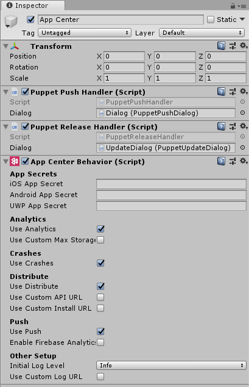

# Migrate from the HockeySDK to App Center SDK for Unity

[!include]

## 1. Update the libraries

### 1.1 Remove old HockeySDK

1. Choose the game object that you had created for the SDK and remove `HockeyAppAndroid` / `HockeyAppiOS` component by clicking the **Settings** icon > **Remove Component**.

1. Remove **HockeyAppUnityAndroid** / **HockeyAppUnityiOS** folder(s) from the **Assets** folder inside your Unity project.

### 1.2 Add new App Center SDK

The App Center SDK is integrated by importing Unity Packages into your project. To do so, first install the [App Center Unity Editor Extensions](https://github.com/Microsoft/AppCenter-SDK-Unity-Extension) plugin. Open the Editor Extensions via the Unity menu: **Window** > **App Center** > **Editor Extensions** and select **Install App Center SDK**.

Please note that the App Center SDK is designed with a modular approach – you can integrate only those services that you're interested in. See the equivalences in the next table:

HockeyApp module         | App Center module
------------------------ | -----------------
`Crashes and Exceptions` | `Crashes`
`Metrics`                | `Analytics`
`Version Updates`        | `Distribute`

To install the services separately, you can select **Install SDK** in each tab.

> [!NOTE]
> The App Center Unity SDK is one for all three platforms: Android, iOS and UWP. You don't have to install each SDK separately.

The recommended way to integrate the App Center Unity SDK is to use **App Center Editor Extension**, but we support other scenarios. For more info, refer to the [App Center Unity Documentation](~/sdk/getting-started/unity.md#3-add-the-app-center-sdk-to-your-project).

## 2. Setup the SDK

### 2.1 Convert the application identifier

The App Center SDK uses application identifiers in the globally unique identifier (GUID) format. Your HockeyApp App ID can be used by App Center but you need to convert it to a different format. To convert the identifier you must add four hyphens to get an 8-4-4-4-12 representation.

Before (HockeyApp):
`00112233445566778899aabbccddeeff`

After (App Center):
`00112233-4455-6677-8899-aabbccddeeff`

### 2.2 Configure the SDK

#### Attach App Center script

In the Project window, navigate to the **AppCenter** folder that was added to your project. Locate the script with the App Center logo as its icon, named `AppCenterBehavior`, and drag it onto the game object you used previously for HockeySDK.

#### Configure App Center settings

Click on this game object and in the **Inspector** window, you will see the App Center configuration.

Fill in the additional information using the detailed configuration mapping table, which is given below.

## 3. Services and feature comparison

HockeyApp Setting | App Center Setting | Notes
------------------- | ------------------- | ---
App ID | Android/iOS App Secret | Use the App ID that you have converted in the previous step
Server URL | Custom Log URL, _Other Setup_ section | Check **Use Custom Log URL**
Restricted in-app updates | NA | Works out of the box
Crashes and Exceptions (enabled by default) | Use Crashes | [Crashes module](~/sdk/crashes/unity.md)
Auto Upload Crashes | NA (enabled by default) | [Documentation (enabled by default, can be configured)](~/sdk/crashes/unity.md#ask-for-the-users-consent-to-send-a-crash-log)
Exception Logging | [Initial Log level](~/sdk/other-apis/unity.md#adjust-the-log-level), _Other Setup_ section | If you want more detailed logging, use `Verbose`
User Metrics | Use Analytics | [Analytics module](~/sdk/analytics/unity.md)
Version Updates (enabled by default) | Use Distribute | [Distribute module](~/sdk/distribute/unity.md)
Update Alert | NA | [Documentation (has to be configured)](~/sdk/distribute/unity.md#2-customize-the-update-dialog)

> [!NOTE]
> If your project does not support one of the three platforms listed in the settings, simply leave the app secret field as-is; it will have no effect. If your project supports platforms that App Center does not support, the APIs and configuration will have no effect for those platforms.

If your project has the HockeySDK API calls throughout the application, replace them using the detailed API mapping table given below.

Feature | HockeyApp | App Center
------- | --------- | ---
Custom events with properties | [HockeyAppIOS.TrackEvent](https://github.com/bitstadium/HockeySDK-Unity-iOS/blob/5.2.0/Plugins/HockeyAppUnityIOS/HockeyAppUnity-Scripts/HockeyAppIOS.cs#L150-L158) or [HockeyAppAndroid.TrackEvent](https://github.com/bitstadium/HockeySDK-Unity-Android/blob/5.1.1/Plugins/HockeyAppUnityAndroid/HockeyAppUnity-Scripts/HockeyAppAndroid.cs#L149-L156) | [Analytics.TrackEvent](~/sdk/analytics/unity.md#custom-events)
Explicitly check for updates | [HockeyAppIOS.CheckForUpdate](https://github.com/bitstadium/HockeySDK-Unity-iOS/blob/5.2.0/Plugins/HockeyAppUnityIOS/HockeyAppUnity-Scripts/HockeyAppIOS.cs#L187-L190) or [HockeyAppAndroid.CheckForUpdate](https://github.com/bitstadium/HockeySDK-Unity-Android/blob/5.1.1/Plugins/HockeyAppUnityAndroid/HockeyAppUnity-Scripts/HockeyAppAndroid.cs#L216-L219) | NA
Display a feedback form | [HockeyAppIOS.ShowFeedbackForm](https://github.com/bitstadium/HockeySDK-Unity-iOS/blob/5.2.0/Plugins/HockeyAppUnityIOS/HockeyAppUnity-Scripts/HockeyAppIOS.cs#L178-L181) or [HockeyAppAndroid.ShowFeedbackForm](https://github.com/bitstadium/HockeySDK-Unity-Android/blob/5.1.1/Plugins/HockeyAppUnityAndroid/HockeyAppUnity-Scripts/HockeyAppAndroid.cs#L238-L241) | NA (please see the section below)

### Feedback

The feedback service won't be supported in App Center. See [HockeyApp feedback](feedback.md).
