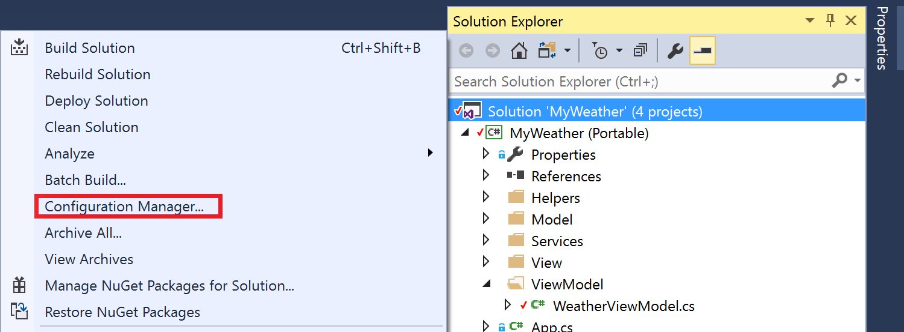
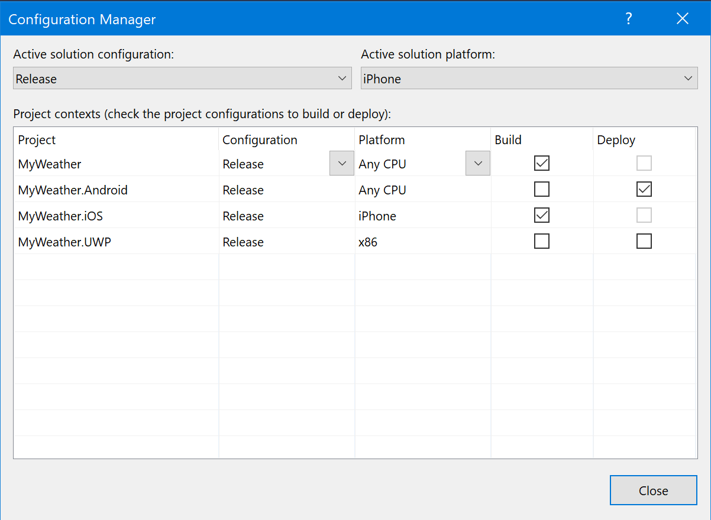
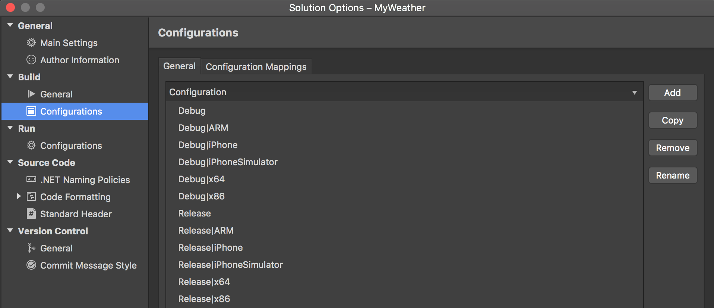
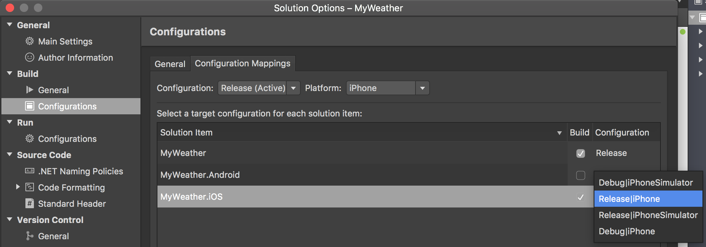

In order to minimize possible build errors when building from the `.sln` file you can apply the following guidelines to prepare proper configurations mapping in your solution.

# Project Configurations
When you change the project option it can belong to different project configurations. Projects can have multiple configurations, namely *Debug* or *Release*. Switching between those configurations allows for different outputs at build time. For example, when you use a Debug configuration, the output will include debugging symbols, which allows the debugger to resolve function name, parameters, or variables from a crash applications stack trace. This, however, leads to an increased file size and should not be used for publishing in stores.

The project configuration usually consists of two parts, one being the name itself and the other is the platform specification. So for Xamarin.iOS application, the configuration can look like *AppStore | iPhone* or *Debug | iPhoneSimulator*. If you use Xamarin.Forms for cross-platform development your PCL project can have just *Release* and *Debug* configurations without platform specification since it is there by default.

# Solution Configurations
Solution configurations direct the behavior for your Run/Build command in IDE and also the way Mobile Center builds your application when the `.sln` file is specified for the source. Your solution can have a different set of interdependent projects and the configurations for it can differ from those you have in each project. To arrange those different configuration options under one solution configuration and to opt in or out various projects building you can change a *Configuration Mapping*. You may want to skip building of Android projects for reduced build time or even fix a build failure if UWP project is selected to build since Mobile Center macOS machines do not support the building of UWP projects.

## Add, Remove or Edit a Solution Configuration in VS for **Windows**
Please open the *Configuration manager* in your solution explorer.

### 1.

### 2.

### 3.
Here in each configuration/platform you have a drop down with *New/Edit* options:

## Add, Remove or Edit a Solution Configuration in VS for **Mac**
To add, remove or edit existing solution configuration please double click on your solution name in the *Solution Explorer*

Then navigate to *Build -> Configurations -> General*

# Changing a Solution Configuration Mappings
The way you can change your *Configuration Mapping* depends on IDE you use. Here you may change specific project building with current solution configuration using the checkboxes in the Build column. You may want to disable building Android projects for your iOS application here. To disable building UWP projects you will need to use VS for Windows or manual editing of your `.sln` file.

## Configuration Mappings in **Windows**
Please open the *Configuration manager* to edit the mappings.

You can read additional configuration mappings information in [VS official documentation](https://docs.microsoft.com/en-us/visualstudio/extensibility/internals/configuration-options-overview).

## Configuration Mappings in **macOS**
Please navigate to *Build -> Configurations -> Configuration Mappings* in your solution options.

There is also additional [configuration mappings information for different Xamarin IDE for Mac](https://developer.xamarin.com/guides/cross-platform/xamarin-studio/projects-and-solutions/#Solution_Configurations).