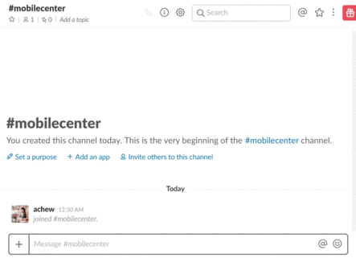

---
# required metadata

title: Mobile Center Slack App Documentation
description: how to use Mobile Center Slack App
keywords: mobile center, slack app, slackbot, slack bot, documentation, integration, slack
author: achewqy
ms.author: amchew
ms.date: 2017-09-14
ms.topic: article
ms.service: mobile-center
ms.assetid: d019ce2d-24b6-4a07-a9a2-e3484fcbb005

# optional metadata

#ms.devlang: dotnet
#ms.reviewer: piyushjo

---

# Mobile Center Slack App

## Overview 

Mobile Center Slack App empowers users to interact with Mobile Center directly from Slack. 

Our aim is to enable users to quickly access Mobile Center services and respond to critical app data in Slack, and distribute to Slack workspaces and messages. Users can easily trigger a build, view an app's analytics and crashes, and invite new testers to an app. This is done via [slash commands](https://api.slack.com/slash-commands) in Slack. 

## Getting Started

1. Navigate to [Mobile Center's Slack App](https://slack.com/apps/A5ZK2MYJC), and install and authorize the app:  

	

1. Navigate to your Slack workspace and select any direct message or channel.

1. In the **message** tab, run the Slash command `/mobile-center`.

1. Authorize Mobile Center's Slack App by following the instructions below:

	1. Go to https://mobile.azure.com/settings/apitokens and create a new Full Access API token.
		- Here are details on how to [create a new Full Access API token](https://docs.microsoft.com/mobile-center/api-docs/), in particular please see steps 4-5.
	1. Go back to Slack and run `/mobile-center login <your token>` command.
	1. Welcome! You've successfully authorized your app.
	
1. You may run `/mobile-center help` to see a complete list of Mobile Center commands. Below is the list of commands supported by Mobile Center Slack App:
	
	| Command       | Description           | 
	|---	|---	|
	| `/mobile-center login <token>` | One time setup to get access to Mobile Center via Slack | 
	| `/mobile-center logout`      | Clean up authorization info     |  
	| `/mobile-center build <app> <branch>` | Trigger a new build of an app      |    
	| `/mobile-center analytics <app>`     | View analytics information | 
	| `/mobile-center invite <app> <distribution group> <email separated by commas>`  | Invite a new tester to an app|   
	| `/mobile-center crashes <app>`      |   crashes information | 
	| `/mobile-center help`      |   View list of Mobile Center commands|  

1. You can pin a specific Mobile Center app to the Slack channel or message. Run the slash command `/mobile-center` and click on **set current app** to choose the default app. To remove the default app, run the slash command `/mobile-center` and click on **clear current app**.  

	

