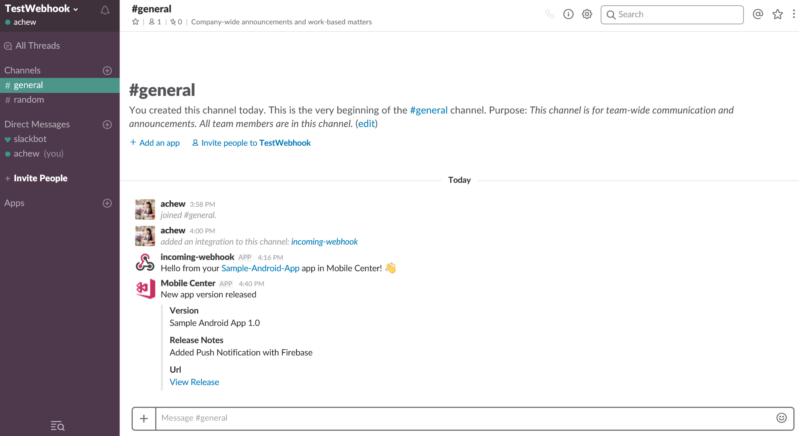
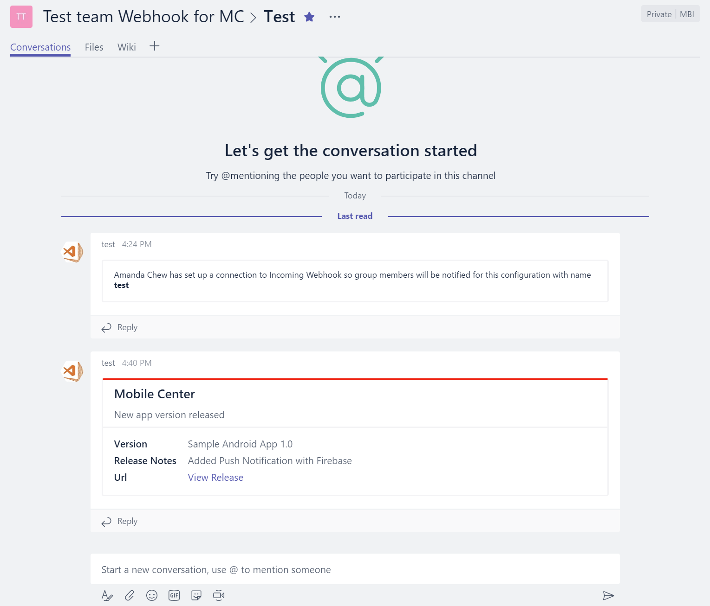

---
# required metadata

title: Mobile Center Webhooks Documentation
description: how to configure Mobile Center webhooks to applications like Slack, Microsoft Teams
keywords: mobile center, webhook, webhooks, documentation, Slack, Microsoft Teams
author: achewqy
ms.author: amchew
ms.date: 2017-09-13
ms.topic: article
ms.service: mobile-center
ms.assetid: 836f00da-66a8-4d5e-8535-1f965bf12f3f

# optional metadata

#ms.devlang: dotnet
#ms.reviewer: piyushjo

---
 
# Mobile Center Webhooks
## Overview

Webhooks are a simple way to notify third party applications when a specified event has occurred.
Mobile Center’s webhooks are useful in empowering users to send automatic notifications to connected applications when either:

- a crash group is created
- a version is released

The main goal of webhooks is to communicate important information from Mobile Center to users rather than having users come to the portal to get this information. Mobile Center will send an HTTP POST payload to the webhook's specified URL. Webhooks can be registered on your specific application under [Mobile Center Apps](https://mobile.azure.com/apps). 

## Getting Started
 
1. Navigate to https://mobile.azure.com/apps, and select the specific app you would like for webhooks integration.

1. In your app, select **Settings**, and click the **edit** button.

1. Select the **New Webhook** button and enter:

    1. Webhook name
    1. Webhook url  
    
      
    	You can obtain the webhook url from the application's settings that you are integrating with (for example, Slack, Microsoft 		Teams). In Mobile Center, click on the **radio buttons** to decide what events will trigger the webhook alerts. Once these 		events happen, alerts from Mobile Center will be posted into your integrated applications. 
	
  		

1. Done! Your webhook is now created and enabled. You may create multiple webhooks by repeating [step 3](#step3).

1. Toggle to the extreme right hand of the webhook to **test, disable or delete** the webhook. 

  - **test** will send a test alert to your connected application.
  - **disable** keeps the webhook inactive but present in your dashboard.
  - **delete** will remove the webhook from your dashboard. 

    Here are how the alerts will look like in your connected applications:
  
    ### Slack

    
  
    ### Microsoft Teams

    
  