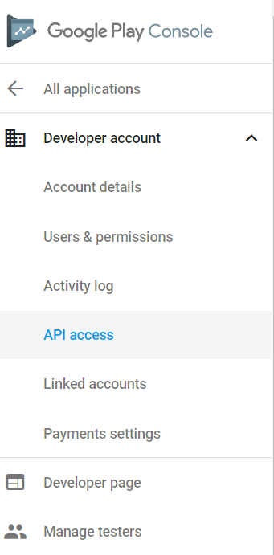
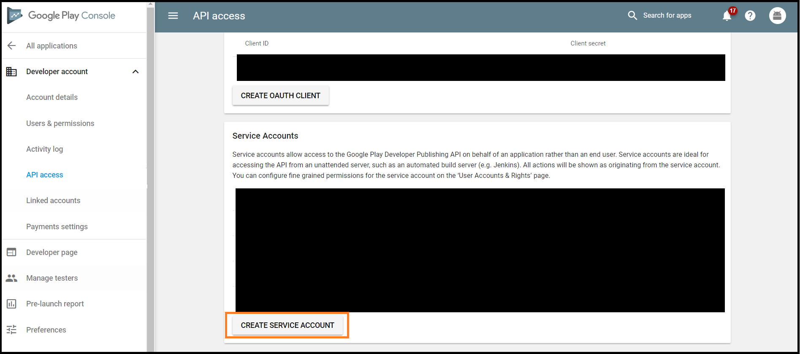
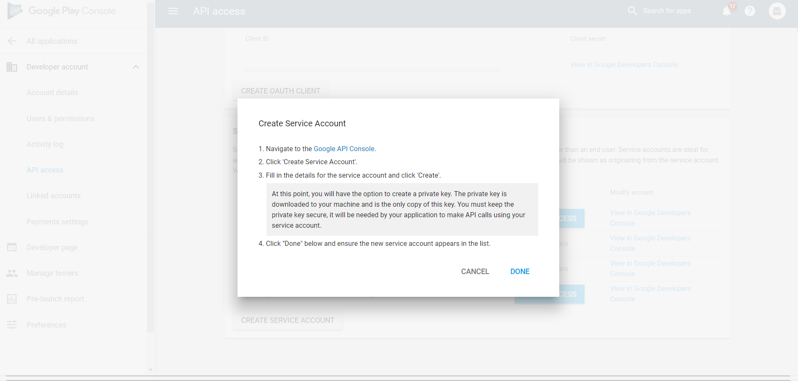
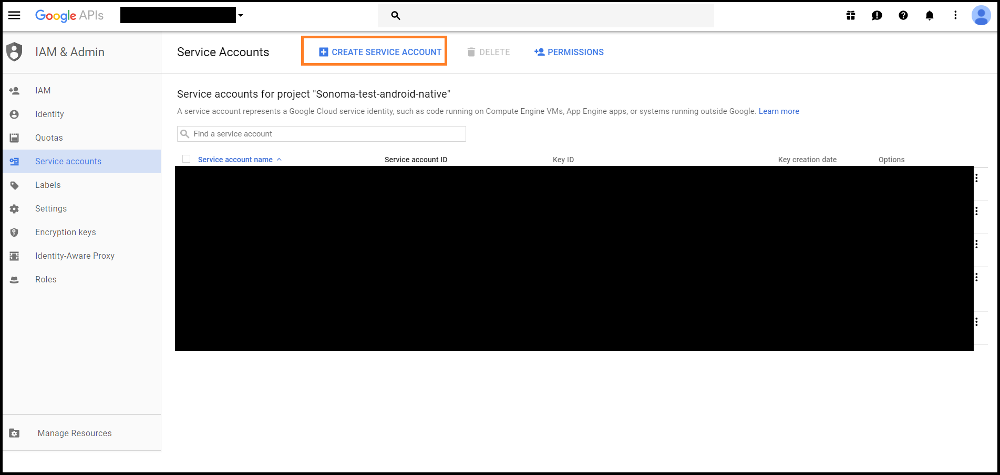
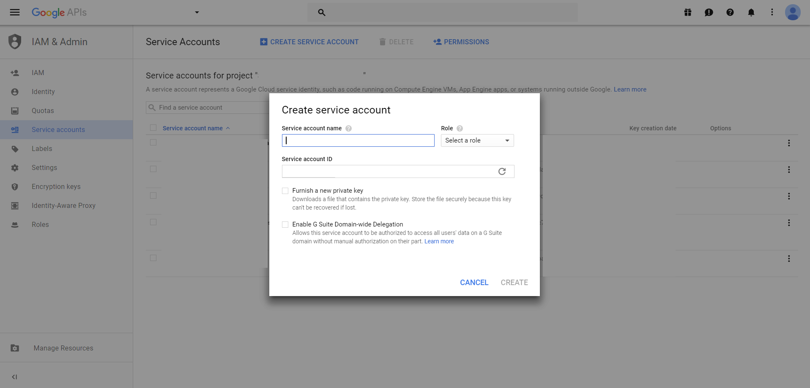
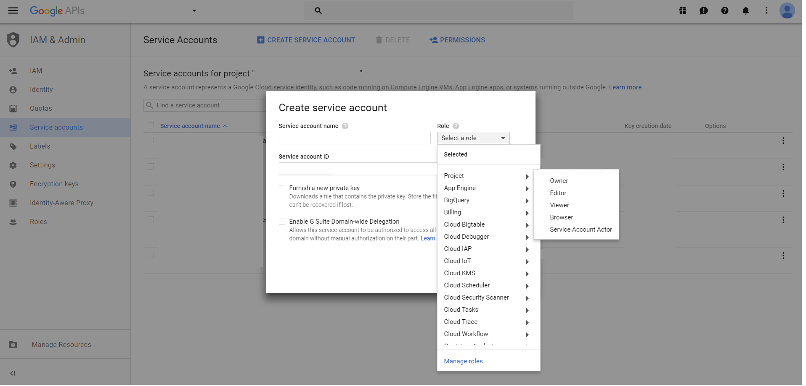
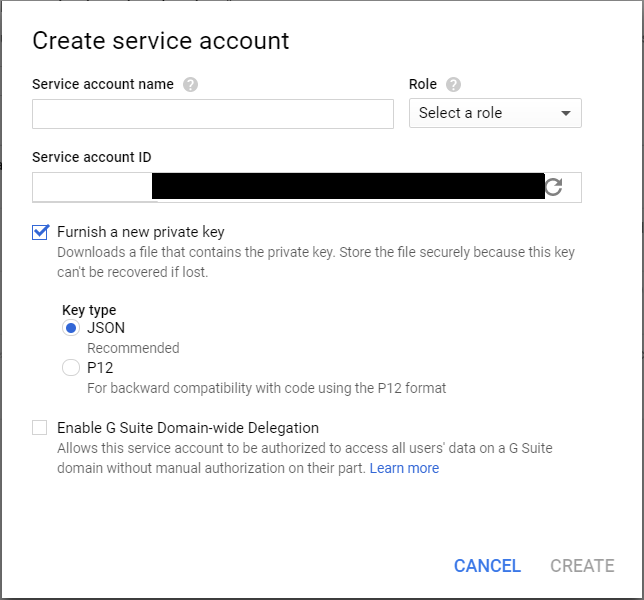
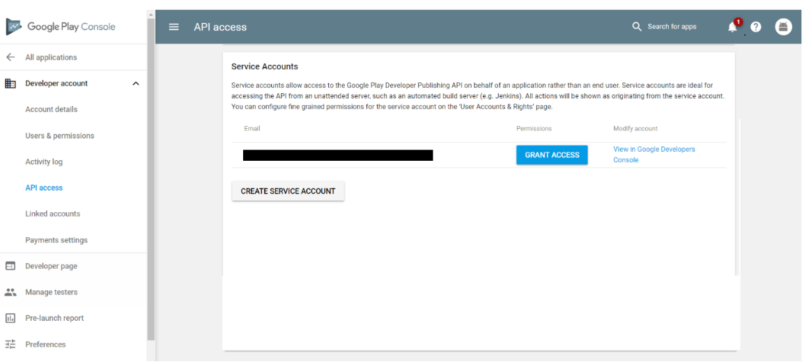

# Google Play Store Distribution 

Publish an upgrade to Google Play, including the Alpha and Beta tracks from Mobile Center. 

### Pre-requisites

* Google requires the first version of your Google Play application to be published to production through the Google console.
* A Google Play Developer account. If you don’t have one, register for a [developer account](https://play.google.com/apps/publish/signup).
* For Mobile center to create a Google Store connection and to access Google API’s on your behalf, you will need to make sure that you have an API project and a Service account, a one time process.
* Review [pre-requisites for Beta and Alpha](https://developer.android.com/distribute/best-practices/launch/beta-tests.html) for more information on these tracks.

For more information, review [How to use the Google Play console] (https://support.google.com/googleplay/android-developer/answer/6112435?hl=en).

### Linking your API Project

Before you can access the API, you must link your Google Play Console to an API project. In most cases, we recommend that you create a new API project, although current API users can link to an existing API project. Keep in mind that each API project can only be linked to a single Google Play Console account.

**Creating a new API project**

* Go to the [API Access](https://play.google.com/apps/publish/#ApiAccessPlace) page on the Google Play Console.
* Accept the Terms of Service.
* Click on "Create new project".
* An API project is automatically generated and linked to your Google Play Console.

**Using an existing API project**

* If you are already a user of the Google Play Developer API, you can link to your existing API project by following these steps. If the API project to link to is not listed, verify that your Google Play Console account is designated as an Owner, and the Google Play Developer API is enabled.
* Go to the [API Access](https://play.google.com/apps/publish/#ApiAccessPlace) page on the Google Play Console.
* Accept the API Terms of Service.
* Choose the project you’d like to link.
* Click on "Link".

###Setting Up API Access Clients
**Using a service account**

You can also create a [service account](https://developers.google.com/accounts/docs/OAuth2ServiceAccount) to access the API from a build server without providing your personal user credentials:

*   Go to the [API Access](https://play.google.com/apps/publish/#ApiAccessPlace) page on the Google Play Console.

*   Under **Service Accounts**, click **Create Service Account**.

*   Follow the instructions on the page to create your service account.

*   On click of [Google API Console](https://play.google.com/apps/publish/#ApiAccessPlace) link. Proceed by clicking **CREATE SERVICE ACCOUNT**.

    1. Configure it as
    

    2. Choose a name for your Service Account and click **Select a role** drop-down menu. select **Owner** (full access to the integration) under **Project**

    3. Choose a **JSON Key Type**, by clicking on "Furnish a new private key".
    

    4. Click **Create** to complete the service account creation. As you have chosen a JSON Key Type, a file with a .json extension will be downloaded on your machine. This file is required to publish your application.

*   Once you’ve created the service account on the Google Developers Console, click **Done**. The [API Access](https://play.google.com/apps/publish/#ApiAccessPlace) page automatically refreshes, and your service account will be listed.

*   Click **Grant Access** to provide the service account the necessary rights to perform actions. You should now be able to access the API through the service account. For more information on OAuth 2.0, review [Using OAuth 2.0 for Server to Server Applications](https://developers.google.com/accounts/docs/OAuth2ServiceAccount).

The following steps explain how to set up the connection between Mobile Center and Google Play.
### Step1: Create a Google Play connection in Mobile Center

1. Click on **Stores** under Distribution. 
2. Click on **Add Connection**.
3. Select **Google Play** store.
4. Click on **Next**.
5. Upload the **private key JSON** file which was downloaded to your machine while creating the service account. If the JSON fields are edited to incorrect values, the store creation might fail. Make sure you have the service account linked to your Google play Developer console as per the pre-requisite section above. 
6. Once the file is uploaded, click **Connect**.
7. A Google Play connection should now be visible with the three tracks, Production, Alpha, and Beta in the **stores** home page. Setting up this connection is a one time process for a specific app in Mobile Center.

### Step 2: Publish your APK to the Google Play Store

1. From the **Stores** home page select any of the tracks created above.
2. Click on **Publish to Store**.
3. Upload the app package. A few points to note
    * Application type should be correct and signed with a valid key store before uploading.
    * Google Play store supports a maximum of 100 MB of application package. If the application exceeds 100 Mb, use the Expansion files to support the application package by uploading those directly in the google play developer console as we currently don’t support Expansion files in Mobile Center. Review [Expansion files](https://support.google.com/googleplay/android-developer/answer/2481797?hl=en).
    * The version of the .apk must be strictly greater than the current version in production.
    * If you have app versions in other tracks like Alpha and Beta, your release version should be strictly less than versions in alpha and Beta track versions.
    * Google API’s currently do not support promotion of an app from one track to another. Hence Mobile Center does not support promoting a version from alpha to beta or beta to production.
4. When the package has been uploaded, you should be able to see some details of the application. Click **Next**.
5. Click on **Publish** to push the app to the **Google Play store**. The status for this release on the store details page will show as **Submitted.**
6. Once Mobile Center has completed the hand-over of the app to Google, the status of the app will change to **Published.** Note that Google could take upto 24 hours to show up the app on the Play store.
7. In case of a failure while publishing by Google, app owner will receive a notiifcation to the registered google mail. 

