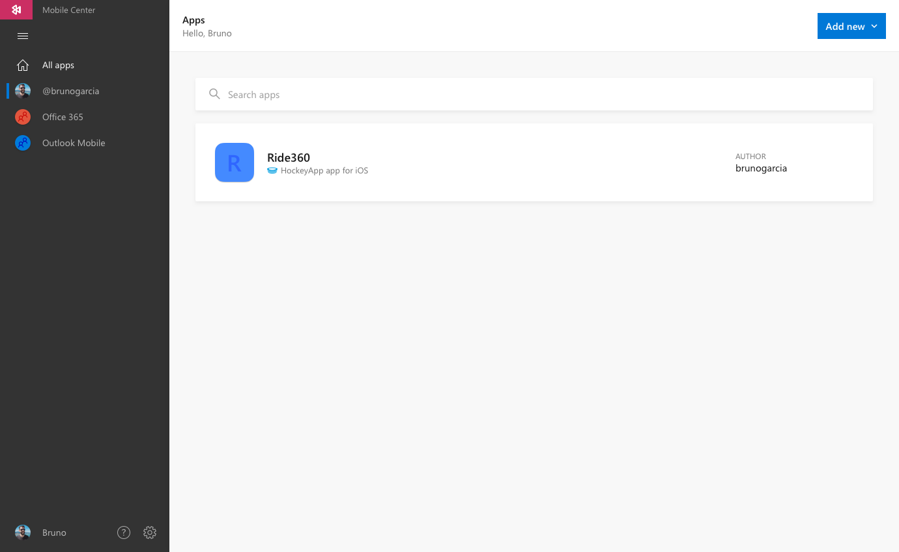
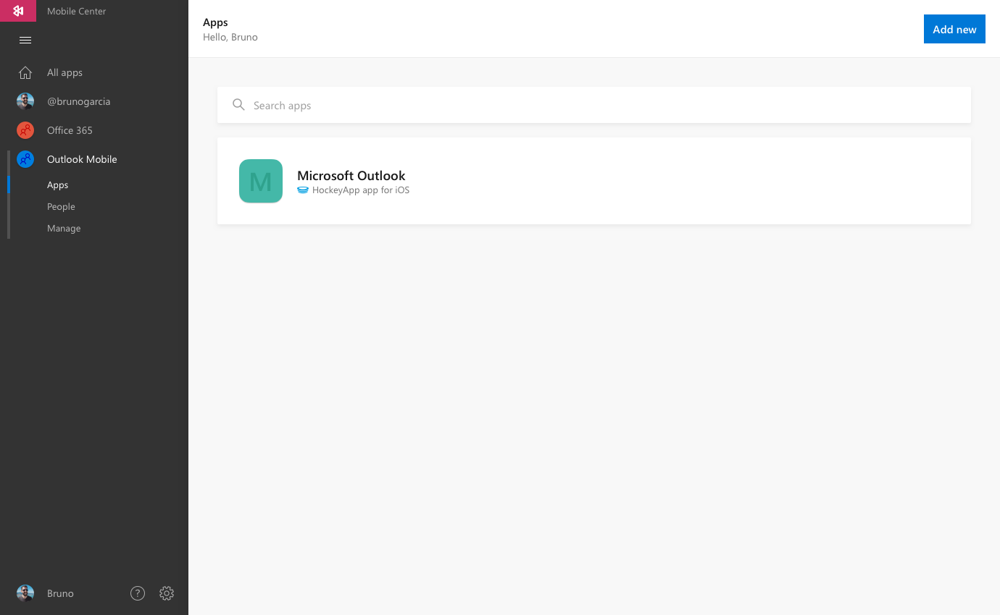

# HockeyApp Transition Plan

We're committed to migrating your HockeyApp account with zero hassle. That's why we have created a [transition plan](https://www.hockeyapp.net/mobile-center/transition/) that is transparent, easy-to-understand, and effortless for our users. This process is being rolled-out in two different phases:

## Preview your apps & data in Mobile Center
Spring 2017 - Available now

Transitioning should be low-risk for all HockeyApp users, that's why we created a side-by-side sync of your apps between our current and future platforms.

HockeyApp Preseason customers can view their HockeyApp apps within Mobile Center without needing to migrate them. To get started, [sign-in](https://mobile.azure.com/login?utm_medium=referral_link&utm_source=Hockey%20App) to Mobile Center using your existing HockeyApp credentials.

### Accessing your HockeyApp apps

Once logged in, you'll see a list of all of your existing HockeyApp apps (alongside any exiting Mobile Center apps you have already created).

HockeyApp apps that are **iOS** or **Android**, and built using **Native**, **Xamarin**, or **React Native** technologies will be ready-to-use within Mobile Center. We're busy working on expanding to other platforms. Keep an eye on our [Product Roadmap](~/general/roadmap.md) for updates on OS and platform expansion and improvements.
 

### What can you do within Mobile Center?

Use existing HockeyApp apps with [Build](~/build/index.md) and [Test](~/test-cloud/index.md) services without affecting your existing HockeyApp apps.

* Mobile Center's **Distribute** service will work alongside HockeyApp. Upload and distribute your new releases using Mobile Center, all while automatically syncing with your HockeyApp account. [More details here](~/migration/hockeyapp/distribution.md).

<!--  -->

* Mobile Center's **Crashes** and **Analytics** services will automatically stream data collected from your existing HockeyApp SDK directly into Mobile Center. Read more about HockeyApp [Crashes](~/migration/hockeyapp/crashes.md) and [Analytics](~/migration/hockeyapp/analytics.md) inside Mobile Center.

### What you can't do within Mobile Center

* During this Preview period, all app management (Collaborators, renaming app, deleting app, etc) will remain in HockeyApp. To easily access the HockeyApp version, click the link in the upper, right-hand corner of 'Getting Started'.

### Accessing your HockeyApp personal apps

* Access all the apps owned by you in the by clicking your username in the left navigation. Apps you have created in Mobile Center that are owned by you will also appear here.

<!--  -->

### Accessing your HockeyApp organizations

* Access all of the organizations you belong to HockeyApp. Using the left navigation, click on existing HockeyApp organizations alongside ones you have created in Mobile Center.
* Use the **People** tab to view the Collaborators on all apps within the organization.

<!--  -->

> [!NOTE]
> Unlike HockeyApp, all collaborators within an organization are able to create apps.

<!-- ## Coming soon -->
