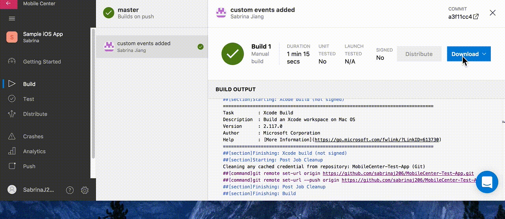

---
# required metadata

title: Crashes | Sample App Tutorials
description: Tutorial on viewing crashes from a sample iOS app in App Center
keywords: app center
authors: sabrinaj206
ms.author: t-sajia
ms.date: 06/28/2017
ms.topic: article
ms.service: vs-appcenter
ms.custom:
ms.prod:
ms.assetid: c1a3c385-3f62-4a6f-8cd8-661bdb4db795

# optional metadata

#ROBOTS:
#audience:
#ms.devlang: 
#ms.reviewer: [ALIAS]

---

# Crashes - Sample Swift App and Tutorials
In this tutorial, you will learn to view crashes from a sample Swift app in App Center.

If you have not already, first follow the [getting started tutorial](getting-started.md) to set up the sample app.

## Get the symbols
In order to symbolicate crashes in iOS, App Center needs you to upload a **symbol file to App Center**. You can download symbols from a build in App Center, or skip this section and use your own.

If you already completed the [Build tutorial](build.md) and built the sample app:
1. Navigate to the **Build** service in the portal.
2. Select the **master** branch.
3. Click on the latest successful build.
4. Click **Download** > **Download symbols** at the top.

## Upload symbols
1. Navigate to the **Crashes** service and go to the **Symbols** page.
2. Click **Upload symbols** at the top of the page and upload the symbol file you just downloaded.
  <!---->

## Open the sample app
1. Run the sample app. If you're running it in the **Xcode simulator**, follow these additional steps to detach the debugger:
2. Press the **Stop** icon to stop running the app.
3. In the simulator, close the app. Press the home button twice (cmd+shift+h) and swipe up on the sample app.
4. Reopen the app by clicking on its icon.  

  

## Crashing the sample app
1. Swipe over to the **Crashes** page. Tap the **Send a sample crash** button to crash the app.
2. **Reopen the app.** This sends the crash report to the App Center backend.  

  

## View the crashes in App Center
1. Navigate to the **Crashes** service in App Center. It may take a couple minutes for the crash report to show up after reopening the app.
2. Click on the crash to view its details, such as its stack trace, affected devices, and more.
