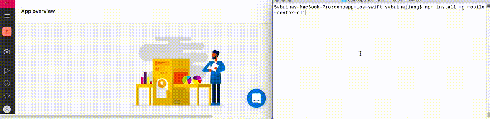
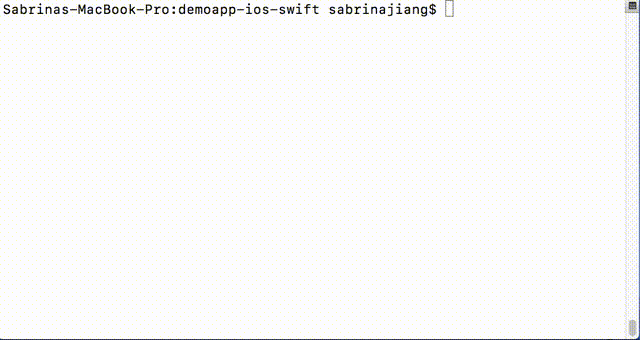
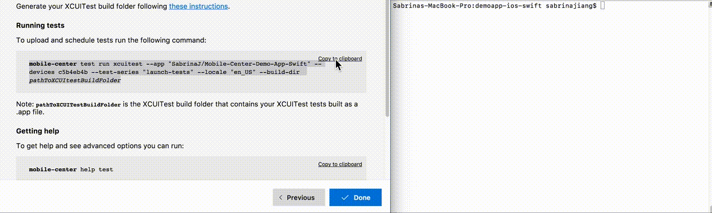

---
# required metadata

title: Test| Sample App Tutorials
description: Tutorial to test the sample ios app with App Center.
keywords: app center
authors: sabrinaj206
ms.author: t-sajia
ms.date: 06/26/2017
ms.topic: article
ms.service: vs-appcenter
ms.custom:
ms.prod:
ms.assetid: 6b151137-b1c3-41a7-bfbd-383c6f4c853c

# optional metadata

#ROBOTS:
#audience:
#ms.devlang:
#ms.reviewer: [ALIAS]

---

# Test - Sample Swift App and Tutorials

XCUITests are included with the sample app. In this tutorial, you will learn to run the UI tests using App Center.

First, follow the [getting started tutorial](getting-started.md) to set up the sample app.

### Prerequisites
 - Provisioning Profile and Certificate. Go to the [Apple Developer Documentation](https://developer.apple.com/library/content/documentation/IDEs/Conceptual/AppDistributionGuide/MaintainingProfiles/MaintainingProfiles.html) to learn about creating an App ID to codesign the sample iOS app with.

## Install App Center Command Line Interface

1. Install [Node.js](https://nodejs.org/en/) version 6.3 or later.
2. Open the terminal and run the command below to install the App Center CLI:

  ```shell
  npm install -g mobile-center-cli
  ```

3. Run the command below and follow the directions to log in to App Center:

  ```bash
  mobile-center login
  ```  
  

## Make the test folder
1. Open a terminal and go to the project directory.
2. Run the command below to remove the derivedDataPath if it exists:

  ```bash
  rm -rf ddp
  ```

3. Run the command below to make the build folder for tests:

  ```bash
  xcrun xcodebuild build-for-testing -configuration Debug -workspace sampleapp-ios-swift.xcworkspace -sdk iphoneos -scheme sampleapp-ios-swift -derivedDataPath ddp
  ```  
  <!---->

## Prepare to run tests in App Center
1. Go to the **Test** service in [App Center](https://appcenter.ms/apps).
2. Click on **Start testing your app**.
3. Select the first device, the **Apple iPhone 7 Plus**, and press **Select one device** at the bottom.  
4. Choose **XCUITest** as the Test framework.   
5. Click **Next**.  
  <!---->

## Run the tests
1. Copy the custom command under **Running tests**.
2. Paste it into the terminal while in the project directory.
3. Replace ```pathToXCUItestBuildFolder``` with the text below:

  ```bash
  ddp/Build/Products/Debug-iphoneos
  ```

4. Run the command. You will see the tests begin to run.
5. In App Center, click **Done** to close the panel.  
  
