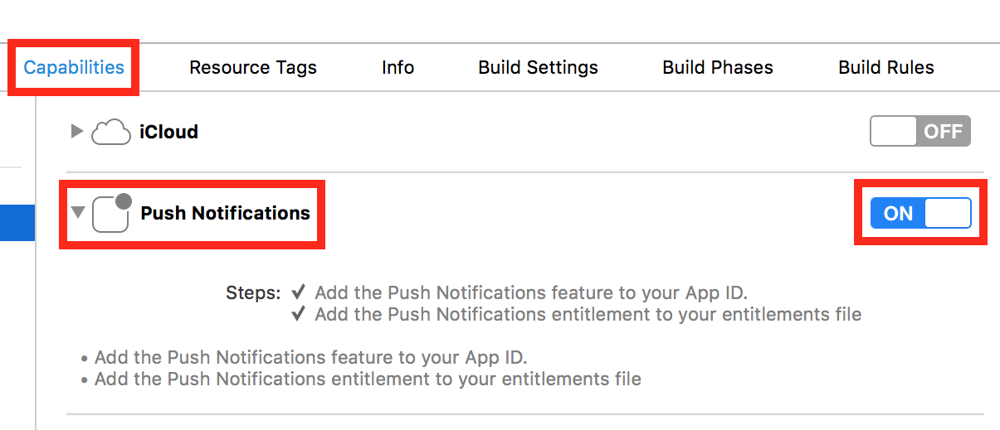

---
# required metadata

title: Push | Demo App Tutorials
description: Tutorial to help user create and send push notifications.
keywords: mobile-center
authors: sabirnaj206 sshibu
ms.author: t-sajia t-shshib
ms.date: 06/26/2017
ms.topic: article
ms.service: mobile-center
ms.custom: samples
ms.prod: .net-core
ms.assetid: c5e0de7e-63d8-41a4-839f-9fd210ba3aca

# optional metadata

#ROBOTS:
#audience:
#ms.devlang: dotnet
#ms.reviewer: [ALIAS]

---

# Push
In this tutorial you will learn how to send push notification to users through Mobile Center.

First, follow the [getting started tutorial](/getting-started.md) to set up the sample app.

### Prerequisites
- Code signed

## Enable Apple Push Notifications service
1. Open the **.xcworkspace**.
2. Click **Capabilities**.
3. Turn **Push Notifications** on.

## Get your Apple Push Notification service Key
1. Go to your **[Keys](https://developer.apple.com/account/ios/authkey/)** on the Apple Developer website.
2. Create a new APNs Key if you don't have one. Fill in a Key name and check the **APNs** checkbox.
3. Copy the **Key ID** and paste it in the box in Mobile Center.

## Get the sample app's Prefix and ID
1. Go to your **[App IDs](https://developer.apple.com/account/ios/identifier/bundle)** on the Apple Developer Website.
2. Click on the sample app's ID.
3. Copy the **Prefix** and paste it in the box in Mobile Center.
4. Copy the **ID** and paste it in the box in Mobile Center.
5. Enter your Authentication Key. <!-- UPDATE THIS -->
5. Choose **Sandbox**.
6. Click **Done** at the bottom.

## Set up a push notification
1. First, follow the [Distribute tutorial](distribute.md) to download the app to your device.
2. Navigate to the **Push** service in Mobile Center.
3. Click **Send notification** at the top of the page.
4. Set the **Campaign Name** as "Using Push Notifcations". Set the **Message** as "testing".

## Send a push notification
1. Click **Next** at the bottom.
2. Choose **All registered devices**.
3. Click **Next** and **Send notification** at the bottom.
