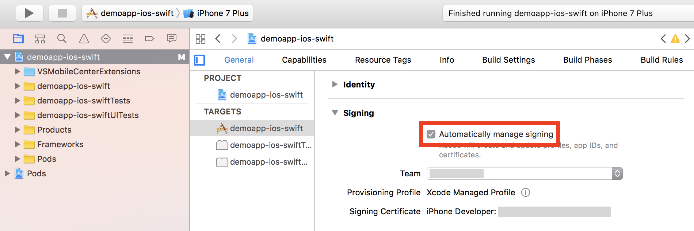
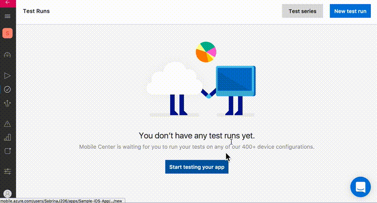
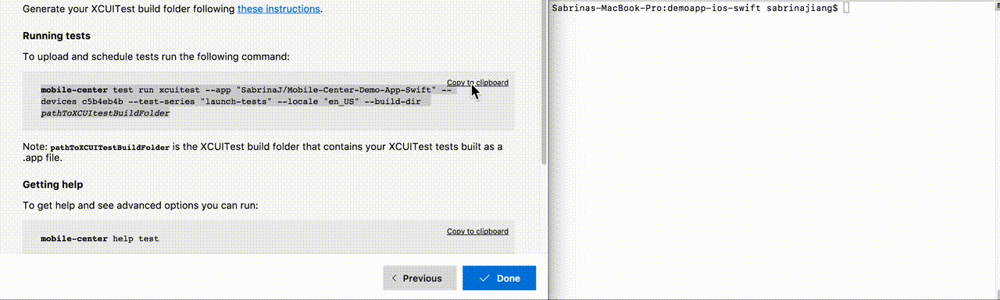

---
# required metadata

title: Test| Demo App Tutorials
description: Tutorial to test the sample ios app with Mobile Center.
keywords: mobile-center
authors: sabrinaj206 sshibu
ms.author: t-sajia t-shshib
ms.date: 06/26/2017
ms.topic: article
ms.service: mobile-center
ms.custom: samples
ms.prod: .net-core
ms.assetid: 6b151137-b1c3-41a7-bfbd-383c6f4c853c

# optional metadata

#ROBOTS:
#audience:
#ms.devlang: dotnet
#ms.reviewer: [ALIAS]

---

# Test

We've included XCUITests with the sample app. In this tutorial, you will learn to run the UI tests using Mobile Center.

First, follow the [getting started tutorial](/getting-started.md) to set up the sample app.

### Prerequisites
- Provisioning Profile and Certificate

## Install Mobile Center Command Line Interface

1. Install [Node.js](https://nodejs.org/en/) version 6.3 or later.
2. Open the terminal and run this command to install the Mobile Center CLI:

  ```shell
  npm install -g mobile-center-cli
  ```

3. Run this command and follow the directions to log in to Mobile Center:

  ```shell
  mobile-center login
  ```  
  

## Codesign the project <!-- UPDATE THIS -->
1. Open **.xcworkspace** from the sample app's folder.
2. Go to **General** within the .xcodeproj file and changing the information under the **Signing** tabs.
3. Select **Automatically manage signing** to point to Xcode to a certificate installed on your machine.  
  

## Make the test folder
1. Open a terminal and go to the project directory.
2. Run this command to remove the derivedDataPath if it exists:

  ```shell
  rm -rf ddp
  ```

3. Run this command to make the build folder for tests:

  ```shell
  xcrun xcodebuild build-for-testing -configuration Debug -workspace demoapp-ios-swift.xcworkspace -sdk iphoneos -scheme demoapp-ios-swift -derivedDataPath ddp
  ```


## Prepare to run tests in Mobile Center
1. Go to the **Test** service in [Mobile Center](https://mobile.azure.com/apps).
2. Click on **Start testing your app**.
3. Select the first device, the **Apple iPhone 7 Plus**, and press **Select one device** at the bottom.  
4. Choose **XCUITest** as the Test framework.   
5. Click **Next**.  
  

## Run the tests
1. Copy the custom command under **Running tests**.
2. Paste it into the terminal while in the project directory.
3. Replace ```pathToXCUItestBuildFolder``` with:

  ```shell
  ddp/Build/Products/Debug-iphoneos
  ```

4. Run the command. You will see the tests begin to run.
5. In Mobile Center, click **Done** to close the panel.

  
