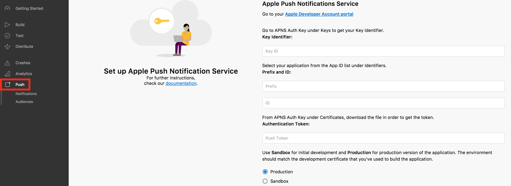
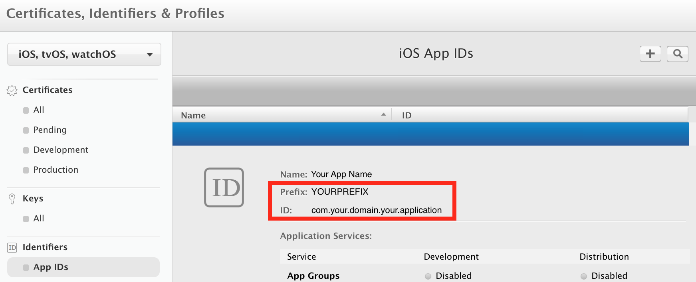
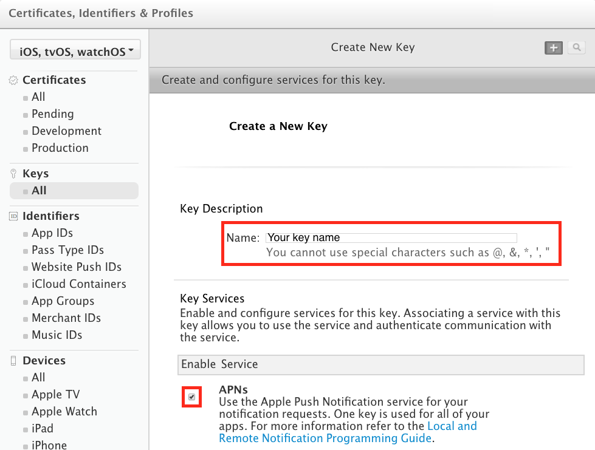
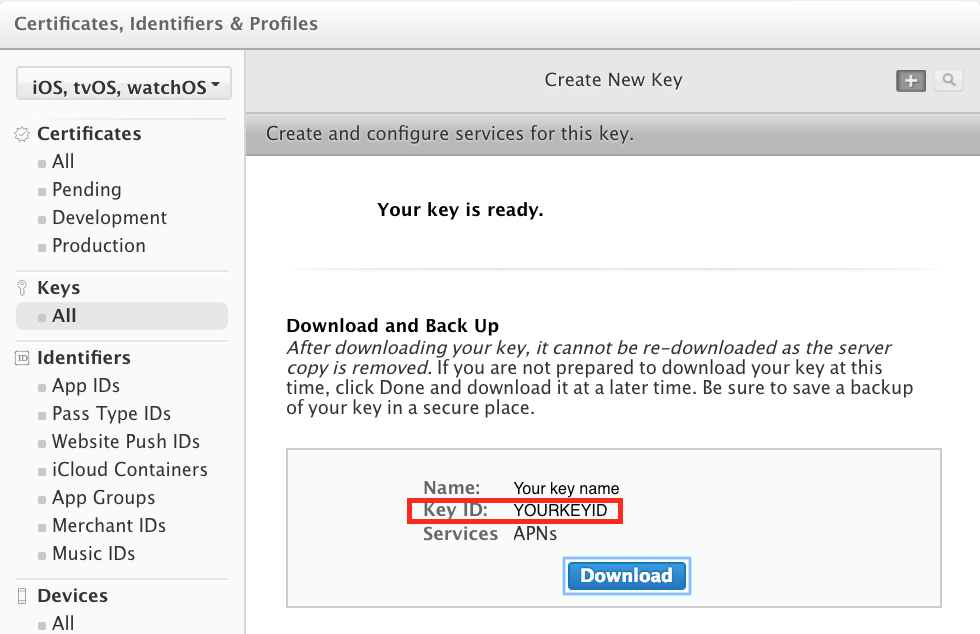

### Set up APNs

1. Log in to the Mobile Center portal, select your application, click on the **Push** button from the left menu then click **Next** to reveal the push notification settings UI:

    

    On the bottom of the page, select **Sandbox** for initial development or **Production** for production version of your application. You will collect the **Key ID**, **App Name**, **App ID** and **Push Token** in the next steps.

2. Go to your Apple developer account and select your application from the [App ID list](https://developer.apple.com/account/ios/identifier/bundle) in **Identifiers**. Copy the **Prefix** value from this window and paste it to the Mobile Center push settings **App ID** field. Do the same with the **ID** value to be copied to the Mobile Center push settings **App Name** field.

    

3. Go to your Apple developer account and create a [new key](https://developer.apple.com/account/ios/authkey/create) in **Certificates, Identifiers & Profiles**/**Keys**. Make sure to check the APNs checkbox, fill in the key name and press **Continue** then **Confirm**.

    

    On the next screen, copy the **Key ID** value and paste it to the Mobile Center push settings **Key ID** field. Download the key file.

    

4. Open your key file with a text editor and copy the authentication token it contains.

    

    On the Mobile Center push settings, paste this token to the **Authentication Token** field then click **Done** to complete this configuration.
