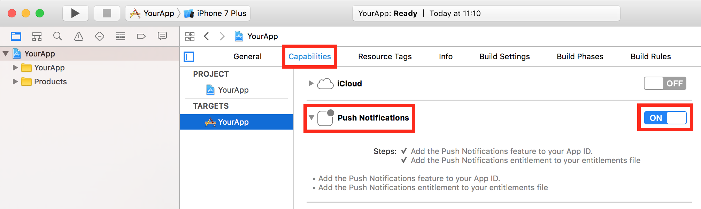

# Mobile Center Push

> [!div class="op_single_selector"]
> * [Android](android.md)
> * [iOS](ios.md)
> * [UWP](uwp.md)
> * [Xamarin.Android](xamarin-android.md)
> * [Xamarin.iOS](xamarin-ios.md)
> * [Xamarin.Forms](xamarin-forms.md)

Mobile Center Push enables you to send push notifications to users of your app from the Mobile Center portal.

## Prerequisite - Enable Apple Push Notifications service (APNs) for your app

Configure Apple Push Notifications service (APNs) for your app from your Apple developer account and Mobile Center portal before adding Mobile Center Push to your app.

### Enable push notifications on your application

 In Xcode's project editor, choose your target and click **Capabilities**. In the **Push Notifications** section, click the switch to turn it from OFF to ON.



[!include[](apns-setup.md)]

For more information, refer to the [Apple documentation](http://help.apple.com/xcode/mac/current/#/dev11b059073).

## Add Mobile Center Push to your app

### 1. Add the Mobile Center Push module

The Mobile Center SDK is designed with a modular approach – you only need to integrate the services that you're interested in.

#### Integration via Cocoapods

If you are integrating Mobile Center into your app via Cocoapods, add the following dependency to your podfile and run `pod install`.

```ruby
pod 'MobileCenter/MobileCenterPush'
```

#### Integration by copying the binaries into your project

If you wish to manually integrate the module, follow this [documentation link](ios-manual-integration.md).

### 2.Start Mobile Center Push

In order to use Mobile Center, you need to opt in to the service(s) that you want to use, meaning by default no services are started and you will have to explicitly call each of them when starting the SDK.

#### 2.1 Add the import for Mobile Center Push

Open your **AppDelegate.m** file  in Objective-C or **AppDelegate.swift** file in Swift and add the following import statements:

```objc
@import MobileCenter;
@import MobileCenterPush;
```
```swift
import MobileCenter
import MobileCenterPush
```

#### 2.2 Add the `start:withServices:` method

Add `MSPush` to your `start:withServices:` method to start Mobile Center Distribute together with the other services that you want to use in your app.

Insert the following line to start the SDK in your app's **AppDelegate.m** class in Objective-C or  **AppDelegate.swift** class in Swift in the `didFinishLaunchingWithOptions` method.

```objc
[MSMobileCenter start:@"{Your App Secret}" withServices:@[[MSPush class]]];
```
```swift
MSMobileCenter.start("{Your App Secret}", withServices: [MSPush.self])
```

Make sure you have replaced `{Your App Secret}` in the code sample above with your App Secret. Please also check out the [Get started](~/sdk/getting-started/ios.md) section if you haven't configured the SDK in your application.

#### 2.3 [Optional] Receive push notifications if you have already implemented `application:didReceiveRemoteNotification:fetchCompletionHandler` method

If you or one of your third party libraries already implements `application:didReceiveRemoteNotification:fetchCompletionHandler` method, then follow [these steps](#implement-the-callback-to-receive-push-notifications) to add the code to receive push notifications.

## Customize your usage of Mobile Center Push

You can set up a delegate to be notified whenever a push notification is received in foreground or a background push notification has been clicked by the user.

By default, iOS does not generate notifications when the push is received in foreground, you can use the delegate to customize the push experience when received in foreground or do a specific action when the application is launched by clicking on the push notification when received in background.

You need to register the delegate before starting MobileCenter as shown in the following example:

```objc
[MSPush setDelegate:self];
[MSMobileCenter start:@"{Your App Secret}" withServices:@[[MSPush class]]];
```
```swift
MSPush.setDelegate(self)
MSMobileCenter.start("{Your App Secret}", withServices: [MSPush.self])
```

Here is an example of the delegate implementation that displays an alert dialog when the message is received in foreground or a background push notification has been clicked:

```objc
- (void)push:(MSPush *)push didReceivePushNotification:(MSPushNotification *)pushNotification {
  NSString *message = pushNotification.message;
  for (NSString *key in pushNotification.customData) {
    message = [NSString stringWithFormat:@"%@\n%@: %@", message, key, [pushNotification.customData objectForKey:key]];
  }
  UIAlertView *alert = [[UIAlertView alloc] initWithTitle:pushNotification.title
                                                  message:message
                                                 delegate:self
                                        cancelButtonTitle:@"OK"
                                        otherButtonTitles:nil];
  [alert show];
}
```
```swift
func push(_ push: MSPush!, didReceive pushNotification: MSPushNotification!) {
  var message: String = pushNotification.message
  for item in pushNotification.customData {
    message = String(format: "%@\n%@: %@", message, item.key, item.value)
  }
  let alert = UIAlertView(title: pushNotification.title, message: message, delegate: self, cancelButtonTitle: "OK")
  alert.show()
}
```

## Enable or disable Mobile Center Push at runtime

You can enable and disable Mobile Center Push at runtime. If you disable it, the SDK will stop updating the device token used to push but the existing one will continue working. In other words, disabling the Mobile Center Push in the SDK will **NOT** stop your application from receiving push notifications.

```objc
[MSPush setEnabled:NO];
```
```swift
MSPush.setEnabled(false)
```

To enable Mobile Center Push again, use the same API but pass `YES`/`true` as a parameter.

```objc
[MSPush setEnabled:YES];
```
```swift
MSPush.setEnabled(true)
```

## Check if Mobile Center Push is enabled

You can also check if Mobile Center Push is enabled or not:

```objc
BOOL enabled = [MSPush isEnabled];
```
```swift
var enabled = MSPush.isEnabled()
```

## Disable automatic forwarding of application delegate's methods to Mobile Center services

Mobile Center uses swizzling to automatically forward your application delegate's methods to Mobile Center services to improve SDK integration. There is a possibility of conflicts with other third party libraries or the application delegate itself. In this case, you might want to disable the Mobile Center application delegate forwarding for all Mobile Center services by following the steps below:

1. Open your **Info.plist file**.
2. Add `MobileCenterAppDelegateForwarderEnabled` key and set the value to `0`. This will disable application delegate forwarding for all Mobile Center services.
3. Implement the callbacks to register push notifications

Implement the `application:didRegisterForRemoteNotificationsWithDeviceToken:` callback and the `application:didFailToRegisterForRemoteNotificationsWithError:` callback in your `AppDelegate` to register for Push notifications.

```objc
- (void)application:(UIApplication *)application
    didRegisterForRemoteNotificationsWithDeviceToken:(NSData *)deviceToken {

  // Pass the device token to MSPush.
  [MSPush didRegisterForRemoteNotificationsWithDeviceToken:deviceToken];
}

- (void)application:(UIApplication *)application
    didFailToRegisterForRemoteNotificationsWithError:(nonnull NSError *)error {

  // Pass the error to MSPush.
  [MSPush didFailToRegisterForRemoteNotificationsWithError:error];
}
```
```swift
func application(_ application: UIApplication, didRegisterForRemoteNotificationsWithDeviceToken deviceToken: Data) {

  // Pass the device token to MSPush.
  MSPush.didRegisterForRemoteNotifications(withDeviceToken: deviceToken)
}

func application(_ application: UIApplication, didFailToRegisterForRemoteNotificationsWithError error: Error) {

  // Pass the error to MSPush.
  MSPush.didFailToRegisterForRemoteNotificationsWithError(error)
}
```

4. Implement the callback to receive push notifications

Implement the `application:didReceiveRemoteNotification:fetchCompletionHandler` callback to add the logic for receiving a Push notification.

```objc
- (void)application:(UIApplication *)application
   didReceiveRemoteNotification:(NSDictionary *)userInfo
         fetchCompletionHandler:(void (^)(UIBackgroundFetchResult))completionHandler {
  NSDictionary *dictionary = [[userInfo objectForKey:@"aps"] objectForKey:@"alert"];
  UIAlertView *alert = [[UIAlertView alloc] initWithTitle:[dictionary valueForKey:@"title"]
                                                  message:[dictionary valueForKey:@"body"]
                                                 delegate:self
                                        cancelButtonTitle:@"OK"
                                        otherButtonTitles:nil];
  [alert show];
}
```
```swift
func application(_ application: UIApplication, didReceiveRemoteNotification userInfo: [AnyHashable : Any], fetchCompletionHandler completionHandler: @escaping (UIBackgroundFetchResult) -> Void) {
  let dictionary = ((userInfo["aps"] as? [AnyHashable: Any])?["alert"] as? [AnyHashable: Any])
  let alert = UIAlertView(title: dictionary?["title"] as? String, message: dictionary?["body"] as? String, delegate: self, cancelButtonTitle: "OK")
  alert.show()
}
```