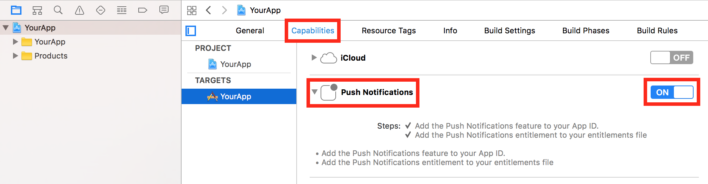

# App Center Push

> [!div class="op_single_selector"]
> * [Android](android.md)
> * [iOS](ios.md)
> * [UWP](uwp.md)
> * [Xamarin.Android](xamarin-android.md)
> * [Xamarin.iOS](xamarin-ios.md)
> * [Xamarin.Forms](xamarin-forms.md)
> * [React Native Android](react-native-android.md)
> * [React Native iOS](react-native-ios.md)
> * [macOS](macos.md)
> * [Cordova Andriod](cordova-android.md)
> * [Cordova iOS](cordova-ios.md)

App Center Push enables you to send push notifications to users of your app from the App Center portal.

## Prerequisite - Enable Apple Push Notifications service (APNs) for your app

Configure Apple Push Notifications service (APNs) for your app from your Apple developer account and App Center portal before adding App Center Push to your app.

### Enable push notifications on your application

 In Xcode's project editor, choose your target and click **Capabilities**. In the **Push Notifications** section, click the switch to turn it from OFF to ON.



[!include[](macos-apns-setup.md)]

For more information, refer to the [Apple documentation](http://help.apple.com/xcode/mac/current/#/dev11b059073).

[!include[](introduction-apple.md)]

#### 2.2 Add the `start:withServices:` method

Add `MSPush` to your `start:withServices:` method to start App Center Push together with the other services that you want to use in your app.

Insert the following line to start the SDK in your app's **AppDelegate.m** class in Objective-C or  **AppDelegate.swift** class in Swift in the `applicationDidFinishLaunching` method.

```objc
[MSAppCenter start:@"{Your App Secret}" withServices:@[[MSPush class]]];
```
```swift
MSAppCenter.start("{Your App Secret}", withServices: [MSPush.self])
```

Make sure you have replaced `{Your App Secret}` in the code sample above with your App Secret. Please also check out the [Get started](~/sdk/getting-started/macos.md) section if you haven't configured the SDK in your application.

## Intercept push notifications

You can set up a delegate to be notified whenever a push notification is received while the application is active (currently frontmost) or a notification in Notification Center has been clicked by the user.

By default, App Center Push does not generate notifications when the push is received while the application is active, you can use the delegate to customize the push experience when received while the application is active or do a specific action when the application is being active by clicking on the notification from Notification Center when received while the application is inactive. *App Center Push will not generate any notifications if the push is received while the application is not running.*

You need to register the delegate before starting App Center as shown in the following example:

```objc
[MSPush setDelegate:self];
[MSAppCenter start:@"{Your App Secret}" withServices:@[[MSPush class]]];
```
```swift
MSPush.setDelegate(self)
MSAppCenter.start("{Your App Secret}", withServices: [MSPush.self])
```

Here is an example of the delegate implementation that displays an alert dialog when the message is received by App Center Push:

```objc
- (void)push:(MSPush *)push didReceivePushNotification:(MSPushNotification *)pushNotification {
  NSString *title = pushNotification.title ?: @"";
  NSString *message = pushNotification.message;
  NSMutableString *customData = nil;
  for (NSString *key in pushNotification.customData) {
    ([customData length] == 0) ? customData = [NSMutableString new] : [customData appendString:@", "];
    [customData appendFormat:@"%@: %@", key, [pushNotification.customData objectForKey:key]];
  }
  message = [NSString stringWithFormat:@"%@%@%@", (message ? message : @""), (message && customData ? @"\n" : @""),
                                       (customData ? customData : @"")];
  NSAlert *alert = [[NSAlert alloc] init];
  [alert setMessageText:title];
  [alert setInformativeText:message];
  [alert addButtonWithTitle:@"OK"];
  [alert runModal];
}
```
```swift
func push(_ push: MSPush!, didReceive pushNotification: MSPushNotification!) {
  let title: String = pushNotification.title ?? ""
  var message: String = pushNotification.message ?? ""
  var customData: String = ""
  for item in pushNotification.customData {
    customData =  ((customData.isEmpty) ? "" : "\(customData), ") + "\(item.key): \(item.value)"
  }
  message =  message + ((customData.isEmpty) ? "" : "\n\(customData)")
  let alert: NSAlert = NSAlert()
  alert.messageText = title
  alert.informativeText = message
  alert.addButton(withTitle: "OK")
  alert.runModal()
}
```

## Enable or disable App Center Push at runtime

You can enable and disable App Center Push at runtime. If you disable it, the SDK will stop updating the device token used to push but the existing one will continue working. In other words, disabling the App Center Push in the SDK will **NOT** stop your application from receiving push notifications.

```objc
[MSPush setEnabled:NO];
```
```swift
MSPush.setEnabled(false)
```

To enable App Center Push again, use the same API but pass `YES`/`true` as a parameter.

```objc
[MSPush setEnabled:YES];
```
```swift
MSPush.setEnabled(true)
```

## Check if App Center Push is enabled

You can also check if App Center Push is enabled or not:

```objc
BOOL enabled = [MSPush isEnabled];
```
```swift
var enabled = MSPush.isEnabled()
```

## Disable automatic forwarding of application delegate's methods to App Center services

App Center uses swizzling to automatically forward your application delegate's methods to App Center services to improve SDK integration. There is a possibility of conflicts with other third party libraries or the application delegate itself. In this case, you might want to disable the App Center application delegate forwarding for all App Center services by following the steps below:

1. Open your **Info.plist file**.
2. Add `AppCenterAppDelegateForwarderEnabled` key and set the value to `0`. This will disable application delegate forwarding for all App Center services.
3. Implement the callbacks to register push notifications

    Implement the `application:didRegisterForRemoteNotificationsWithDeviceToken:` callback and the `application:didFailToRegisterForRemoteNotificationsWithError:` callback in your `AppDelegate` to register for Push notifications.

    ```objc
    - (void)application:(NSApplication *)application
        didRegisterForRemoteNotificationsWithDeviceToken:(NSData *)deviceToken {

      // Pass the device token to MSPush.
      [MSPush didRegisterForRemoteNotificationsWithDeviceToken:deviceToken];
    }

    - (void)application:(NSApplication *)application
        didFailToRegisterForRemoteNotificationsWithError:(nonnull NSError *)error {

      // Pass the error to MSPush.
      [MSPush didFailToRegisterForRemoteNotificationsWithError:error];
    }
    ```
    ```swift
    func application(_ application: NSApplication, didRegisterForRemoteNotificationsWithDeviceToken deviceToken: Data) {

      // Pass the device token to MSPush.
      MSPush.didRegisterForRemoteNotifications(withDeviceToken: deviceToken)
    }

    func application(_ application: NSApplication, didFailToRegisterForRemoteNotificationsWithError error: Error) {

      // Pass the error to MSPush.
      MSPush.didFailToRegisterForRemoteNotificationsWithError(error)
    }
    ```

4. Implement the callback to receive push notifications

    Implement the `application:didReceiveRemoteNotification:` callback to forward push notifications to the Push service.

    ```objc
    - (void)application:(NSApplication *)application
        didReceiveRemoteNotification:(NSDictionary *)userInfo {
      [MSPush didReceiveRemoteNotification:userInfo];
    }
    ```
    ```swift
    func application(_ application: NSApplication, didReceiveRemoteNotification userInfo: [String : Any]) {
      MSPush.didReceiveRemoteNotification(userInfo)
    }
    ```
