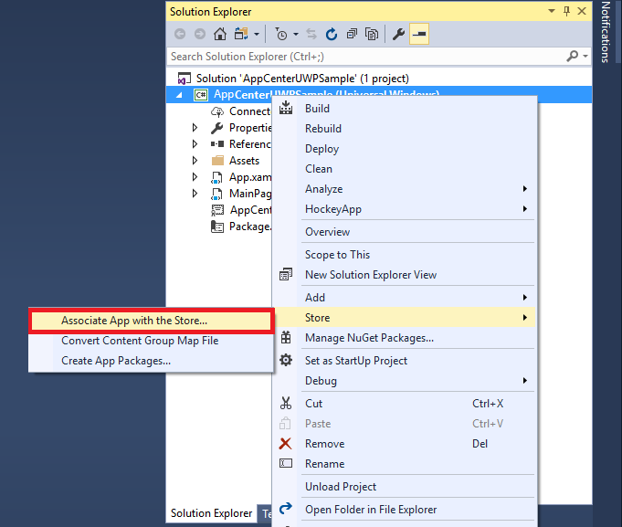

# App Center Push

> [!div class="op_single_selector"]
> * [Android](android.md)
> * [iOS](ios.md)
> * [UWP](uwp.md)
> * [Xamarin.Android](xamarin-android.md)
> * [Xamarin.iOS](xamarin-ios.md)
> * [Xamarin.Forms](xamarin-forms.md)
> * [React Native Android](react-native-android.md)
> * [React Native iOS](react-native-ios.md)
> * [macOS](macos.md)
> * [Cordova Andriod](cordova-android.md)
> * [Cordova iOS](cordova-ios.md)

App Center Push enables you to send push notifications to users of your app from the App Center portal and relies on [Windows Notification Services](https://docs.microsoft.com/windows/uwp/controls-and-patterns/tiles-and-notifications-windows-push-notification-services--wns--overview) (WNS) to push notifications to the devices.

> [!NOTE]
> A toast is displayed only if the application is in background at the moment the Push is received.

## Prerequisite - Register your app for Windows Notification Services (WNS)

Before you can send notification using WNS, your app must be registered with the Windows Store. This will provide you with credentials for your app that App Center will use to authenticate with WNS. These credentials consist of a Package Security Identifier (SID) and an application secret key. To perform this registeration, you need to associate your app with the Windows Store in Visual Studio.

### 1. Windows Store Association in Visual Studio

1. In Visual Studio Solution Explorer, right-click the UWP project, click **Store -> Associate App with the Store...**

    

2. In the wizard, click **Next**, sign in with your Windows developer account, type a name for your app in **Reserve a new app name**, then click **Reserve**.

3. After the app registration is successfully created, select the new app name, click **Next**, and then click **Associate**. This adds the required Windows Store registration information to the application manifest.

>[!NOTE]
>You will need a Windows Developer account to send push notifications to your UWP app. You can [register a developer account](https://developer.microsoft.com/en-us/store/register) if you don't already have one.

### 2. Get Package SID and Application secret from Application Registration Portal

1. Navigate to the [Microsoft Application Registration Portal](https://apps.dev.microsoft.com/#/appList), sign-in with your Microsoft account. Click the Windows Store app you associated in the previous step.

    

2. In the registration page, make a note of the value under **Application Secrets** and the **Package SID**, which you will next use to configure your App Center Push backend.

### 3. Configure Package SID and Security Key in App Center portal

Navigate to your App Center app -> Push, enter **Package SID** and **Security key** that you obtained from the [Microsoft Application Registration Portal](https://apps.dev.microsoft.com/#/appList) in the previous step, click **Apply changes**.

## Add App Center Push to your app

Please follow the [Get started](~/sdk/getting-started/uwp.md) section if you haven't set up and started the SDK in your application.

### 1. Add the App Center Push package

The App Center SDK is designed with a modular approach – a developer only needs to integrate the modules of the services that they're interested in. It can be integrated using Visual Studio or Package Manager Console.

[!include[](add-nuget.md)]

Now that you've integrated App Center Push in your application, it's time to start the SDK and make use of App Center.

### 2. Start App Center Push service

[!include[](start-push.md)]

>[!NOTE]
>If your UWP project is part of a [Xamarin.Forms](xamarin-forms.md) application, it is not necessary to add the call to `AppCenter.Start()` in the UWP portion of the project. The method call can instead be made from the PCL or shared project portion of your Xamarin.Forms application.

## Intercept push notifications

App Center Push makes it possible to intercept push notifications but there is some setup required to enable this feature in UWP.

### Additional setup

Call `Push.CheckLaunchedFromNotification(e);` after `AppCenter.Start` in `OnLaunched` method.

```csharp
protected override void OnLaunched(LaunchActivatedEventArgs e)
{
    AppCenter.Start("{Your App Secret}", typeof(Analytics), typeof(Push));
    Push.CheckLaunchedFromNotification(e);
}
```

### Subscribe to the push event

[!include[](dotnet-push-event-intro.md)]

> [!NOTE]
> No toast is shown when the push is received in foreground.

> [!NOTE]
> If the push is received in background, the event is **NOT** triggered at receive time.
> The event is triggered when you click on the notification.

> [!NOTE]
> UWP toasts do **NOT** expose **title** and **message** to the background notification click callback.
> **Title** and **message** are only available in **foreground** pushes.

[!include[](dotnet-push-event-example.md)]

## Enable or disable App Center Push at runtime

[!include[](enable-or-disable.md)]
