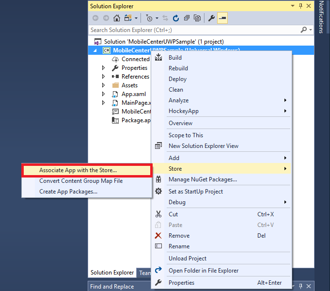
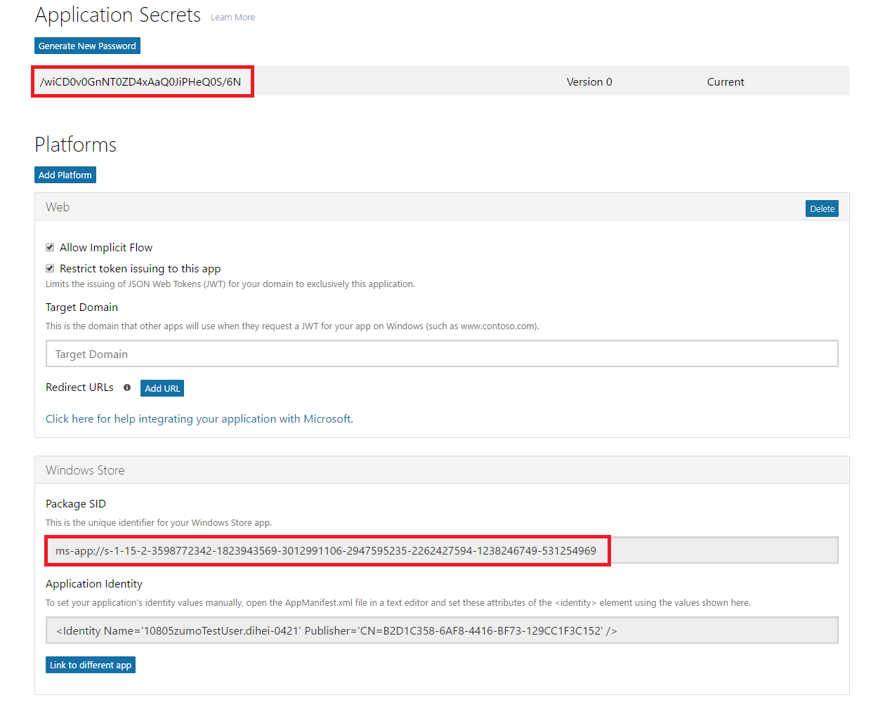

# Mobile Center Push

> [!div class="op_single_selector"]
> * [Android](android.md)
> * [iOS](ios.md)
> * [UWP](uwp.md)
> * [Xamarin.Android](xamarin-android.md)
> * [Xamarin.iOS](xamarin-ios.md)

Mobile Center Push enables you to send push notifications to users of your app from the Mobile Center portal.

Mobile Center Push relies on [Windows Notification Services](https://docs.microsoft.com/en-us/windows/uwp/controls-and-patterns/tiles-and-notifications-windows-push-notification-services--wns--overview) (WNS) to push notifications to the devices.

## 1. Register your app for Windows Notification Services (WNS)

Before you can send notification using WNS, your app must be registered with the Windows Store. This will provide you with credentials for your app that Mobile Center will use to authenticate with WNS. These credentials consist of a Package Security Identifier (SID) and an application secret key. To perform this registeration, you need to associate your app with the Windows Store in Visual Studio.

### 1.1. Windows Store Association in Visual Studio

1. In Visual Studio Solution Explorer, right-click the UWP project, click **Store -> Associate App with the Store...**

2. In the wizard, click **Next**, sign in with your Microsoft account, type a name for your app in **Reserve a new app name**, then click **Reserve**.

3. After the app registration is successfully created, select the new app name, click **Next**, and then click **Associate**. This adds the required Windows Store registration information to the application manifest.

### 1.2. Get Package SID and Application secret from Application Registration Portal

1. Navigate to the [Microsoft Application Registration Portal](https://apps.dev.microsoft.com/#/appList), sign-in with your Microsoft account. Click the Windows Store app you associated in the previous step.

2. In the registration page, make a note of the value under **Application Secrets** and the **Package SID**, which you will next use to configure your Mobile Center Push backend.

### 1.3. Configure Package SID and Security Key in Mobile Center portal

Navigate to your Mobile Center app -> Push, enter **Package SID** and **Security key** that you obtained from the [Microsoft Application Registration Portal](https://apps.dev.microsoft.com/#/appList) in the previous step, click **Apply changes**.

## 2. Add Mobile Center Push to your app

Please follow the [Get started](~/sdk/getting-started/uwp.md) section if you haven't set up and started the SDK in your application.

### 2.1. Add the Mobile Center Push package

The Mobile Center SDK is designed with a modular approach – a developer only needs to integrate the modules of the services that they're interested in. It can be integrated using Visual Studio or Package Manager Console.

[!include]

Now that you've integrated Mobile Center Push in your application, it's time to start the SDK and make use of Mobile Center.

### 2.2. Start Mobile Center Push service

[!include]

## 3. Enable or disable Mobile Center Push at runtime

[!include]

## 4. Intercept push notification in the foreground

[!include]
