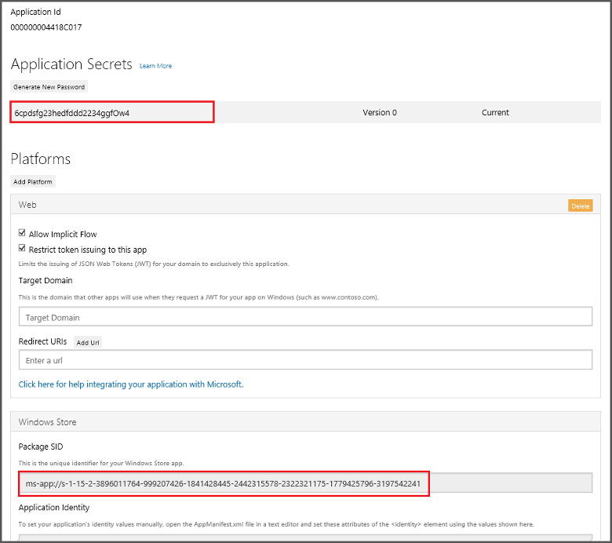

# Mobile Center Push

Mobile Center Push will let you send push notifications to the users of your app. The SDK automatically configures push notifications and delivers notifications you send on the portal.

Mobile Center Push relies on [Windows Notification Services](https://docs.microsoft.com/en-us/windows/uwp/controls-and-patterns/tiles-and-notifications-windows-push-notification-services--wns--overview) (WNS) to push notifications to the devices.

## 1. Register your app for Windows Notification Services (WNS)

Before you can send notification using WNS, your app must be registered with Windows Store. This will provide you with credentials for your app that Mobile Center will use in authenticating with WNS. These credentials consist a Package Security Identifier (SID) and an application secret key. To perform this registeration, you need to associate your app with Windows Store in Visual Studio.

### 1.1. Windows Store Association in Visual Studio

1. In Visual Studio Solution Explorer, right-click the UWP project, click **Store -> Associate App with the Store...**


2. In the wizard, click **Next**, sign in with your Microsoft account, type a name for your app in **Reserve a new app name**, then click **Reserve**.

3. After the app registration is successfully created, select the new app name, click **Next**, and then click **Associate**. This adds the required Windows Store registration information to the application manifest.

### 1.2. Get Package SID and Application secret from Application Registration Portal

1. Navigate to the [Microsoft Application Registration Portal](https://apps.dev.microsoft.com/#/appList), sign-in with your Microsoft account. Click the Windows Store app you associated in the previous step.



2. In the registration page, make a note of the value under **Application Secrets** and the **Package SID**, which you will next use to configure your Mobile Center Push backend.

### 1.3. Configure Package SID and Security Key in Mobile Center portal

Navigate to your Mobile Center app -> Push, enter **Package SID** and **Security key** that you obtained from the [Microsoft Application Registration Portal](https://apps.dev.microsoft.com/#/appList) in the previous step, click **Apply changes**.

## 2. Add Push to your Mobile Center app

Please follow the [Get started](~/sdk/getting-started/uwp.md) section if you haven't set up and started the SDK in your application.

### 2.1. Add the Mobile Center Push package

The Mobile Center SDK is designed with a modular approach – a developer only needs to integrate the modules of the services that they're interested in. It can be integrated using Visual Studio or Package Manager Console.

2.1.1 Visual Studio

1. Navigate to the **Project -> Add NuGet Packages...**

2. Search for **Mobile Center**, and select **Mobile Center Push**, then click **Add Packages**. 

2.1.2 Package Manager Console

1. Type the following command in Package Manager Console:

    `PM> Install-Package Microsoft.Azure.Mobile.Push`

Now that you've integrated Mobile Center Push in your application, it's time to start the SDK and make use of Mobile Center.

### 2.2. Start Mobile Center Push service

In order to use Mobile Center, you need to opt in to the module(s) that you want to use, meaning by default no modules are started and you will have to explicitly call each of them when starting the SDK.

Add references to Mobile Center package and Mobile Center Push package:

```csharp
using Microsoft.Azure.Mobile;
using Microsoft.Azure.Mobile.Push;
```

2.2.1 UWP application

Add `typeof(Push)` to your `MobileCenter.Start()` method to start Mobile Center Push together with the other services that you want to use in your app.

```csharp
MobileCenter.Start("{Your App Secret}", typeof(Analytics), typeof(Push));
```

Make sure you have replaced `{Your App Secret}` in the code sample above with your App Secret. Please check out the [Get started](~/sdk/getting-started/uwp.md) section if you haven't configured the SDK in your application.

2.2.2 Xamarin.Forms UWP application

Add `typeof(Push)` to your `MobileCenter.Start()` method to start Mobile Center Push at the end of `OnLaunched()` method of your app. Note that you need to initialized MobileCenter `MobileCenter.Start("{Your App Secret}", typeof(Analytics))` **before** you can add Push service to your app.

```csharp
MobileCenter.Start(typeof(Push));
``` 

## 3. Enable or disable Mobile Center Push at runtime

You can enable and disable Mobile Center Push at runtime.

If you disable it, the SDK will stop updating the WNS registration identifier used to push but the existing one will continue working. As a result disabling will **NOT** stop push notifications from being received.

```csharp
Push.Enabled = false;
```
To enable Mobile Center Push again, use the same API but pass `true` as a parameter.

```csharp
Push.Enabled = true;
```

You can also check if Mobile Center Push is enabled or not:

```csharp
bool isEnabled = Push.Enabled;
```
