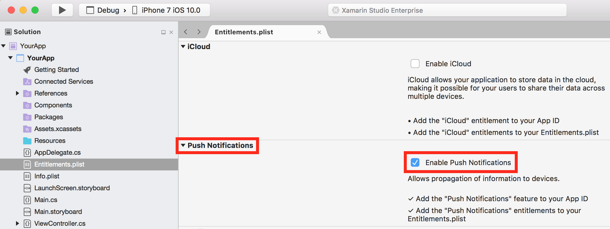

---
# required metadata

title: Mobile Center Push for Xamarin.iOS Apps
description: Integrating Mobile Center Push into Xamarin.iOS applications
keywords: sdk, push
author: achocron
ms.date: 05/10/2017
ms.topic: article
ms.assetid: 1fe3506e-ba5c-406d-8ba2-b38a2d1ca588
ms.service: mobile-center
ms.custom: sdk
ms.tgt_pltfrm: xamarin.ios
---

# Mobile Center Push

> [!div class="op_single_selector"]
> * [Android](android.md)
> * [iOS](ios.md)
> * [UWP](uwp.md)
> * [Xamarin.Android](xamarin-android.md)
> * [Xamarin.iOS](xamarin-ios.md)
> * [Xamarin.Forms](xamarin-forms.md)

Mobile Center Push enables you to send push notifications to users of your app from the Mobile Center portal.

## 1. Enable Apple Push Notifications service (APNs) for your app

Please configure Apple Push Notifications service (APNs) for your app from your Apple developer account and the Mobile Center portal before adding Mobile Center Push to your app. Mobile Center Push won't get any notifications if you don't setup push notifications.

### Enable push notifications on your application

Double-click the **Entitlements.plist** file in your Xamarin Solution Explorer. This will open the Entitlements.plist editor. Check the **Enable Push Notifications** checkbox from the **Push Notifications** section.


[!include[](apns-setup.md)]

For more information refer to the [Xamarin documentation](https://developer.xamarin.com/guides/ios/platform_features/introduction-to-ios10/user-notifications/enhanced-user-notifications/#Configuring-the-Remote-Notifications-Environment).

## 2. Add Mobile Center Push to your app

Please follow the [Get started](~/sdk/getting-started/uwp.md) section if you haven't set up and started the SDK in your application.

### 2.1. Add the Mobile Center Push package

The Mobile Center SDK is designed with a modular approach – a developer only needs to integrate the modules of the services that they're interested in. It can be integrated using Visual Studio or Package Manager Console.

[!include[](add-nuget.md)]

Now that you've integrated Mobile Center Push in your application, it's time to start the SDK and make use of Mobile Center.

### 2.2. Start Mobile Center Push service

[!include[](start-push.md)]

>[!NOTE]
>If your Xamarin.iOS project is part of a [Xamarin.Forms](xamarin-forms.md) application, it is not necessary to add the call to `MobileCenter.Start()` in the Xamarin.iOS portion of the project. The method call can instead be made from the PCL or shared project portion of your Xamarin.Forms application.

## 3. Implement callbacks to register for Push notifications

Implement the methods `RegisteredForRemoteNotifications` and `FailedToRegisterForRemoteNotifications` in your `AppDelegate` class as follows:

```csharp
public override void RegisteredForRemoteNotifications(UIApplication application, NSData deviceToken)
{
	Push.RegisteredForRemoteNotifications(deviceToken);
}
```

```csharp
public override void FailedToRegisterForRemoteNotifications(UIApplication application, NSError error)
{
	Push.FailedToRegisterForRemoteNotifications(error);
}
```

>[!NOTE]
>You may have already imlemented these methods while following Xamarin's documentation on enabling APNS. It is okay to replace the implementation from their example with the code provided above. You may also add the Mobile Center lines of code above alongside existing code in your implementation of these methods.

## 4. Enable or disable Push at runtime

[!include[](enable-or-disable.md)]

## 5. Intercept push notifications

Mobile Center Push makes it possible to intercept push notifications but there is some setup required to enable this feature in Xamarin.iOS.

### 5.1. Implement callbacks to enable push event

To enable the push event feature, implement `DidReceiveRemoteNotification` in your `AppDelegate` class as follows:

```csharp
public override void DidReceiveRemoteNotification(UIApplication application, NSDictionary userInfo, System.Action<UIBackgroundFetchResult> completionHandler)
{
	var result = Push.DidReceiveRemoteNotification(userInfo);
	if (result)
	{
		completionHandler?.Invoke(UIBackgroundFetchResult.NewData);
	}
	else
	{
		completionHandler?.Invoke(UIBackgroundFetchResult.NoData);
	}
}
```

Now, the `Push.PushNotificationReceived` event will be invoked when your application receives a push notification. This event is also accessible from the PCL part of a Xamarin.Forms project.

### 5.2. Subscribe to the push event
[!include[](push-callbacks.md)]
