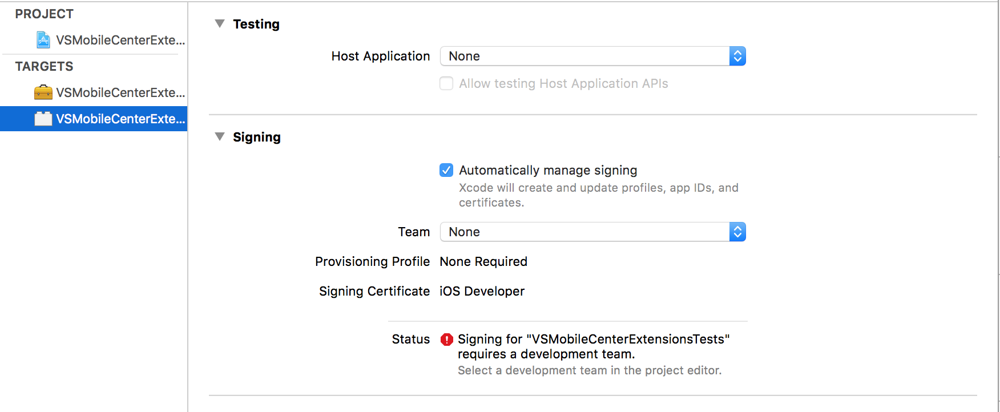
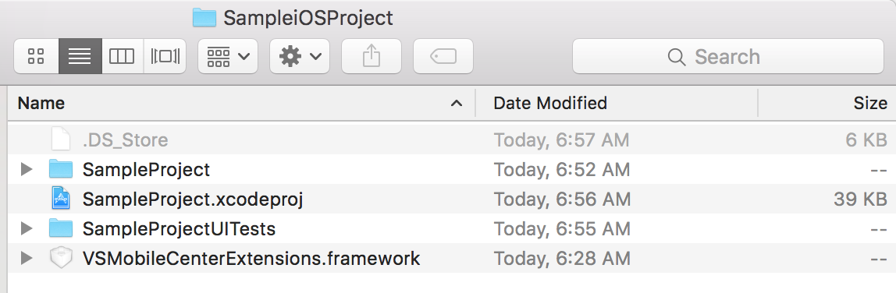
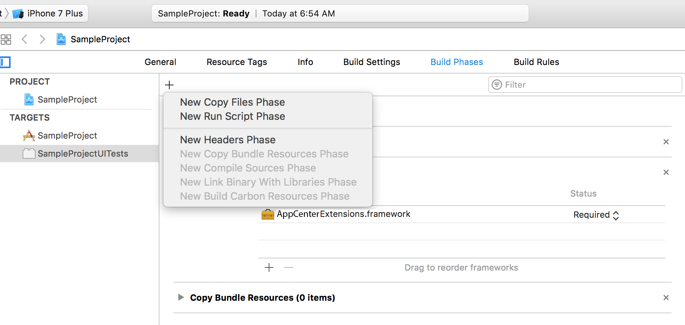
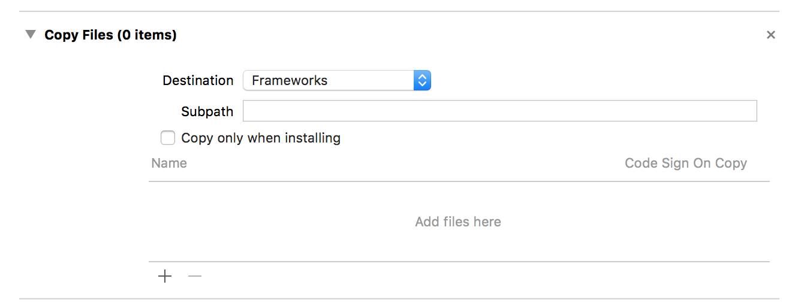
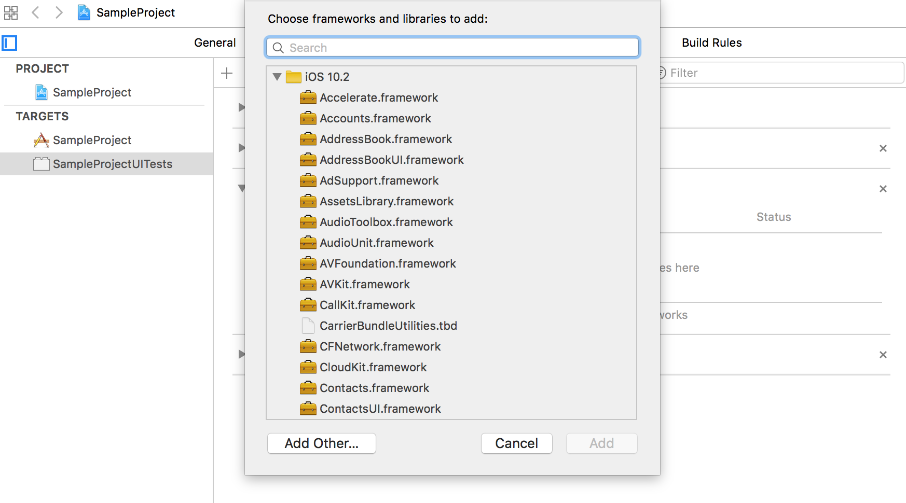
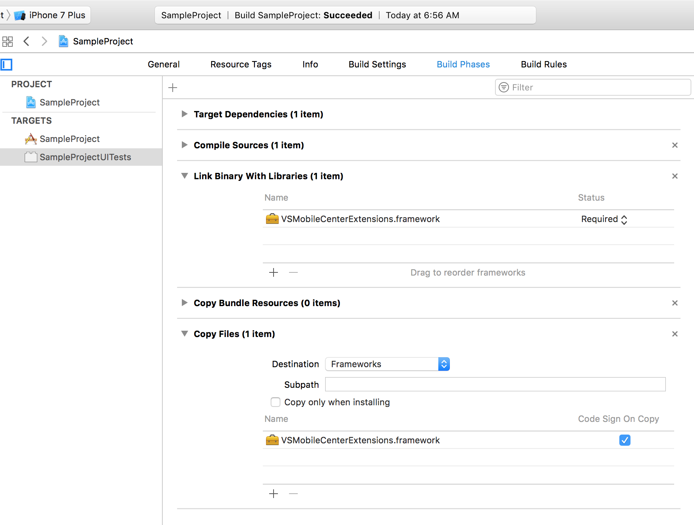
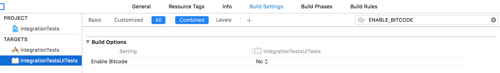

# Preparing XCUITest Tests for Upload

The steps necessary to prepare an app and its corresponding test suite for upload
to Test Cloud vary depending on the test framework. The section below provides instructions for installing the XCUITest extensions for Test Cloud and preparing your tests for upload.

The extension library enables triggering screenshots and labeling test steps when running XCUITests in Visual Studio Mobile Center. By default, test steps are automatically marked at the conclusion of each test method (which also triggers a screenshot);
this library allows you to explicitly declare where you want to mark your test steps / trigger screenshots.


## Requirements

### Application Project

`VSMobileCenterExtensions.framework` is built for iOS 9.0 or later.

### Build Server

VSMobileCenterExtensions has been tested on OSX El Capitan (10.11.5) and Xcode 8.2. However, it should work on newer
versions of Xcode/macOS. Please file an [issue](https://github.com/xamarinhq/test-cloud-xcuitest-extensions/issues/new) if you have trouble with a newer Xcode/macOS configuration.

In order to run the unit tests, you will also need to change the project's codesign info locally to point to a certificate
installed on your own machine.



If you want to install the `xcpretty` gem (see [building from source](#building-from-source) below), you will also need a valid ruby installation. Ruby 2.2.1 or higher is recommended.

## Installation

The extension can be added to your Xcode XCUITest target by using a dependency manager (Cocoapods or Carthage) or by manually including it in the target.

### Cocoapods

1. Ensure you have installed the `cocoapods` gem:

	```shell
	$ gem install cocoapods
	```

2. Create a `Podfile` in your Xcode project folder with the following:

	```ruby
	use_frameworks! #this line is necessary if your project is using Swift

	target 'MyUITestTarget' do
	  pod 'VSMobileCenterExtensions'
	end
	```

	"MyUITestTarget" should be the name of the target for your XCUITests. If you're unsure of what your test target is called, you can run

	```shell
	$ xcodebuild -list
	```
	to see a list of available targets for your project.

3. Once you have created the `Podfile`, run

	```shell
	$ pod install
	```

4. You will probably see a notice from `cocoapods` about closing the Xcode project (if currently open) and using `[YOUR_PROJECT_NAME].xcworkspace` from now own. Please follow these instructions.

### Carthage

1. First ensure you have `carthage` available by running

	```shell
	$ brew install carthage
	```
	If you don't have homebrew, you can get it [here](http://brew.sh/).

2. Create a `Cartfile` with the following contents:

	```
	github "xamarinhq/test-cloud-xcuitest-extensions"
	```

3. Follow the [Official Carthage Instructions](https://github.com/Carthage/Carthage#if-youre-building-for-ios-tvos-or-watchos) for installing frameworks from a Cartfile.

### Building from source

_Optional_: It is recommended that you install the `xcpretty` gem for nicer output:
```shell
$ gem install xcpretty
```

1. From the root of the VSMobileCenterExtensions project folder, run:
	```shell
	$ make
	```
	This will build `VSMobileCenterExtensions.framework` inside of the `build/Release-iphoneos`
folder.

2. Copy `VSMobileCenterExtensions.framework` into your application's project folder.

	

3. In Xcode, in the **Build Phases** tab of your _UI Test target_ (not your main application target),
add the `VSMobileCenterExtensions.framework` in the **Link Binary With Libraries** phase.

4. In the same tab, add the `VSMobileCenterExtensions.framework` to your **Copy Files** phase.

You may need to create one if you don't already have one. To do so, click the **+** (plus) sign on the top left of the pane:



Once you have a **Copy Files** phase, click the **+** (plus) button on the bottom left of the phase's pane to add a new file:



Click **Add Other...** and navigate to the framework:



> [!TIP]
> Make sure that the **Copy Files** phase's destination
> is set to **Frameworks**.

When you're all done, your Build Phases pane should resemble the following:



## Usage

The `VSMobileCenterExtensions` framework exposes a `label` functionality that you can use to
trigger a screenshot and mark a particular point in your UI Test with a label of your choosing.

### Objective-C

In Objective-C, the method is called `+[MCLabel label:]` or `label()` for short.
It accepts a format string and arguments just like `NSLog()`:

```objective-c
#import <VSMobileCenterExtensions/VSMobileCenterExtensions.h>

- (void)testExample {
    //Some test logic...

    [MCLabel label:fmt, ...];
    // or
    label(fmt, ...);

    //More test logic...
}
```

### Swift

In Swift the function is called `MCLabel.labelStep()` – it accepts a string, and an optional
`vaList` if you want to use an Objective-C `NSLog()`-style format string:

```swift
import VSMobileCenterExtensions

class MyTestCase: XCTestCase {
    func textExample() {
        //Some test logic...

        MCLabel.labelStep(label)
        //or
        MCLabel.labelStep(fmt, args: getVaList([ arg, ... ]))

        //More test logic...
    }
}
```

## Preparing Your Application Bundles

In order to run a test in Mobile Center, you will need to build your application and XCUITest runner bundles. To do this, run the following command from the root of your application project directory:

```shell
$ rm -rf ddp #remove the derivedDataPath if it exists
$ xcrun xcodebuild build-for-testing -configuration Debug -workspace YOUR_WORKSPACE -sdk iphoneos -scheme YOUR_APPLICATION_SCHEME -derivedDataPath ddp
```
This will build your Application and your XCUITest-Runner into a local directory called `Build` (specifically, the bundles are in
`Build/Products/Debug-iphoneos/`).

`YOUR_WORKSPACE` should point to a `.xcworkspace` file, likely titled `PROJECT_NAME.xcworkspace`. `YOUR_APPLICAITON_SCHEME` should be
the scheme you use to build your application. By default it is usually the name of your application. If you are unsure, you can run
```
$ xcrun xcodebuild -list
```
to see a list of valid schemes. For more information about Xcode schemes, see the [Apple Developer Documentation](https://developer.apple.com/library/content/featuredarticles/XcodeConcepts/Concept-Schemes.html).

## Known Issues

### UI Testing Failure

When performing gestures in Mobile Center Test, you may see an error message like the following:

```
UI Testing Failure - Failed to scroll to visible (by AX action) Button
...
Error -25204 performing AXAction 2003
```

Presently, the issue not fully understood and believed to originate in `XCTest.framework`. However, evidence suggests
that one possible cause is related to XCUITest not being able to 'see' the element in the hierarchy when the gesture
is invoked.

While not foolproof, as a potential workaround and general improvement to test stability
we recommend adapting the following scaffolding code to your gestures invocation (example is for a `tap` gesture):

**Objective-C**

```objc
- (void)waitAndTap:(XCUIElement *)button {
    NSPredicate *pred = [NSPredicate predicateWithFormat:@"exists == 1 && hittable == 1"];
    [self expectationForPredicate:pred
              evaluatedWithObject:button
                          handler:nil];
    [self waitForExpectationsWithTimeout:5 /*or a larger value if necessary*/ handler:nil];
    [button tap];
}
```

**Swift**

```swift
func waitAndTap(element: XCUIElement) {
    let predicate = NSPredicate(format: "exists == 1 && hittable == 1")
    expectation(for: predicate, evaluatedWith: element)
    waitForExpectations(timeout: 5 /*Or a larger value if necessary*/)
    element.tap()
}
```

You would then invoke `waitAndTap` instead of `tap` to ensure that the element in question is in a hittable state.

Note that in Mobile Center Test, this issue appears to only be prevelant on iPhone 7 devices.

### Xcode 8.3 and Swift

If you are building Swift XCUITests using Xcode 8.3 and newer, you may encounter a build error related to bitcode.  As a workaround, you can disable bitcode in your XCUITest target. To do this,
go to Build Settings, search for `ENABLE_BITCODE` and set the value to `NO` for the test target.  You should not need to change the setting for the App target.



Once a test suite has been instrumented with the Test Cloud extensions, it can be [uploaded to Test Cloud](~/test-cloud/starting-a-test-run.md).
