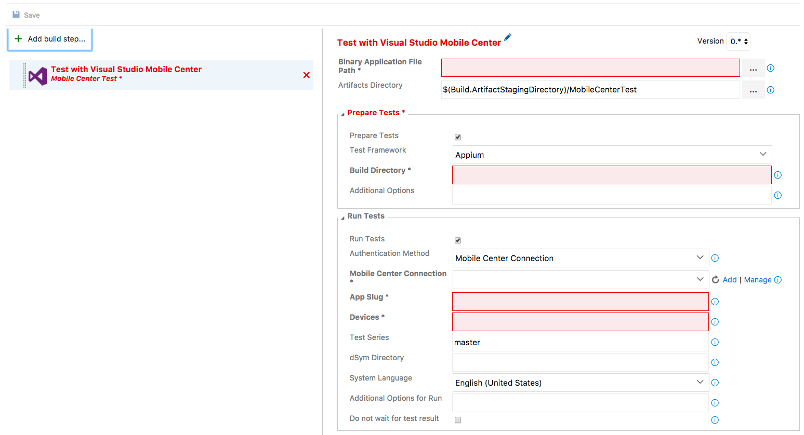
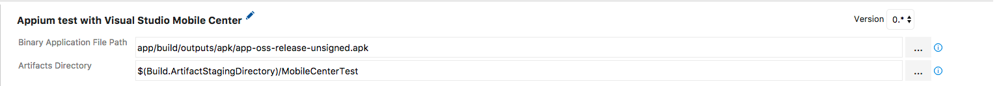
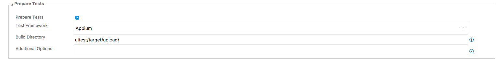
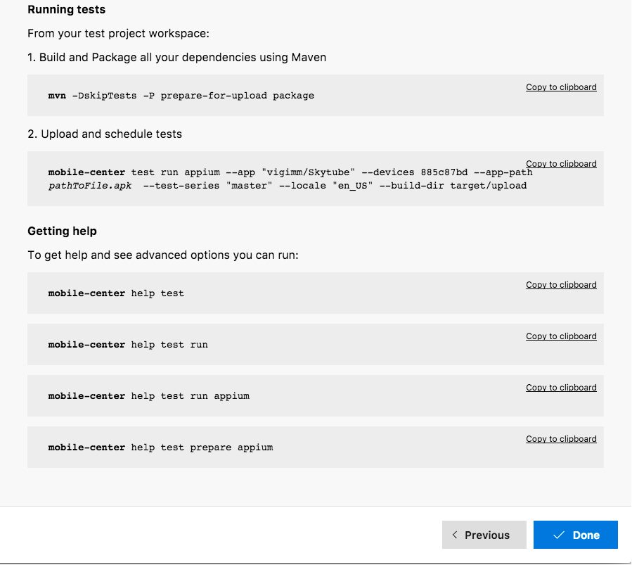
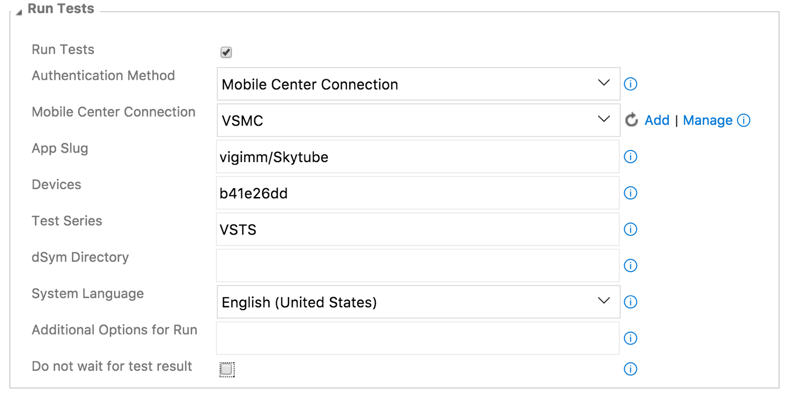

---
# required metadata

title: Using Team Services for UI Testing | Mobile Center Test
description: How to get started with UI Testing in VSTS
keywords: test, VSTS, espresso, appium, xamarin.uitest
author: Oddj0b

ms.date: 05/02/2017
ms.topic: article
ms.service: mobile-center

ms.assetid: 225497b6-6f5a-460a-b842-0d43756deaa9 

# optional metadata

#ROBOTS:
#audience:
#ms.devlang: dotnet
ms.reviewer: vigimm

---

# Add UI tests to your VSTS builds

With the Mobile Center Test task for Visual Studio Team Services (VSTS), you can run your Appium, Calabash, Espresso and Xamarin.UITest test suite in Mobile Center Test. It is the next generation of Xamarin Test Cloud task which also is available in VSTS. You can read more about the frameworks on the [Supported frameworks](supported-frameworks.md) page. 

Each framework will have its own section in this document, where you can read about the basic requirements for setting up a build step definition in VSTS.

## Appium

Before you can start testing using Appium Java, the follow steps are required.
* You will need the application binary (`.apk` or `.ipa` file)
* Activate your trial for Mobile Center Test - this is done on [Mobile Center](https://mobile.azure.com/). First select your app and then select Test in the left-hand menu.
* Prepare your repository for Appium - read more [here](preparing-for-upload/appium.md).

### VSTS setup

You start by adding the Mobile Center Test task to your build definition. The Mobile Center task in the build definition is divided up into sections - where focus will be on _General_, _Prepare Tests_ and _Run Test_ sections. In the general section it is required to insert the path to your app binary (`.apk` or `.ipa`) in the `Binary Application File Path` field.

In the Prepare Tests section, first make sure the _Prepare Tests_ checkbox is checked and that Appium is chosen under `Test Framework`. Insert the path to the Appium test-classes, dependency-jars and the `pom.xml` file into the `Build directory` field. These three artifacts is usually located in the `upload` folder.

If everything is done correctly - preparations are done and it is time to configure the test run. All the information needed is found by creating a new test under Test in Mobile Center. Navigate your browser to [Mobile Center](https://mobile.azure.com/) and select your app. Go to the Test service and click on `New test run` in the upper right hand side of the screen

Select the devices for the test run. The general rule of a device selection is that more devices equal longer testing time. Start small with 1-3 devices, and when everything is working, create a new test run with more devices. Finish your selection by clicking next.

On the next page select your test series or create a new one. Test series is a way of managing your test runs. Choose something which makes sense and will make it easy to find the results later. Examples is VSTS which tells where the test is send from. It can be changed later so it matches your existing test series. Select Appium as framework and click `Next` to proceed.

Leave the submit page (last page on test run setup) open, as there is information needed for setting up the test run on VSTS. 

* First step is creating a Mobile Center connection. See the [Connecting to Mobile Center](#connecting-to-mobile-center-test) section of this document.
* The app slug is structure as `<username>/<appname>`. Insert that into the `App Slug` field. On the submit page it's the `--app` parameter
* Your device selection which is a mixture of letters and numbers, is specified in the `Devices` field. On the submit page it's the `--devices` parameter.
* Test series is a free text - it can be anything. It's the `--test-series` parameter
* System Language is a drop-down menu, and if `Other` is selected a `Other Locale` field appears where you can input laguage and country code like this: en_US

You can read more about starting a test run on the [Starting a test run](starting-a-test-run.md) page.

You're all set to initiate the build.

## Espresso
Before you can start testing using Espresso, there's prerequisite steps. You'll need to built an Android application with the Espresso tests (apk file), you need to activate your trial for Mobile Center Test, this is done on [Mobile Center](https://mobile.azure.com/) and select Test in the left-hand menu. And you need to prepare your repository, read more [here](preparing-for-upload/espresso.md).

### VSTS setup
Inside the VSTS step definition there is 5 section where we'll focus on the first 2, which is general and run test. In the general section there's two options, and we only need to fill the `Binary Application File Path` field with the path to your app binary (`.apk`). Usually this is `<project>/build/outputs/apk`.

If everything is done correctly in the above steps we're ready to run the test on Mobile Center Tests devices. You'll need to configure your test run, you can read about that on the [Starting a test run](starting-a-test-run.md) page.

By now you have your app slug, device selection, system language and test series. The app slug is normally something similiar to `username/appname` fill the `App Slug` with that and your device selection which is a mixture of letters and numbers, this is inserted in the `Devices` field. Your test series is a free text which can be anything, normally it starts with Master and you can leave it like that. Lastly we have the system language which is a drop down menu, this is which language the devices running your test is using.

You'll also need to create a Mobile Center connection, you'll need an API token which you can read more about on the [API documentation](../api-docs/index.md) page.
 
You're all set and ready to queue up the build.

## Xamarin.UITest
Before you can start testing using Xamarin.UITest, there's prerequisite steps. You'll need the application binary (apk or ipa file), you need to activate your trial for Mobile Center Test, this is done on [Mobile Center](https://mobile.azure.com/) and select Test in the left-hand menu. And you need to prepare your repository, read more [here](preparing-for-upload/uitest.md).

### VSTS setup
You start by adding the Mobile Center Test step. Inside the VSTS step definition there is 5 section we'll focus on the first 3, which is _general_, _prepare_ and _run test_. In the general section there's two options, and only information in `Binary Application File Path` is necessary. Insert the path to your app binary (`.apk` or `.ipa`).

Under the Prepare Tests section, first make sure `Prepare Tests` is checked on and that UI Test is chosen under `Test Framework`. Your `Build Directory` is normally `<ProjectName>/bin/<configuration>`.

If everything is done correctly in the above steps we're ready to run the test on Mobile Center Tests devices. You'll need to configure your test run, you can read about that on the [Starting a test run](starting-a-test-run.md) page.

By now you have your app slug, device selection, system language and test series. The app slug is normally something similiar to `username/appname` fill the `App Slug` with that and your device selection which is a mixture of letters and numbers, this is inserted in the `Devices` field. Your test series is a free text which can be anything, normally it starts with Master and you can leave it like that. Lastly we have the system language which is a drop down menu, this is which language the devices running your test is using.

You'll also need to create a Mobile Center connection, you'll need an API token which you can read more about on the [API documentation](../api-docs/index.md) page.

Happy testing go and queue up that build.

## General setup steps

### Connecting to Mobile Center Test

It is required to login into Mobile Center before using the service, there are 2 methods of authentication. The first method is using an API token - you can acquire one by going to Mobile Center and clicking the settings icon at the buttom of the left-hand menu.

Select the API Tokens in the middle menu, and click New API token in the top right hand side of the browser window.

Then name your API token - for instance, you can call it VSTS. In the future, this will help you indentifying which service is using the service. And finally click Add new API token.

A windows appears with the token. When you click close the token will dissappear and not be recoverable, so copy it and store it safely.

Back in VSTS, click `add` next to the Mobile Center Connection field. Inside `name` you can insert mobile-center and the token into the `API token` field. Finish the setup by clicking close. Make sure your newly created connection appears in the Mobile Center Connection field.

The second method is using your log-in credentials. When selecting _Credentials_ from the `Authentication Method`  dropdown menu two new fields appear. `Mobile Center Username` and `Mobile Center Password` insert the your username and password in the aptly named fields. 

You can find your [username here](https://mobile.azure.com/settings/profile). There is a known bug while logging in using your Microsoft credentials, where you might need to create a specific password for Mobile Center. You can set a [new password here](https://mobile.azure.com/settings/password).

